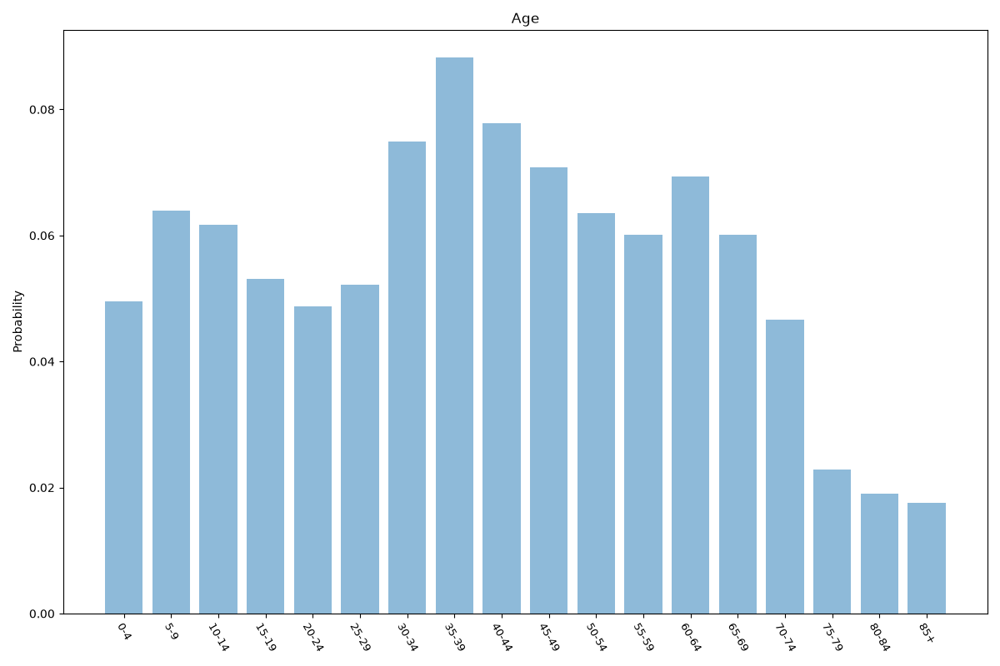
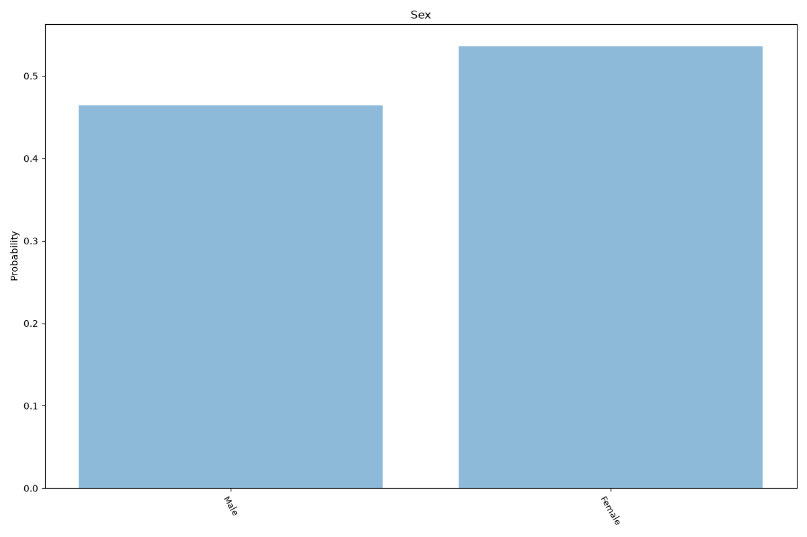
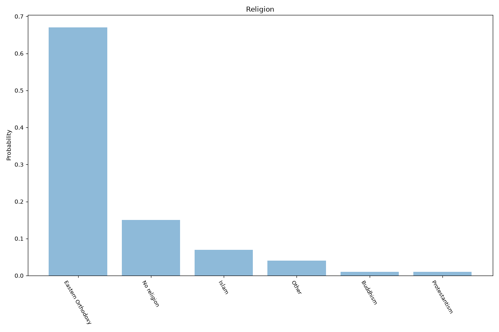
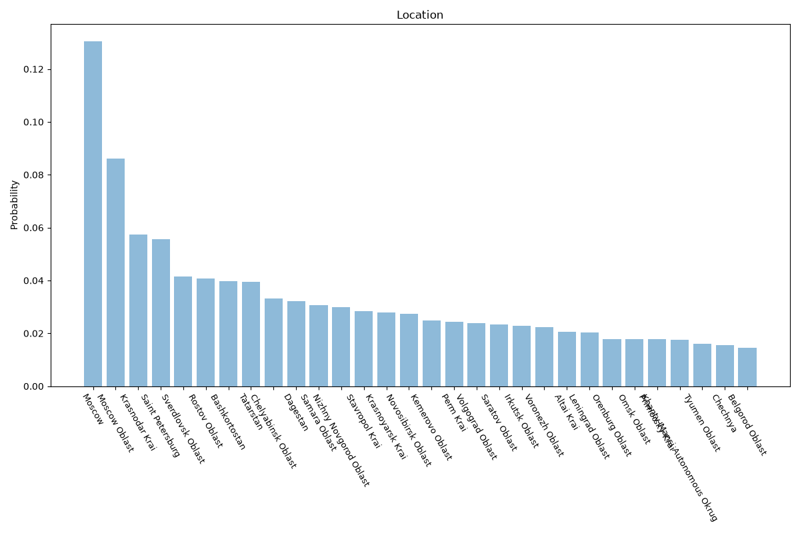

# Russia
**4 features:** age, sex, religion and location.

## Age

## Sex

## Religion

## Location

## Sources

- [World Population Prospects 2024, United Nations (2024)](https://population.un.org/wpp/) — age, sex
- [Religious affiliation survey, VCIOM (Russian Public Opinion Research Center) (2025)](https://wciom.com/) — religion
- [Federal subject population estimates, Rosstat (2025)](https://eng.rosstat.gov.ru/) — location