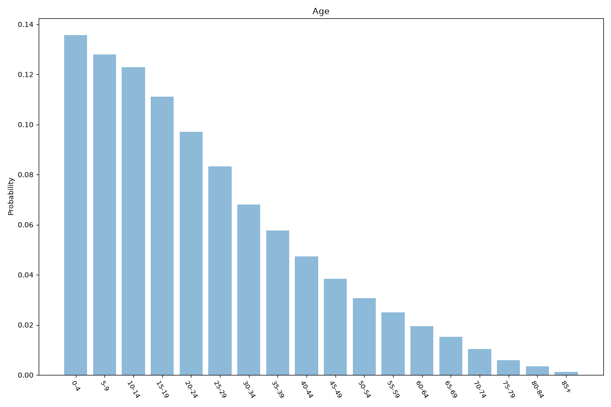
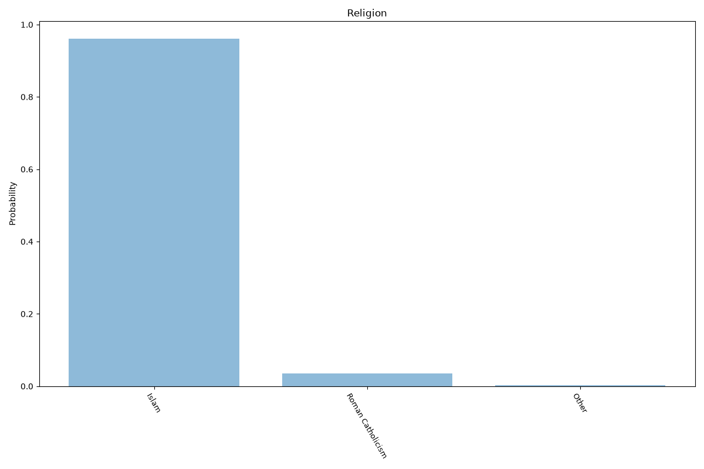
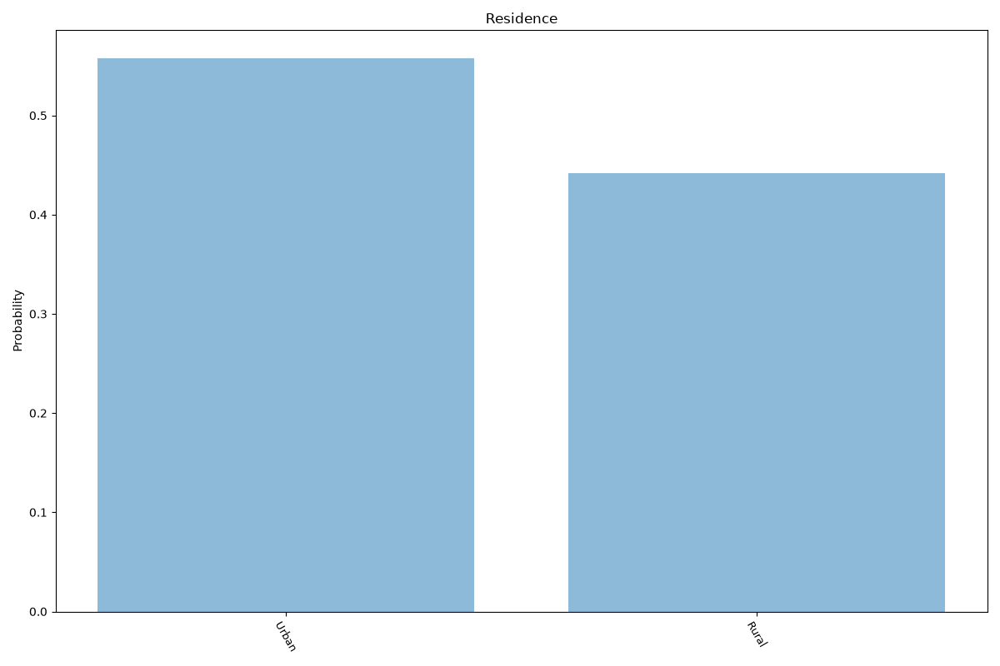
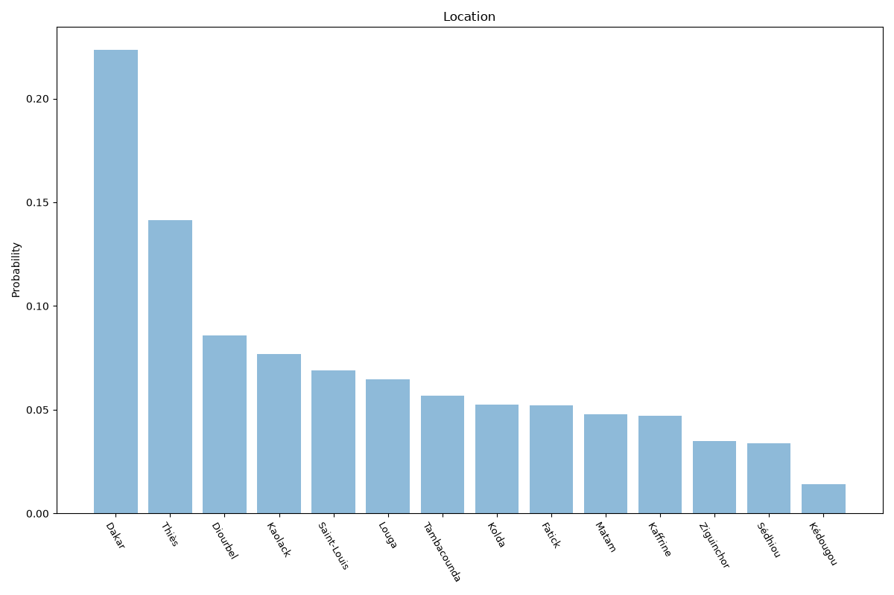

# Senegal
**5 features:** age, sex, religion, residence and location.

## Age

## Sex

## Religion

## Residence

## Location

## Sources

- [World Population Prospects 2024, United Nations (2024)](https://population.un.org/wpp/) — age, sex
- [2013 Census (religion), Agence Nationale de la Statistique et de la Démographie (ANSD) (2013)](https://www.ansd.sn/) — religion
- [2023 Census (RGPH-5), Agence Nationale de la Statistique et de la Démographie (ANSD) (2023)](https://www.ansd.sn/) — location
- [Urban population (% of total population), World Bank (2025)](https://data.worldbank.org/indicator/SP.URB.TOTL.IN.ZS) — residence