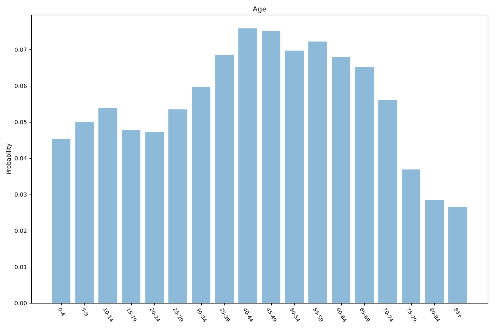
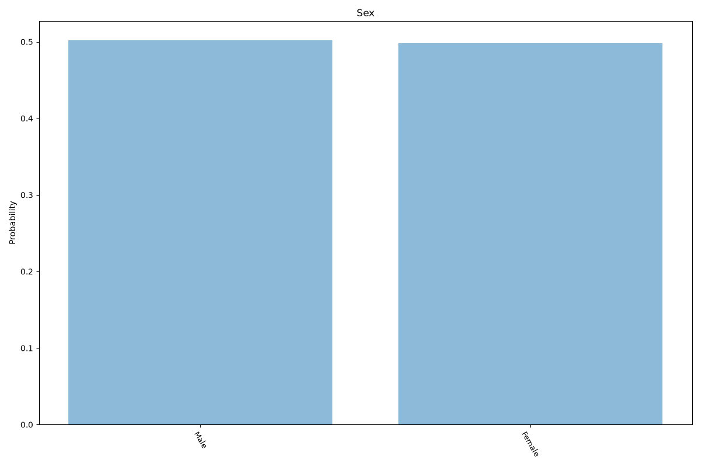
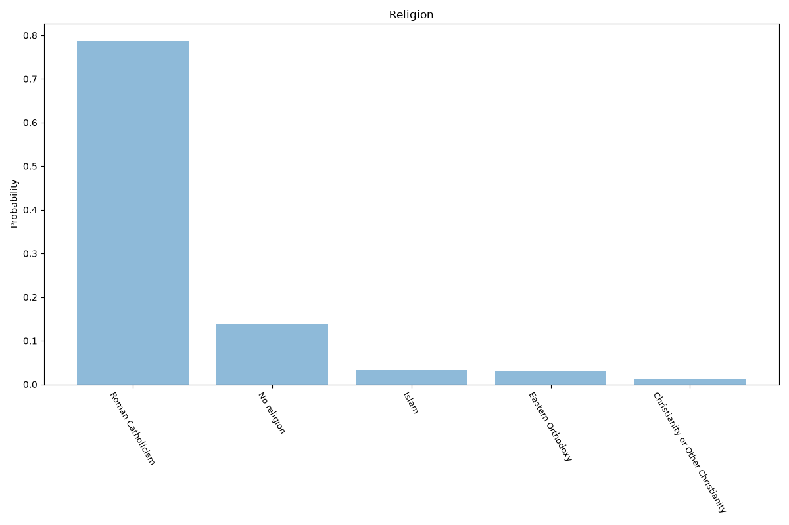
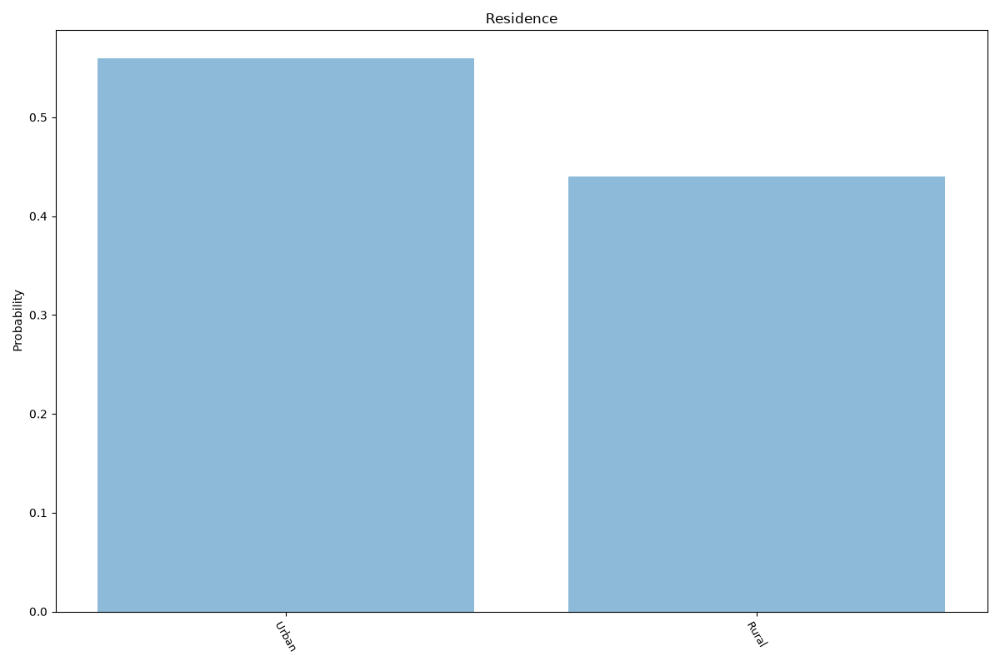
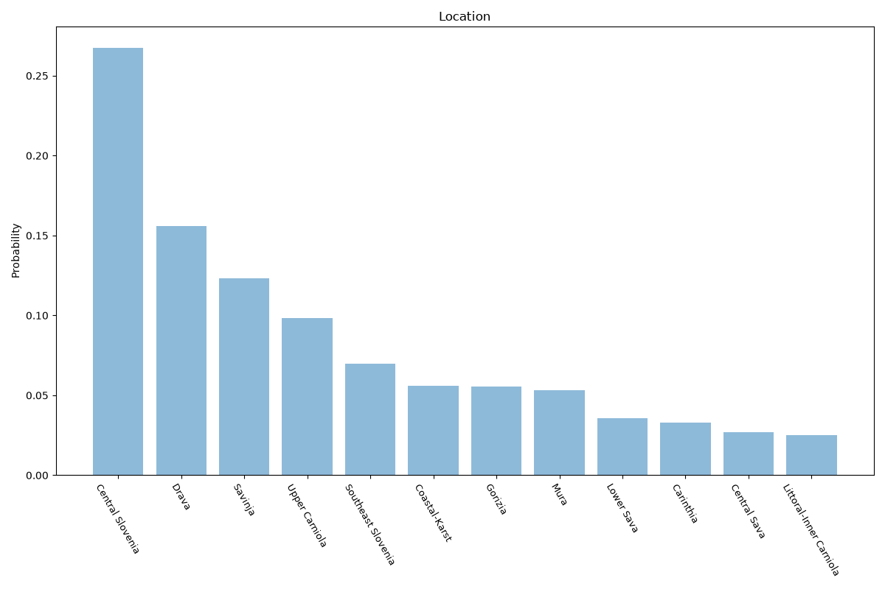

# Slovenia
**5 features:** age, sex, religion, residence and location.

## Age

## Sex

## Religion

## Residence

## Location

## Sources

- [World Population Prospects 2024, United Nations (2024)](https://population.un.org/wpp/) — age, sex
- [2002 Census (religion), Statistical Office of the Republic of Slovenia (SURS) (2002)](https://www.stat.si/eng) — religion
- [Population by statistical region, Statistical Office of the Republic of Slovenia (SURS) (2025)](https://www.stat.si/eng) — location
- [Urban population (% of total population), World Bank (2025)](https://data.worldbank.org/indicator/SP.URB.TOTL.IN.ZS) — residence