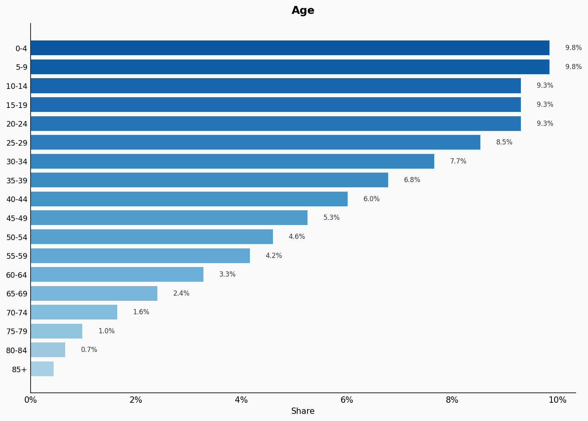
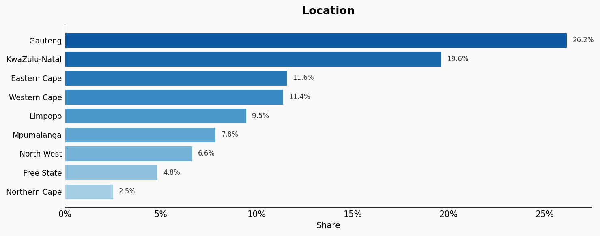
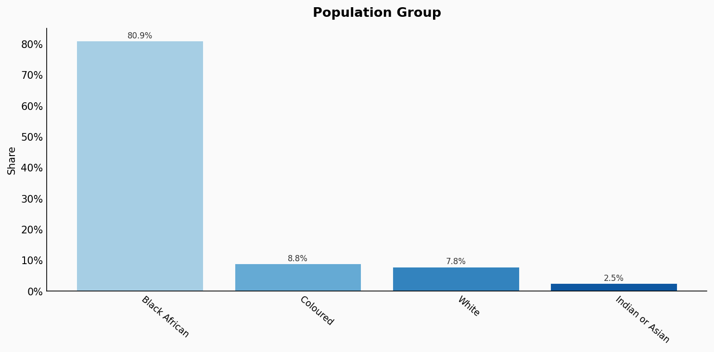
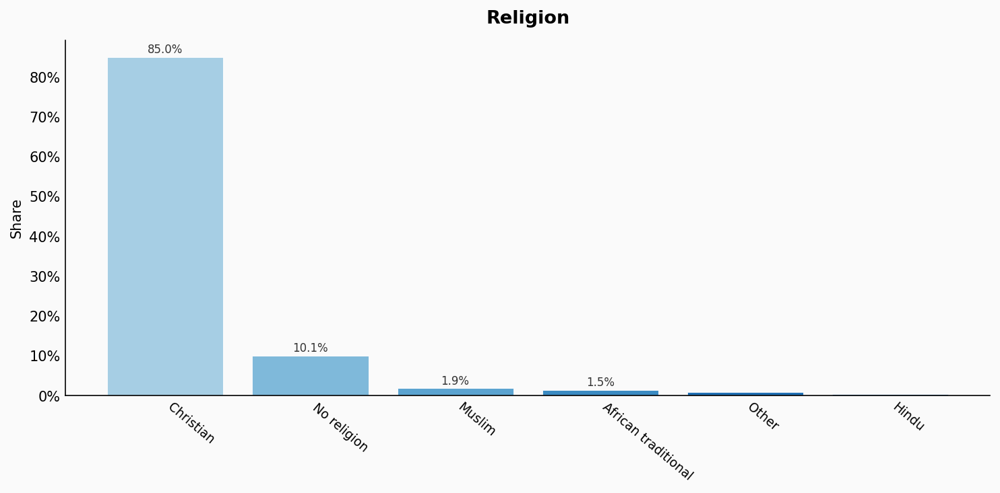
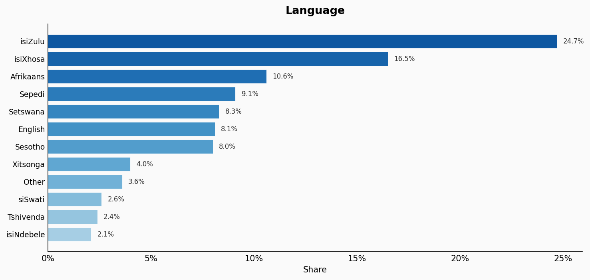
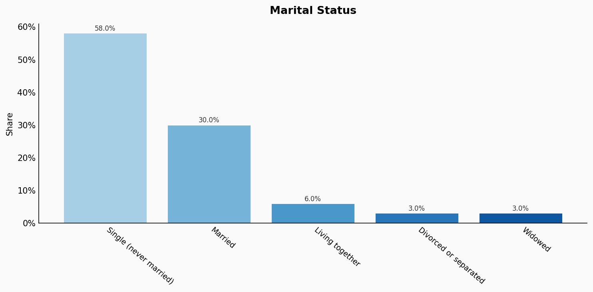
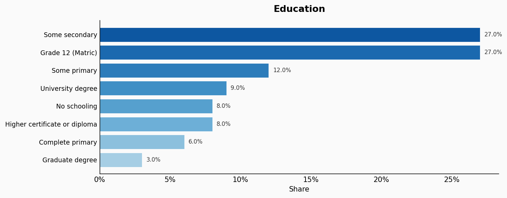
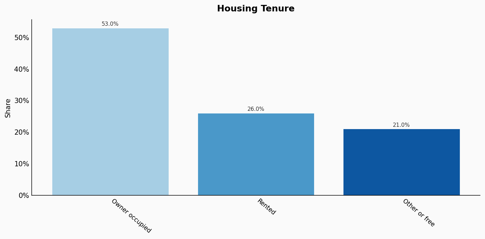
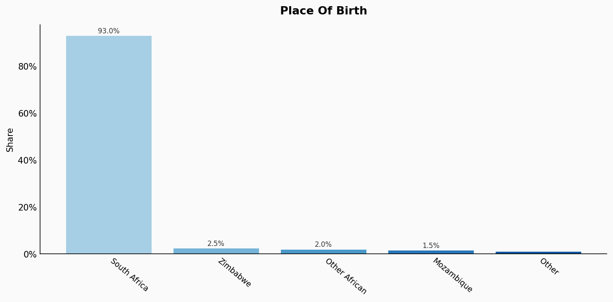
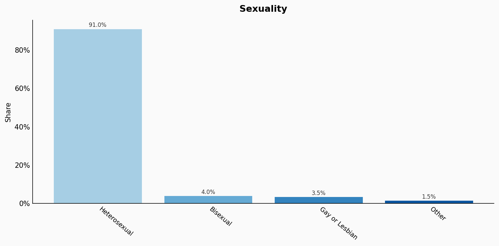

# South Africa

**12 features:** age, sex, location, population group, religion, language, marital status, education, occupation, housing tenure, place of birth, and sexuality.

## Age

| Option | Share |
|---|---:|
| 0-4 | 9.8% |
| 5-9 | 9.8% |
| 10-14 | 9.3% |
| 15-19 | 9.3% |
| 20-24 | 9.3% |
| 25-29 | 8.5% |
| 30-34 | 7.7% |
| 35-39 | 6.8% |
| 40-44 | 6.0% |
| 45-49 | 5.3% |
| 50-54 | 4.6% |
| 55-59 | 4.2% |
| 60-64 | 3.3% |
| 65-69 | 2.4% |
| 70-74 | 1.6% |
| 75-79 | 1.0% |
| 80-84 | 0.7% |
| 85+ | 0.4% |

## Sex

| Option | Share |
|---|---:|
| Female | 51.0% |
| Male | 49.0% |

## Location

| Option | Share |
|---|---:|
| Gauteng | 26.2% |
| KwaZulu-Natal | 19.6% |
| Eastern Cape | 11.6% |
| Western Cape | 11.4% |
| Limpopo | 9.5% |
| Mpumalanga | 7.8% |
| North West | 6.6% |
| Free State | 4.8% |
| Northern Cape | 2.5% |

## Population Group

| Option | Share |
|---|---:|
| Black African | 80.9% |
| Coloured | 8.8% |
| White | 7.8% |
| Indian or Asian | 2.5% |

## Religion

| Option | Share |
|---|---:|
| Christian | 85.0% |
| No religion | 10.1% |
| Muslim | 1.9% |
| African traditional | 1.5% |
| Other | 1.0% |
| Hindu | 0.5% |

## Language

| Option | Share |
|---|---:|
| isiZulu | 24.7% |
| isiXhosa | 16.5% |
| Afrikaans | 10.6% |
| Sepedi | 9.1% |
| Setswana | 8.3% |
| English | 8.1% |
| Sesotho | 8.0% |
| Xitsonga | 4.0% |
| Other | 3.6% |
| siSwati | 2.6% |
| Tshivenda | 2.4% |
| isiNdebele | 2.1% |

## Marital Status

| Option | Share |
|---|---:|
| Single (never married) | 58.0% |
| Married | 30.0% |
| Living together | 6.0% |
| Divorced or separated | 3.0% |
| Widowed | 3.0% |

## Education

| Option | Share |
|---|---:|
| Some secondary | 27.0% |
| Grade 12 (Matric) | 27.0% |
| Some primary | 12.0% |
| University degree | 9.0% |
| No schooling | 8.0% |
| Higher certificate or diploma | 8.0% |
| Complete primary | 6.0% |
| Graduate degree | 3.0% |

## Occupation

| Option | Share |
|---|---:|
| Elementary | 18.0% |
| Service and sales | 16.0% |
| Craft and trades | 12.0% |
| Professionals | 10.0% |
| Technicians | 9.0% |
| Administrative | 9.0% |
| Plant and machine operators | 8.0% |
| Agriculture | 8.0% |
| Management | 7.0% |
| Other | 3.0% |

## Housing Tenure

| Option | Share |
|---|---:|
| Owner occupied | 53.0% |
| Rented | 26.0% |
| Other or free | 21.0% |

## Place Of Birth

| Option | Share |
|---|---:|
| South Africa | 93.0% |
| Zimbabwe | 2.5% |
| Other African | 2.0% |
| Mozambique | 1.5% |
| Other | 1.0% |

## Sexuality

| Option | Share |
|---|---:|
| Heterosexual | 91.0% |
| Bisexual | 4.0% |
| Gay or Lesbian | 3.5% |
| Other | 1.5% |

## Sources

- [Census 2022, Statistics South Africa (Stats SA) (2022)](https://census.statssa.gov.za/)
  *Covers: `age`, `sex`, `location`, `marital status`, `housing tenure`, `place of birth`, `population group`*
- [Quarterly Labour Force Survey Q4 2022, Stats SA (2022)](https://www.statssa.gov.za/?page_id=1854&PPN=P0211)
  *Covers: `education`, `occupation`*
- [General Household Survey 2021, Stats SA (2021)](https://www.statssa.gov.za/?page_id=1854&PPN=P0318)
  *Covers: `religion`*
- [Census 2022 - Home Language, Stats SA (2022)](https://census.statssa.gov.za/)
  *Covers: `language`*
- [South African Social Attitudes Survey 2022, HSRC (2022)](https://www.hsrc.ac.za/en/research-data/view/7495)
  *Covers: `sexuality`*