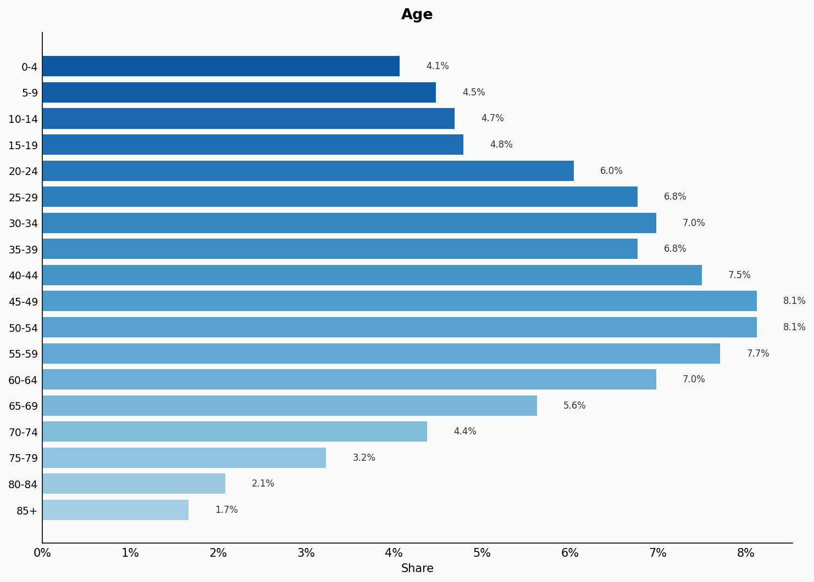
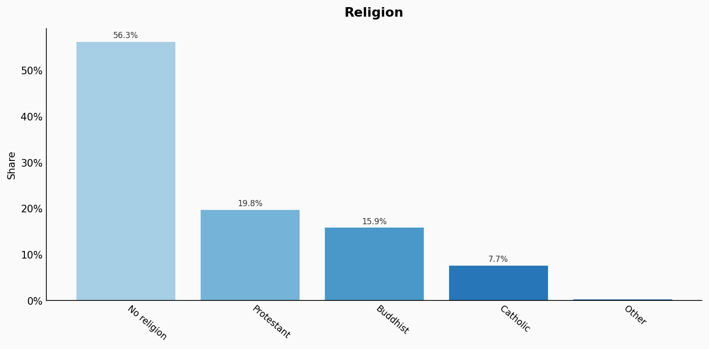
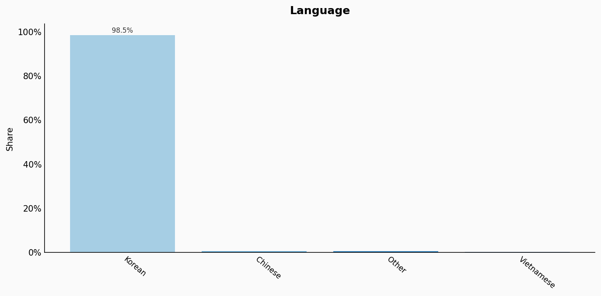
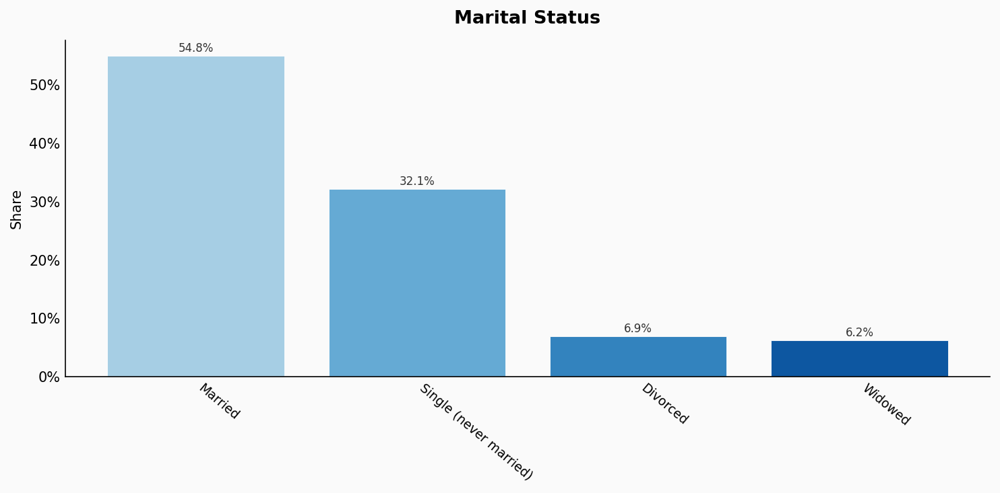
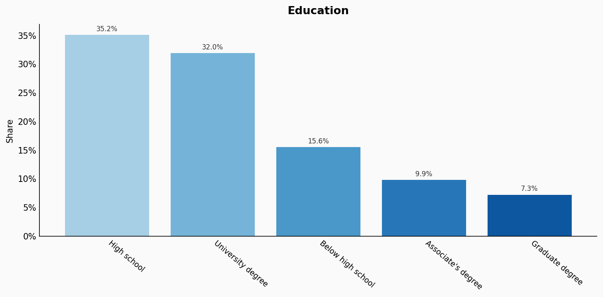
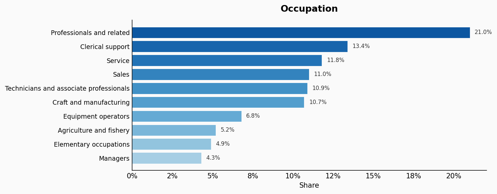
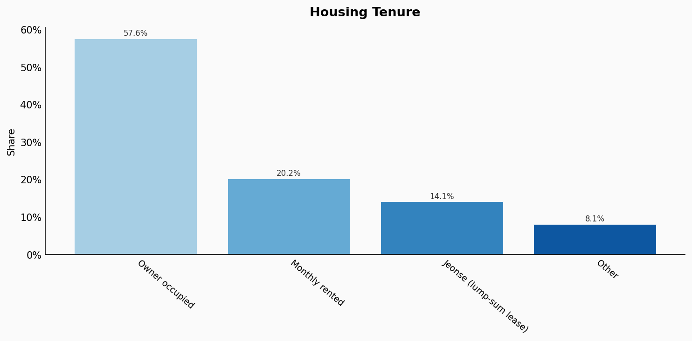
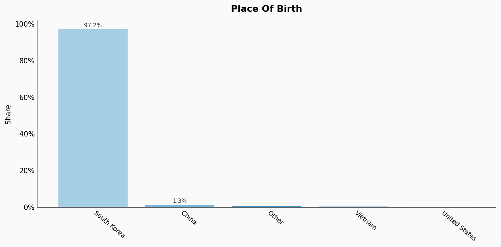
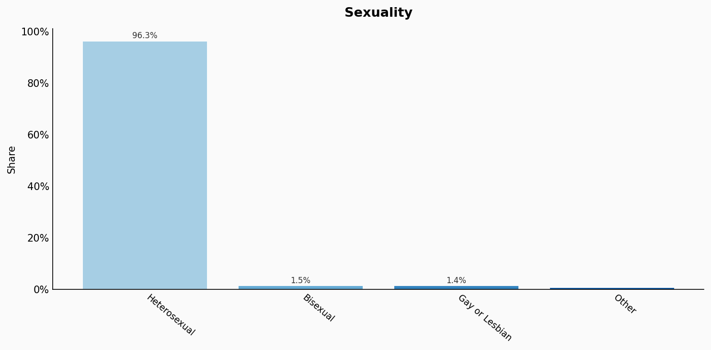

# South Korea

**11 features:** age, sex, location, religion, language, marital status, education, occupation, housing tenure, place of birth, and sexuality.

## Age

| Option | Share |
|---|---:|
| 0-4 | 4.1% |
| 5-9 | 4.5% |
| 10-14 | 4.7% |
| 15-19 | 4.8% |
| 20-24 | 6.0% |
| 25-29 | 6.8% |
| 30-34 | 7.0% |
| 35-39 | 6.8% |
| 40-44 | 7.5% |
| 45-49 | 8.1% |
| 50-54 | 8.1% |
| 55-59 | 7.7% |
| 60-64 | 7.0% |
| 65-69 | 5.6% |
| 70-74 | 4.4% |
| 75-79 | 3.2% |
| 80-84 | 2.1% |
| 85+ | 1.7% |

## Sex

| Option | Share |
|---|---:|
| Female | 50.1% |
| Male | 49.9% |

## Location

| Option | Share |
|---|---:|
| Gyeonggi | 26.2% |
| Seoul | 18.5% |
| Busan | 6.6% |
| South Gyeongsang | 6.3% |
| Incheon | 5.7% |
| North Gyeongsang | 5.1% |
| Daegu | 4.7% |
| South Chungcheong | 4.2% |
| North Jeolla | 3.6% |
| South Jeolla | 3.6% |
| North Chungcheong | 3.2% |
| Gangwon | 3.0% |
| Daejeon | 2.8% |
| Gwangju | 2.8% |
| Ulsan | 2.2% |
| Jeju | 1.2% |
| Sejong | 0.6% |

## Religion

| Option | Share |
|---|---:|
| No religion | 56.3% |
| Protestant | 19.8% |
| Buddhist | 15.9% |
| Catholic | 7.7% |
| Other | 0.3% |

## Language

| Option | Share |
|---|---:|
| Korean | 98.5% |
| Chinese | 0.6% |
| Other | 0.6% |
| Vietnamese | 0.3% |

## Marital Status

| Option | Share |
|---|---:|
| Married | 54.8% |
| Single (never married) | 32.1% |
| Divorced | 6.9% |
| Widowed | 6.2% |

## Education

| Option | Share |
|---|---:|
| High school | 35.2% |
| University degree | 32.0% |
| Below high school | 15.6% |
| Associate's degree | 9.9% |
| Graduate degree | 7.3% |

## Occupation

| Option | Share |
|---|---:|
| Professionals and related | 21.0% |
| Clerical support | 13.4% |
| Service | 11.8% |
| Sales | 11.0% |
| Technicians and associate professionals | 10.9% |
| Craft and manufacturing | 10.7% |
| Equipment operators | 6.8% |
| Agriculture and fishery | 5.2% |
| Elementary occupations | 4.9% |
| Managers | 4.3% |

## Housing Tenure

| Option | Share |
|---|---:|
| Owner occupied | 57.6% |
| Monthly rented | 20.2% |
| Jeonse (lump-sum lease) | 14.1% |
| Other | 8.1% |

## Place Of Birth

| Option | Share |
|---|---:|
| South Korea | 97.2% |
| China | 1.3% |
| Other | 0.7% |
| Vietnam | 0.5% |
| United States | 0.3% |

## Sexuality

| Option | Share |
|---|---:|
| Heterosexual | 96.3% |
| Bisexual | 1.5% |
| Gay or Lesbian | 1.4% |
| Other | 0.8% |

## Sources

- [Population and Housing Census 2020, Statistics Korea (KOSTAT) (2020)](https://www.kostat.go.kr/board.es?mid=a10301010000&bid=204)
  *Covers: `age`, `sex`, `marital status`, `location`, `housing tenure`*
- [Economically Active Population Survey 2022, Statistics Korea (2022)](https://www.kostat.go.kr/board.es?mid=a10301010000&bid=221)
  *Covers: `education`, `occupation`*
- [Social Survey 2021, Statistics Korea (2021)](https://www.kostat.go.kr/board.es?mid=a10301010000&bid=203)
  *Covers: `religion`*
- [Immigration Statistics 2022, Korea Immigration Service (2022)](https://www.immigration.go.kr/immigration/1569/subview.do)
  *Covers: `place of birth`*
- [LGBT Survey, Korean Social Science Data Archive (2020)](https://www.kssda.or.kr/)
  *Covers: `sexuality`*