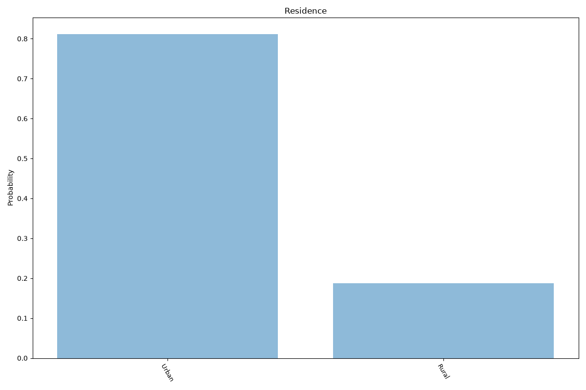

# South Korea
**5 features:** age, sex, religion, residence and location.

## Age

## Sex

## Religion

## Residence

## Location

## Sources

- [World Population Prospects 2024, United Nations (2024)](https://population.un.org/wpp/) — age, sex
- [Religious affiliation survey, Gallup Korea (2025)](https://www.gallup.co.kr/) — religion
- [2020 Census, Statistics Korea (KOSTAT) (2020)](https://kostat.go.kr/) — location
- [Urban population (% of total population), World Bank (2025)](https://data.worldbank.org/indicator/SP.URB.TOTL.IN.ZS) — residence