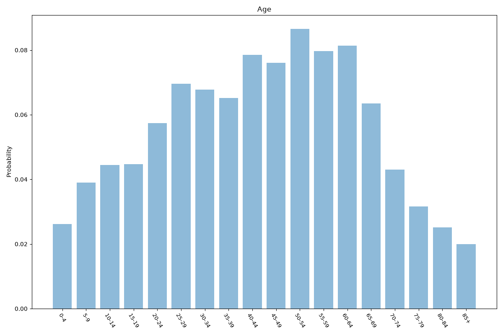
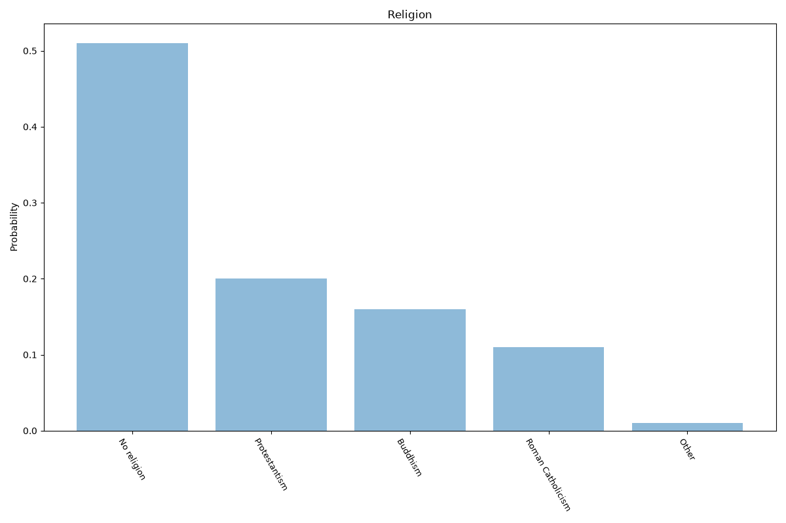
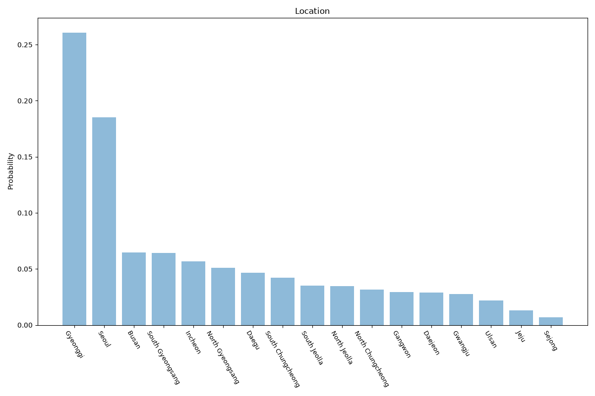

# South Korea
**4 features:** age, sex, religion and location.

## Age

## Sex

## Religion

## Location

## Sources

- [World Population Prospects 2024, United Nations (2024)](https://population.un.org/wpp/) — age, sex
- [Religious affiliation survey, Gallup Korea (2025)](https://www.gallup.co.kr/) — religion
- [2020 Census, Statistics Korea (KOSTAT) (2020)](https://kostat.go.kr/) — location