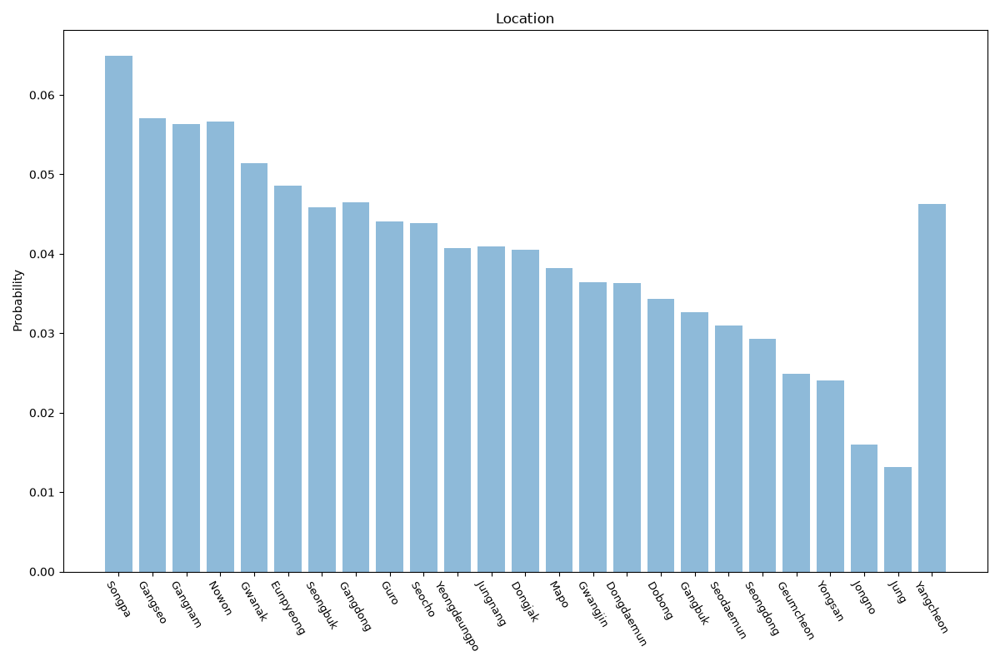

# Seoul
**2 features:** location and residence.

## Location

## Residence

## Sources

- [Resident Registration Population, Statistics Korea (KOSTAT) (2014)](https://kostat.go.kr/) — location
- [World Urbanization Prospects 2018, United Nations (2018)](https://population.un.org/wup/) — residence