# Spain

**11 features:** age, sex, location, religion, language, marital status, education, occupation, housing tenure, place of birth, and sexuality.

## Age

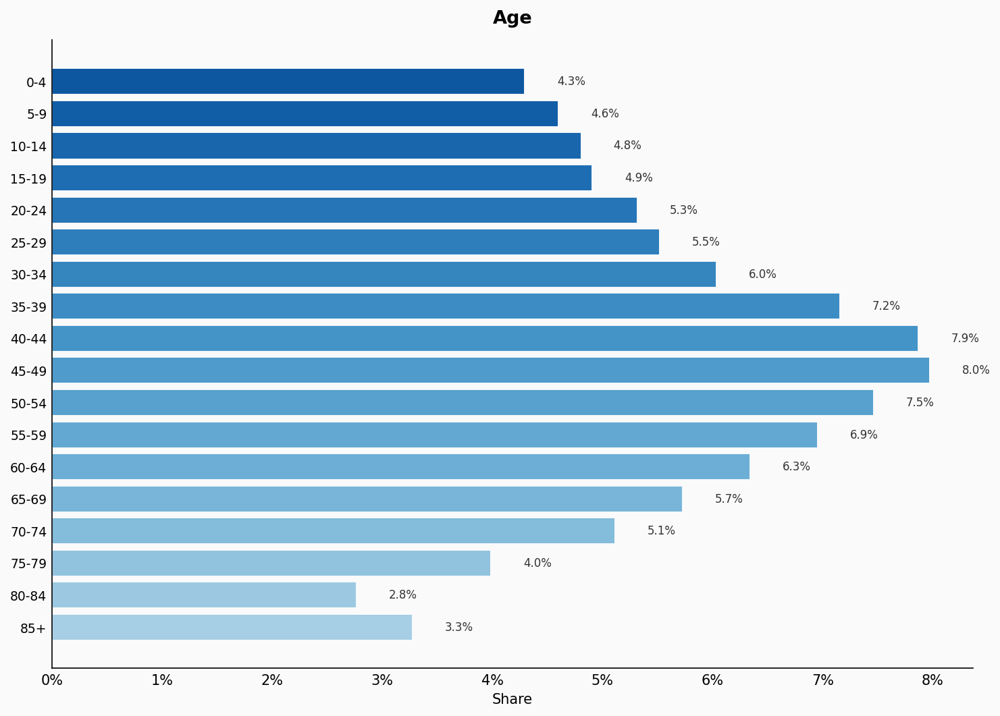

| Option | Share |
|---|---:|
| 0-4 | 4.3% |
| 5-9 | 4.6% |
| 10-14 | 4.8% |
| 15-19 | 4.9% |
| 20-24 | 5.3% |
| 25-29 | 5.5% |
| 30-34 | 6.0% |
| 35-39 | 7.2% |
| 40-44 | 7.9% |
| 45-49 | 8.0% |
| 50-54 | 7.5% |
| 55-59 | 6.9% |
| 60-64 | 6.3% |
| 65-69 | 5.7% |
| 70-74 | 5.1% |
| 75-79 | 4.0% |
| 80-84 | 2.8% |
| 85+ | 3.3% |

## Sex

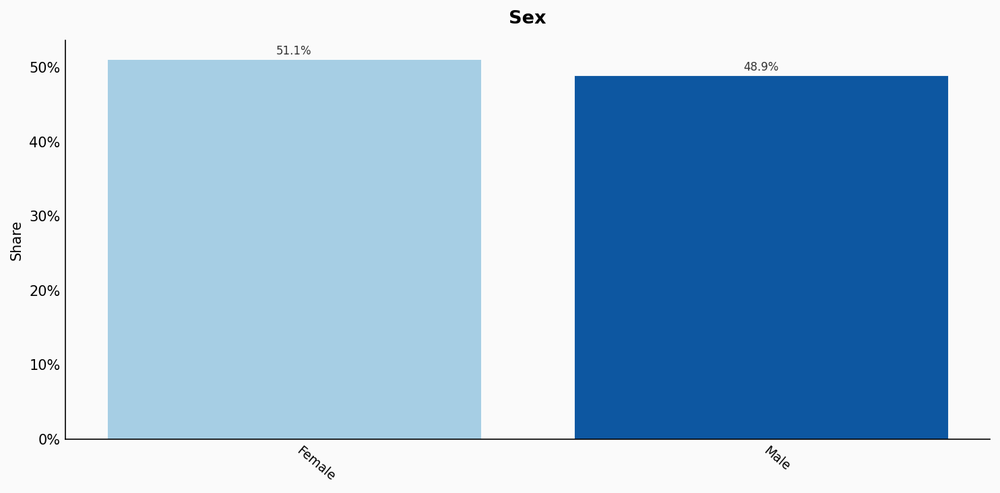

| Option | Share |
|---|---:|
| Female | 51.1% |
| Male | 48.9% |

## Location

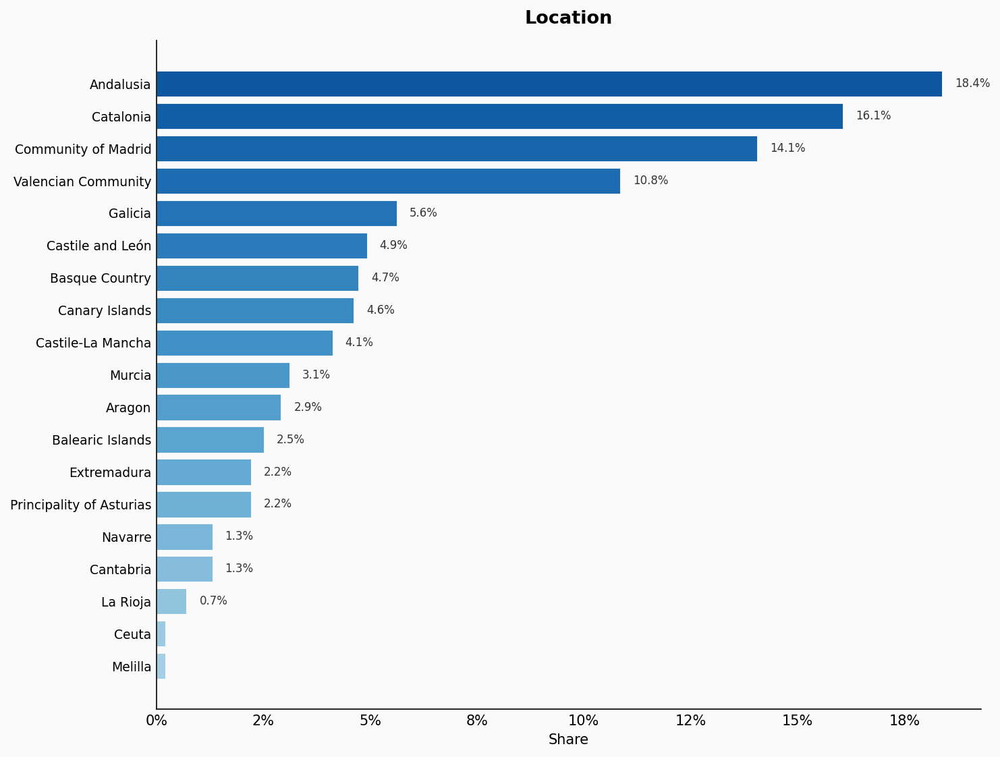

| Option | Share |
|---|---:|
| Andalusia | 18.4% |
| Catalonia | 16.1% |
| Community of Madrid | 14.1% |
| Valencian Community | 10.8% |
| Galicia | 5.6% |
| Castile and León | 4.9% |
| Basque Country | 4.7% |
| Canary Islands | 4.6% |
| Castile-La Mancha | 4.1% |
| Murcia | 3.1% |
| Aragon | 2.9% |
| Balearic Islands | 2.5% |
| Extremadura | 2.2% |
| Principality of Asturias | 2.2% |
| Navarre | 1.3% |
| Cantabria | 1.3% |
| La Rioja | 0.7% |
| Ceuta | 0.2% |
| Melilla | 0.2% |

## Religion

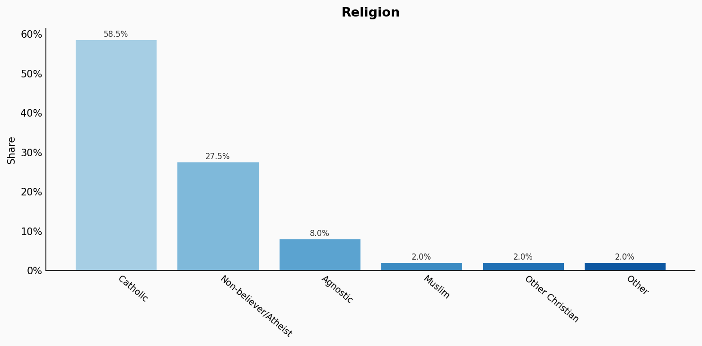

| Option | Share |
|---|---:|
| Catholic | 58.5% |
| Non-believer/Atheist | 27.5% |
| Agnostic | 8.0% |
| Muslim | 2.0% |
| Other Christian | 2.0% |
| Other | 2.0% |

## Language

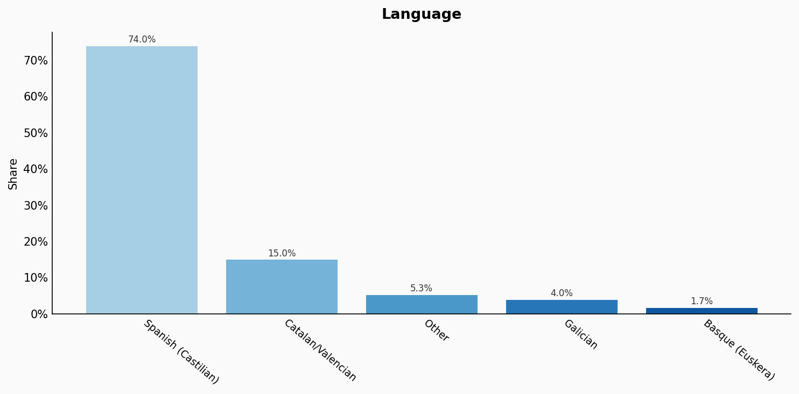

| Option | Share |
|---|---:|
| Spanish (Castilian) | 74.0% |
| Catalan/Valencian | 15.0% |
| Other | 5.3% |
| Galician | 4.0% |
| Basque (Euskera) | 1.7% |

## Marital Status

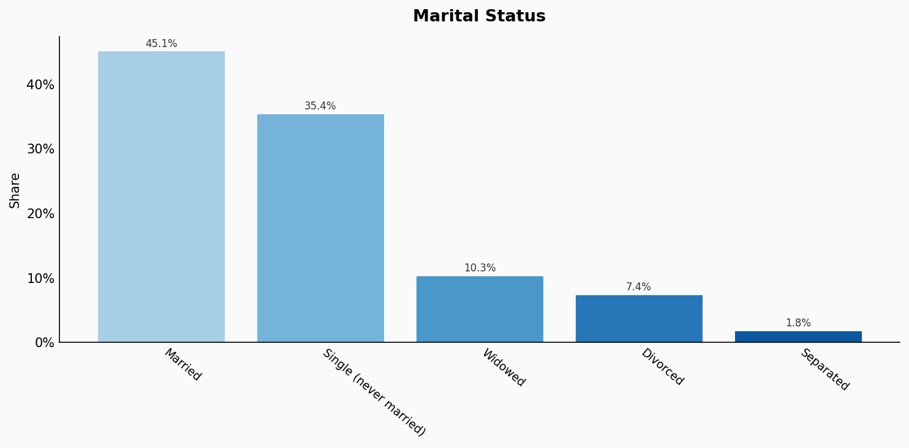

| Option | Share |
|---|---:|
| Married | 45.1% |
| Single (never married) | 35.4% |
| Widowed | 10.3% |
| Divorced | 7.4% |
| Separated | 1.8% |

## Education

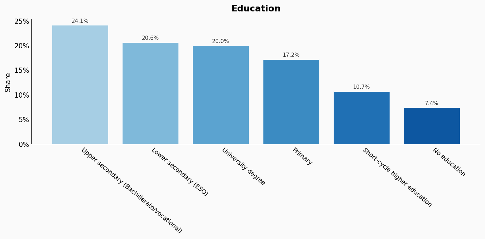

| Option | Share |
|---|---:|
| Upper secondary (Bachillerato/vocational) | 24.1% |
| Lower secondary (ESO) | 20.6% |
| University degree | 20.0% |
| Primary | 17.2% |
| Short-cycle higher education | 10.7% |
| No education | 7.4% |

## Occupation

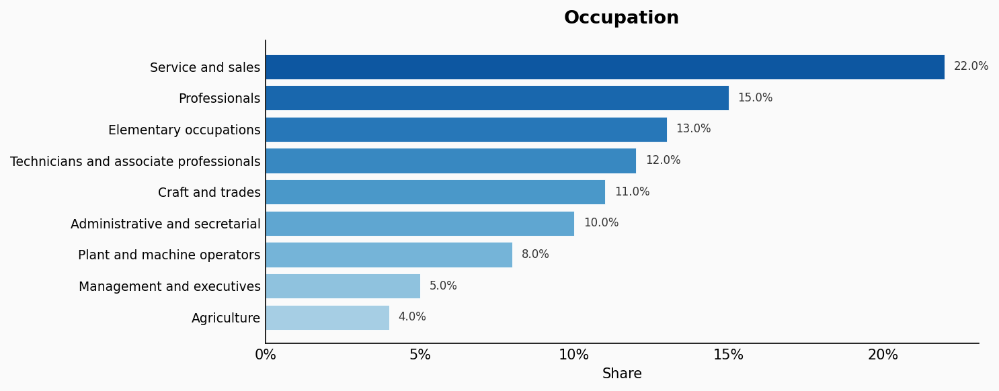

| Option | Share |
|---|---:|
| Service and sales | 22.0% |
| Professionals | 15.0% |
| Elementary occupations | 13.0% |
| Technicians and associate professionals | 12.0% |
| Craft and trades | 11.0% |
| Administrative and secretarial | 10.0% |
| Plant and machine operators | 8.0% |
| Management and executives | 5.0% |
| Agriculture | 4.0% |

## Housing Tenure

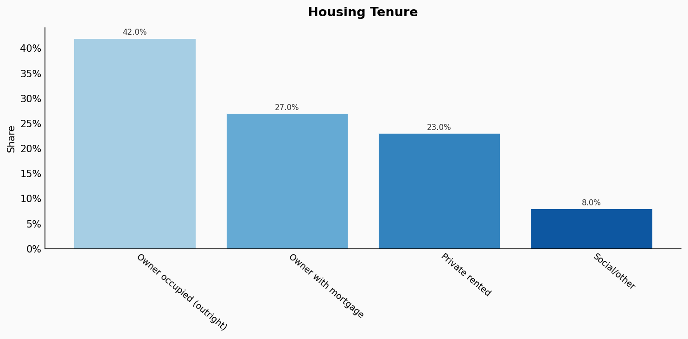

| Option | Share |
|---|---:|
| Owner occupied (outright) | 42.0% |
| Owner with mortgage | 27.0% |
| Private rented | 23.0% |
| Social/other | 8.0% |

## Place Of Birth

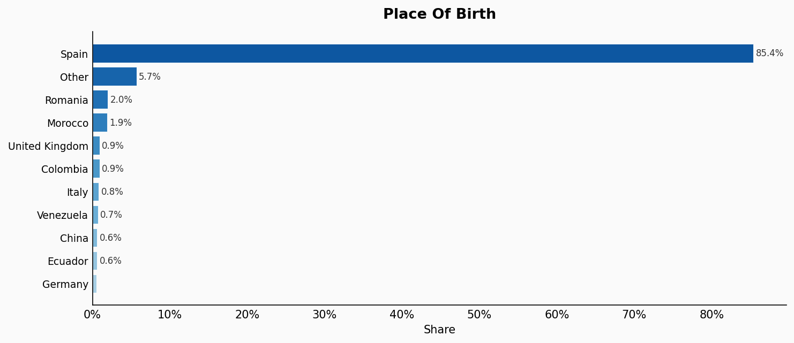

| Option | Share |
|---|---:|
| Spain | 85.4% |
| Other | 5.7% |
| Romania | 2.0% |
| Morocco | 1.9% |
| United Kingdom | 0.9% |
| Colombia | 0.9% |
| Italy | 0.8% |
| Venezuela | 0.7% |
| China | 0.6% |
| Ecuador | 0.6% |
| Germany | 0.5% |

## Sexuality

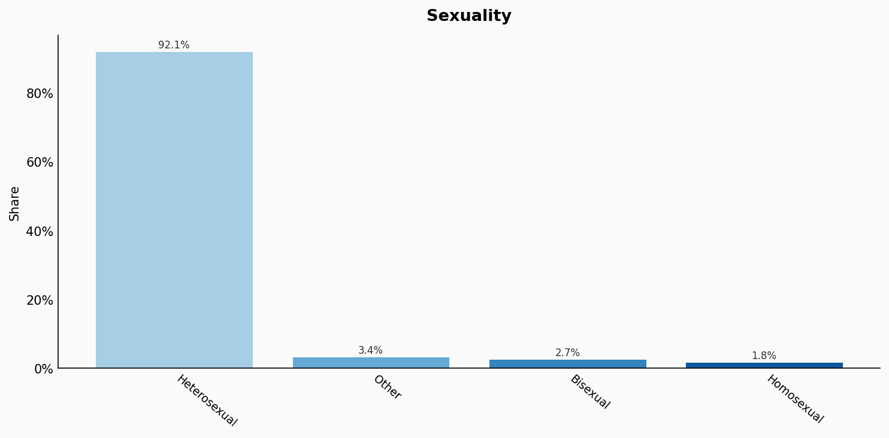

| Option | Share |
|---|---:|
| Heterosexual | 92.1% |
| Other | 3.4% |
| Bisexual | 2.7% |
| Homosexual | 1.8% |

## Sources

- [Estadística del Padrón Continuo 2022, INE (2022)](https://www.ine.es/dyngs/INEbase/es/operacion.htm?c=Estadistica_C&cid=1254736177012&menu=ultiDatos&idp=1254734710990)
  *Covers: `age`, `sex`, `marital status`, `location`*
- [Encuesta de Población Activa 2022, INE (2022)](https://www.ine.es/dyngs/INEbase/es/operacion.htm?c=Estadistica_C&cid=1254736176918&menu=ultiDatos&idp=1254735976595)
  *Covers: `education`, `occupation`, `housing tenure`*
- [Barómetro del CIS, Centro de Investigaciones Sociológicas (2022)](https://www.cis.es/cis/opencms/ES/NoticiasNovedades/2022/barometro_octubre_2022.html)
  *Covers: `religion`*
- [Encuesta sobre el uso de lenguas en España, INE (2022)](https://www.ine.es/prensa/ule_2022.pdf)
  *Covers: `language`*
- [Estadística de Migraciones 2022, INE (2022)](https://www.ine.es/dyngs/INEbase/es/operacion.htm?c=Estadistica_C&cid=1254736177000&menu=ultiDatos&idp=1254735573002)
  *Covers: `place of birth`*
- [Barómetro del CIS - Orientación sexual, CIS (2021)](https://www.cis.es/cis/export/sites/default/-Archivos/Marginales/3320_3339/3321/es3321.pdf)
  *Covers: `sexuality`*