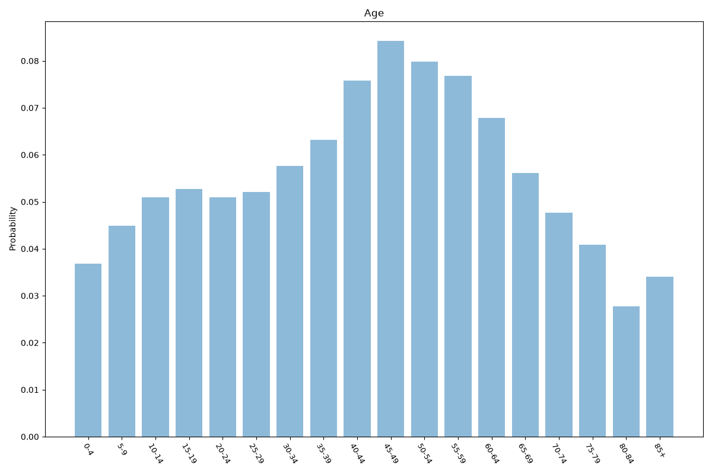
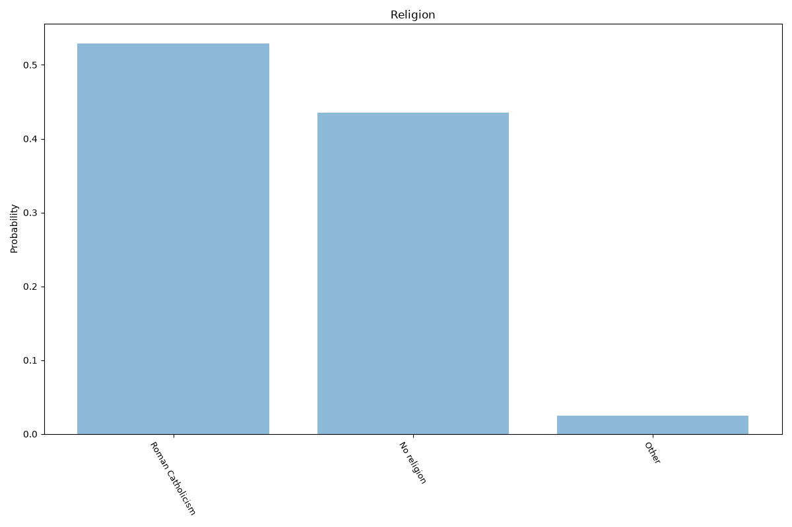
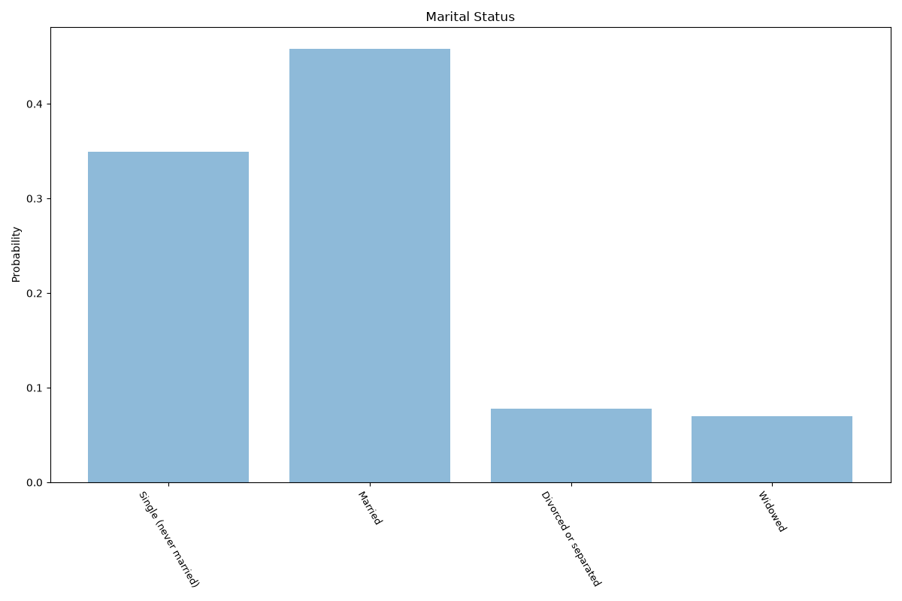
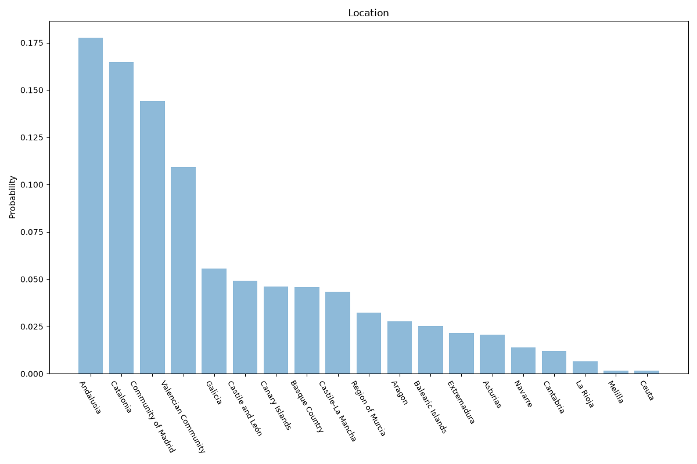

# Spain
**5 features:** age, sex, religion, marital status and location.

## Age

## Sex

## Religion

## Marital Status

## Location

## Sources

- [World Population Prospects 2024, United Nations (2024)](https://population.un.org/wpp/) — age, sex
- [Cifras oficiales de población (Padrón municipal), Instituto Nacional de Estadística (INE) (2024)](https://www.ine.es/) — location
- [Barómetro de julio de 2023, Centro de Investigaciones Sociológicas (CIS) (2023)](https://www.cis.es/) — religion
- [Censo Anual de Población 2025, INE (2025)](https://www.ine.es/dyngs/Prensa/en/CensoVariables2025.htm) — marital status