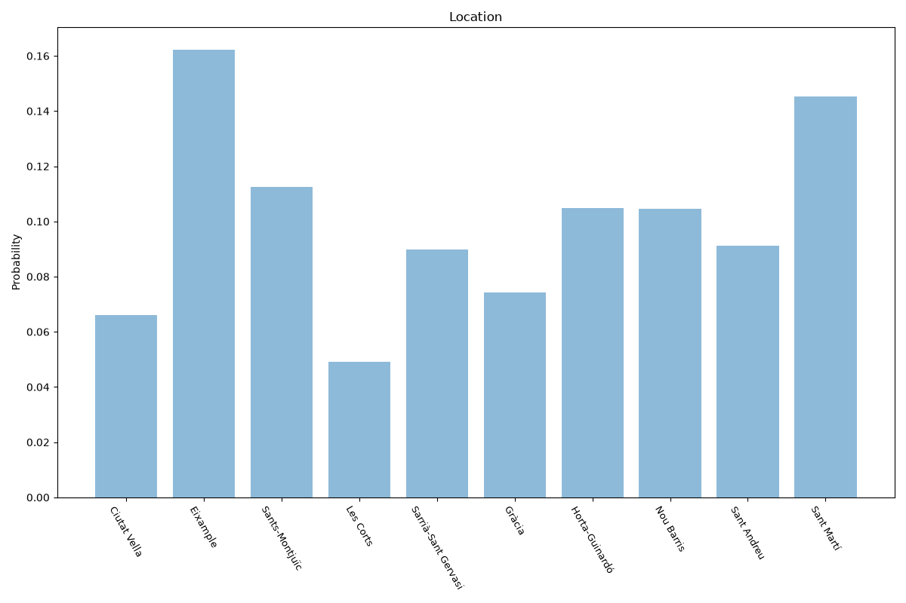

# Barcelona
**2 features:** location and residence.

## Location

## Residence

## Sources

- [Lectura del Padró municipal d'habitants, Ajuntament de Barcelona (2021)](https://www.idescat.cat/) — location
- [World Urbanization Prospects 2018, United Nations (2018)](https://population.un.org/wup/) — residence