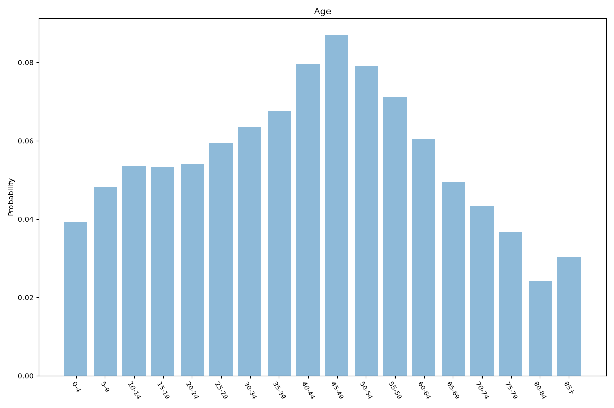
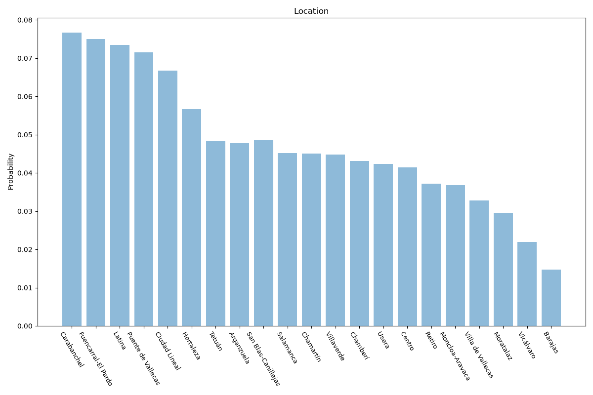

# Madrid
**3 features:** age, residence and location.

## Age

## Residence

## Location

## Sources

- [Population by age, Comunidad de Madrid (NUTS 2 ES30), Eurostat (2023)](https://ec.europa.eu/eurostat) — age
- [Padrón municipal (Madrid districts), Instituto Nacional de Estadística (INE) (2017)](https://www.ine.es/) — location
- [World Urbanization Prospects 2018, United Nations (2018)](https://population.un.org/wup/) — residence