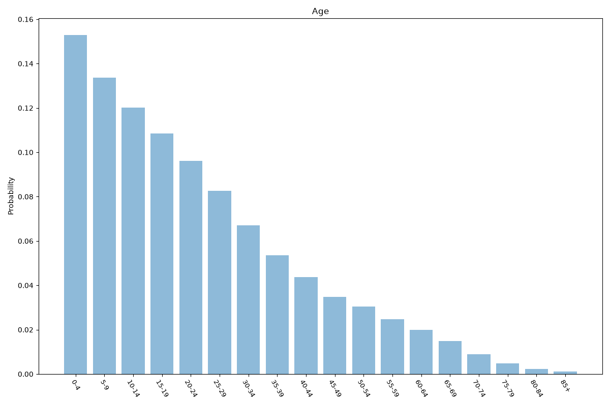
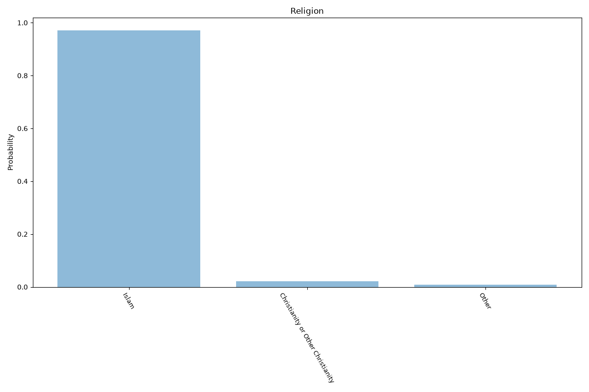
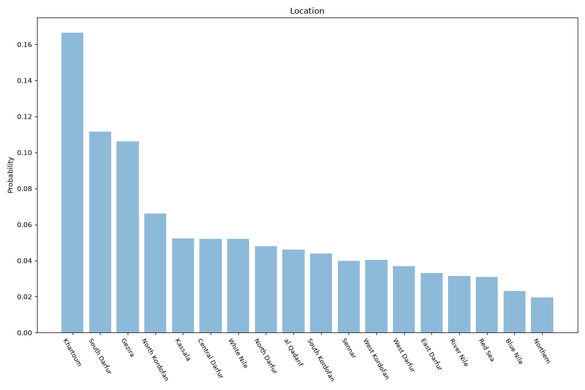

# Sudan
**4 features:** age, sex, religion and location.

## Age

## Sex

## Religion

## Location

## Sources

- [World Population Prospects 2024, United Nations (2024)](https://population.un.org/wpp/) — age, sex
- [Afrobarometer (2021)](https://www.afrobarometer.org/) — religion
- [Population projections 2018, Central Bureau of Statistics (Sudan) (2018)](https://cbs.gov.sd/) — location