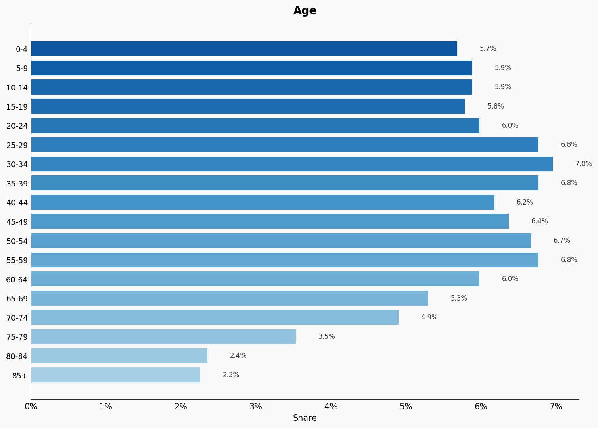
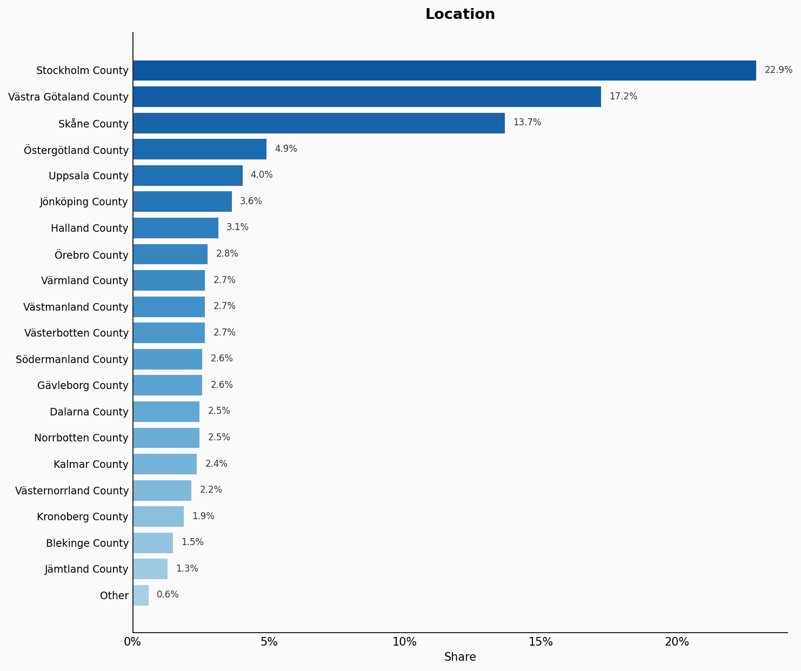
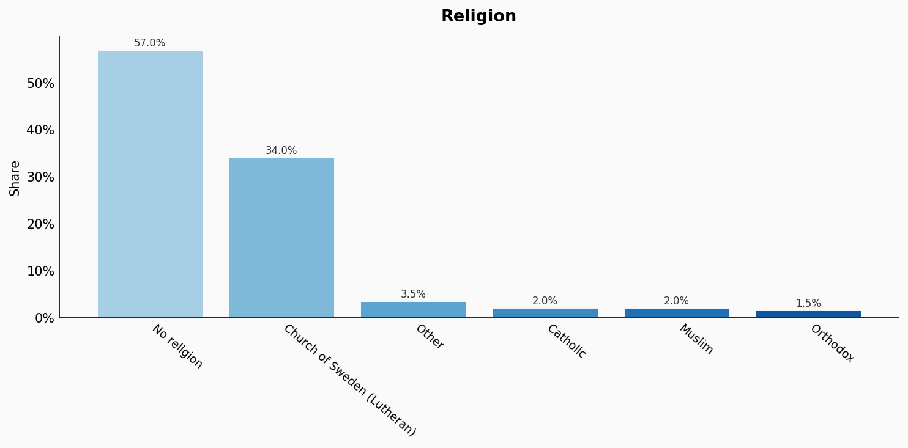
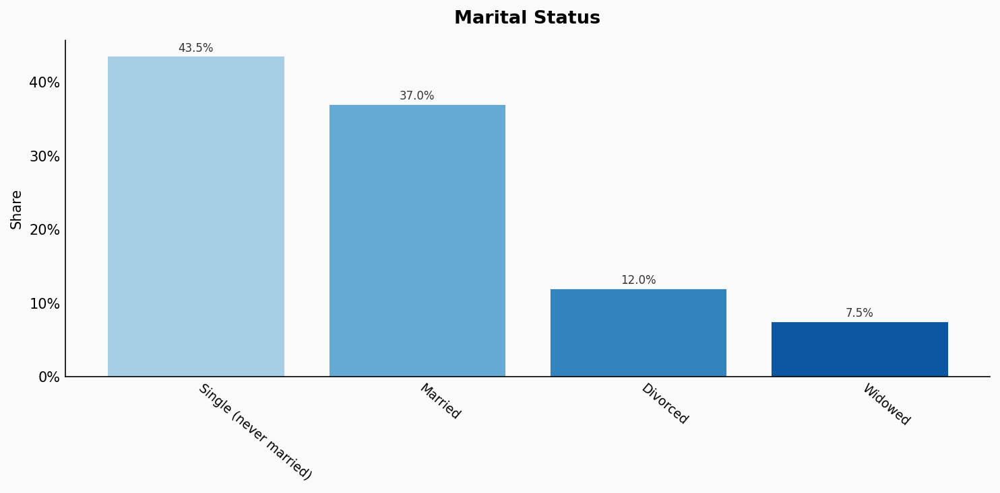
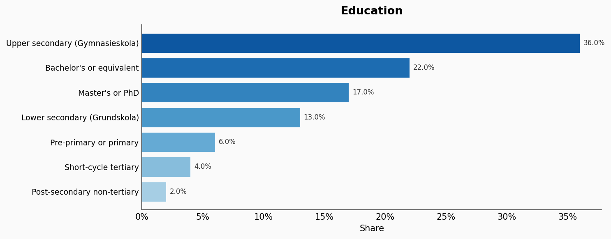
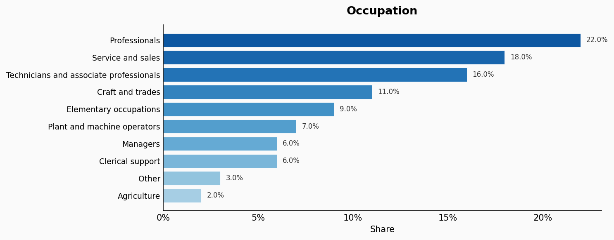
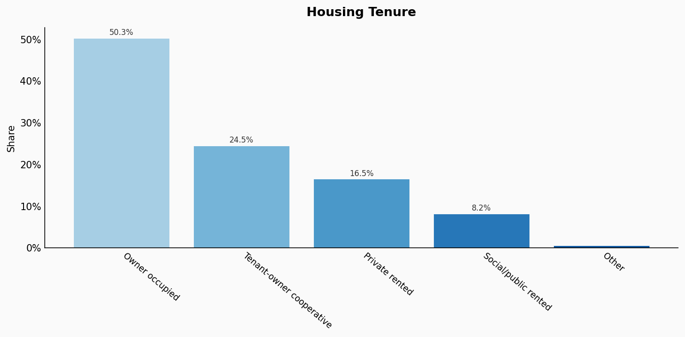
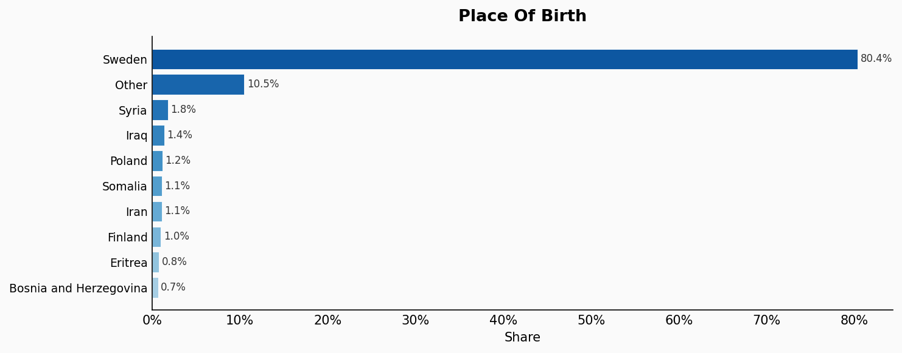
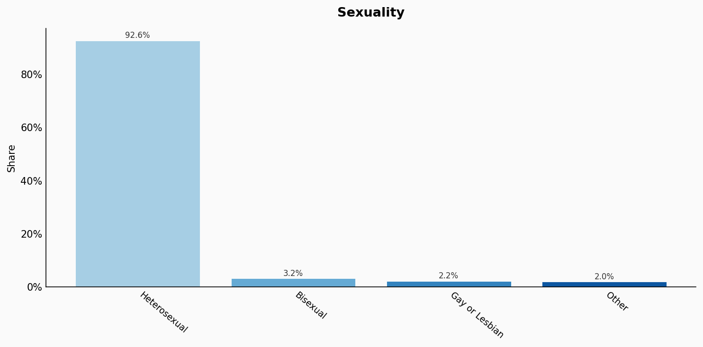

# Sweden

**11 features:** age, sex, location, religion, language, marital status, education, occupation, housing tenure, place of birth, and sexuality.

## Age

| Option | Share |
|---|---:|
| 0-4 | 5.7% |
| 5-9 | 5.9% |
| 10-14 | 5.9% |
| 15-19 | 5.8% |
| 20-24 | 6.0% |
| 25-29 | 6.8% |
| 30-34 | 7.0% |
| 35-39 | 6.8% |
| 40-44 | 6.2% |
| 45-49 | 6.4% |
| 50-54 | 6.7% |
| 55-59 | 6.8% |
| 60-64 | 6.0% |
| 65-69 | 5.3% |
| 70-74 | 4.9% |
| 75-79 | 3.5% |
| 80-84 | 2.4% |
| 85+ | 2.3% |

## Sex

| Option | Share |
|---|---:|
| Male | 50.1% |
| Female | 49.9% |

## Location

| Option | Share |
|---|---:|
| Stockholm County | 22.9% |
| Västra Götaland County | 17.2% |
| Skåne County | 13.7% |
| Östergötland County | 4.9% |
| Uppsala County | 4.0% |
| Jönköping County | 3.6% |
| Halland County | 3.1% |
| Örebro County | 2.8% |
| Värmland County | 2.7% |
| Västmanland County | 2.7% |
| Västerbotten County | 2.7% |
| Södermanland County | 2.6% |
| Gävleborg County | 2.6% |
| Dalarna County | 2.5% |
| Norrbotten County | 2.5% |
| Kalmar County | 2.4% |
| Västernorrland County | 2.2% |
| Kronoberg County | 1.9% |
| Blekinge County | 1.5% |
| Jämtland County | 1.3% |
| Other | 0.6% |

## Religion

| Option | Share |
|---|---:|
| No religion | 57.0% |
| Church of Sweden (Lutheran) | 34.0% |
| Other | 3.5% |
| Catholic | 2.0% |
| Muslim | 2.0% |
| Orthodox | 1.5% |

## Language

| Option | Share |
|---|---:|
| Swedish | 88.0% |
| Other | 4.5% |
| Arabic | 2.2% |
| Persian/Dari | 1.0% |
| Somali | 1.0% |
| Finnish | 1.0% |
| Polish | 0.9% |
| Kurdish | 0.7% |
| Tigrinya | 0.7% |

## Marital Status

| Option | Share |
|---|---:|
| Single (never married) | 43.5% |
| Married | 37.0% |
| Divorced | 12.0% |
| Widowed | 7.5% |

## Education

| Option | Share |
|---|---:|
| Upper secondary (Gymnasieskola) | 36.0% |
| Bachelor's or equivalent | 22.0% |
| Master's or PhD | 17.0% |
| Lower secondary (Grundskola) | 13.0% |
| Pre-primary or primary | 6.0% |
| Short-cycle tertiary | 4.0% |
| Post-secondary non-tertiary | 2.0% |

## Occupation

| Option | Share |
|---|---:|
| Professionals | 22.0% |
| Service and sales | 18.0% |
| Technicians and associate professionals | 16.0% |
| Craft and trades | 11.0% |
| Elementary occupations | 9.0% |
| Plant and machine operators | 7.0% |
| Managers | 6.0% |
| Clerical support | 6.0% |
| Other | 3.0% |
| Agriculture | 2.0% |

## Housing Tenure

| Option | Share |
|---|---:|
| Owner occupied | 50.3% |
| Tenant-owner cooperative | 24.5% |
| Private rented | 16.5% |
| Social/public rented | 8.2% |
| Other | 0.5% |

## Place Of Birth

| Option | Share |
|---|---:|
| Sweden | 80.4% |
| Other | 10.5% |
| Syria | 1.8% |
| Iraq | 1.4% |
| Poland | 1.2% |
| Somalia | 1.1% |
| Iran | 1.1% |
| Finland | 1.0% |
| Eritrea | 0.8% |
| Bosnia and Herzegovina | 0.7% |

## Sexuality

| Option | Share |
|---|---:|
| Heterosexual | 92.6% |
| Bisexual | 3.2% |
| Gay or Lesbian | 2.2% |
| Other | 2.0% |

## Sources

- [Befolkningsstatistik 2022, Statistiska centralbyrån (SCB) (2022)](https://www.scb.se/hitta-statistik/statistik-efter-amne/befolkning/befolkningens-sammansattning/befolkningsstatistik/)
  *Covers: `age`, `sex`, `marital status`, `location`, `place of birth`*
- [Arbetskraftsundersökning 2022, SCB (2022)](https://www.scb.se/hitta-statistik/statistik-efter-amne/arbetsmarknad/arbetskraftsundersokningar/arbetskraftsundersokningarna-aku/)
  *Covers: `education`, `occupation`, `housing tenure`*
- [Trossamfund och religiös tillhörighet, SCB (2021)](https://www.scb.se/hitta-statistik/statistik-efter-amne/demokrati/val-till-riksdag-landsting-och-kommun/val-till-riksdagen/)
  *Covers: `religion`*
- [Hälsa på lika villkor, Folkhälsomyndigheten (2022)](https://www.folkhalsomyndigheten.se/folkhalsorapportering-statistik/statistikdatabaser-och-visualisering/nationella-folkhalsoenkaten/halsa-pa-lika-villkor/)
  *Covers: `sexuality`*