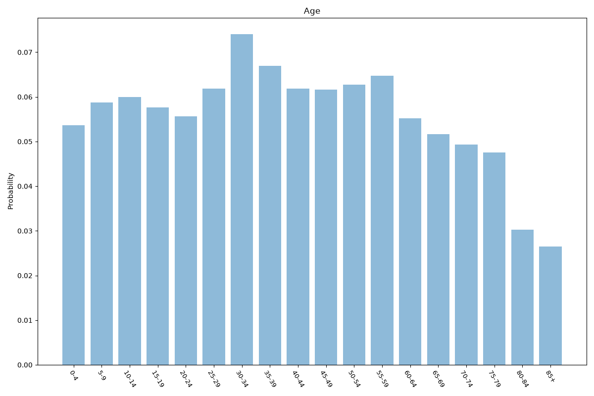
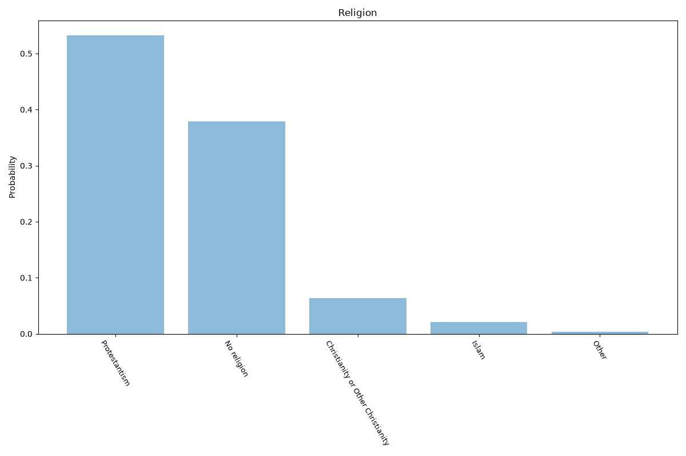
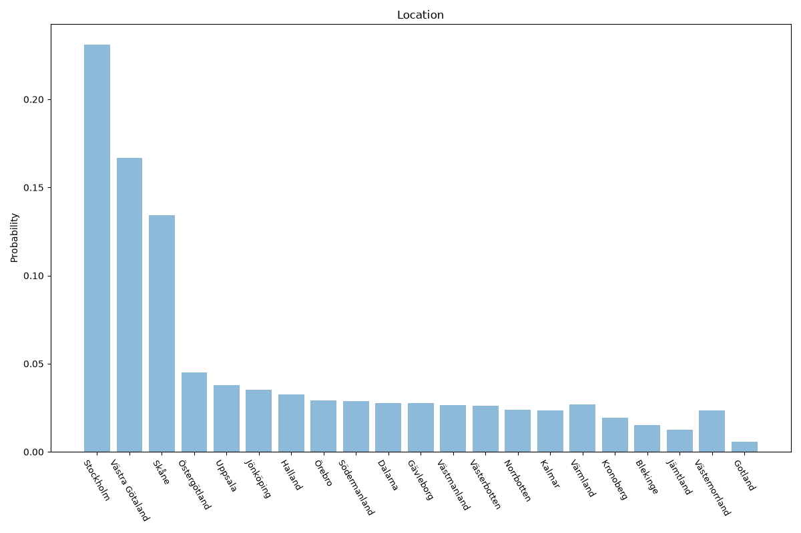

# Sweden
**4 features:** age, sex, religion and location.

## Age

## Sex

## Religion

## Location

## Sources

- [World Population Prospects 2024, United Nations (2024)](https://population.un.org/wpp/) — age, sex
- [Religious affiliation estimates (Church of Sweden membership and survey data) (2021)](https://www.svenskakyrkan.se/statistik) — religion
- [Population by county 2021, Statistics Sweden (SCB) (2021)](https://www.scb.se/en/) — location