# Switzerland

**11 features:** age, sex, location, religion, language, marital status, education, occupation, housing tenure, place of birth, and sexuality.

## Age

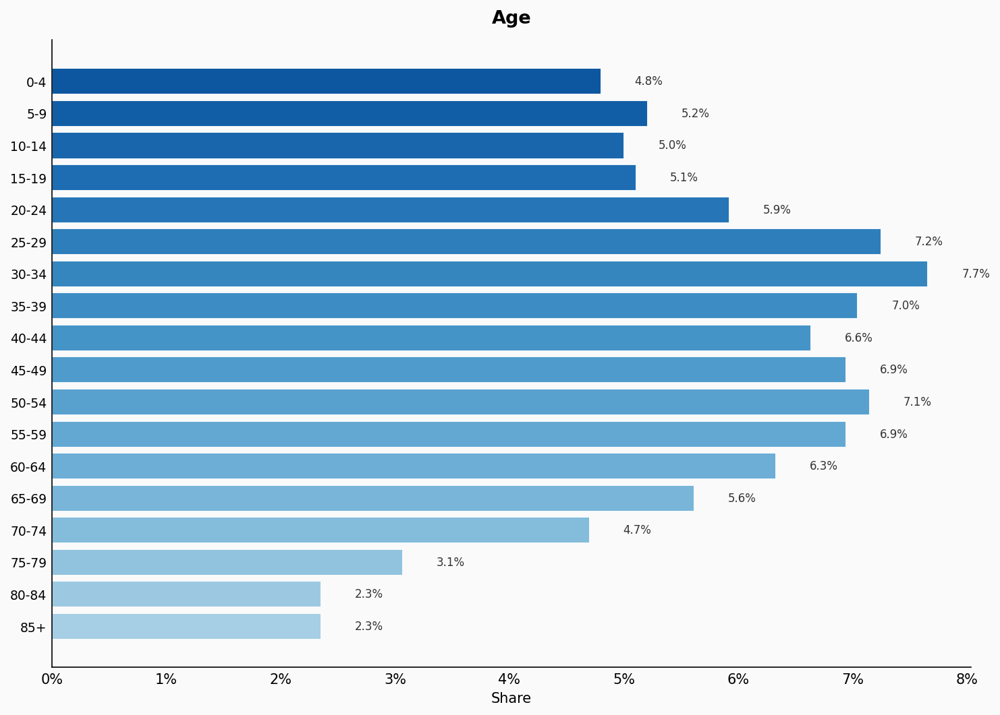

| Option | Share |
|---|---:|
| 0-4 | 4.8% |
| 5-9 | 5.2% |
| 10-14 | 5.0% |
| 15-19 | 5.1% |
| 20-24 | 5.9% |
| 25-29 | 7.2% |
| 30-34 | 7.7% |
| 35-39 | 7.0% |
| 40-44 | 6.6% |
| 45-49 | 6.9% |
| 50-54 | 7.1% |
| 55-59 | 6.9% |
| 60-64 | 6.3% |
| 65-69 | 5.6% |
| 70-74 | 4.7% |
| 75-79 | 3.1% |
| 80-84 | 2.3% |
| 85+ | 2.3% |

## Sex

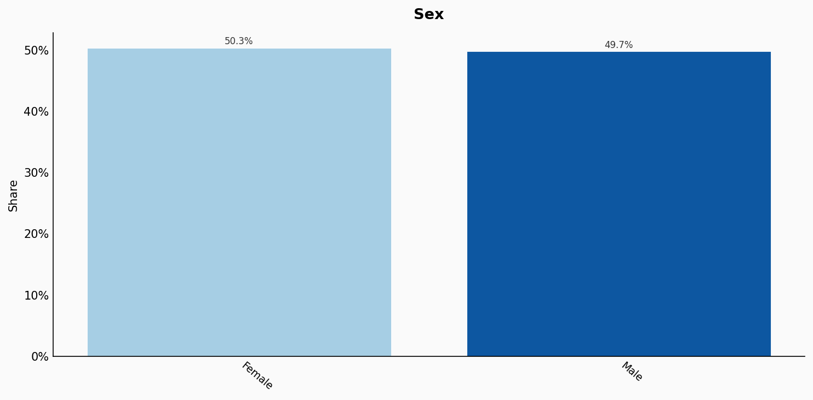

| Option | Share |
|---|---:|
| Female | 50.3% |
| Male | 49.7% |

## Location

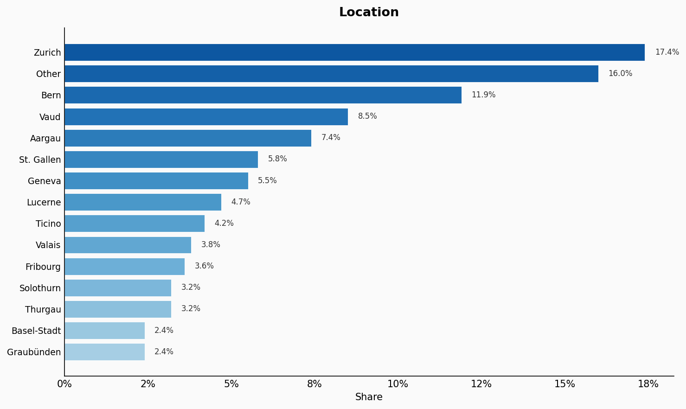

| Option | Share |
|---|---:|
| Zurich | 17.4% |
| Other | 16.0% |
| Bern | 11.9% |
| Vaud | 8.5% |
| Aargau | 7.4% |
| St. Gallen | 5.8% |
| Geneva | 5.5% |
| Lucerne | 4.7% |
| Ticino | 4.2% |
| Valais | 3.8% |
| Fribourg | 3.6% |
| Solothurn | 3.2% |
| Thurgau | 3.2% |
| Basel-Stadt | 2.4% |
| Graubünden | 2.4% |

## Religion

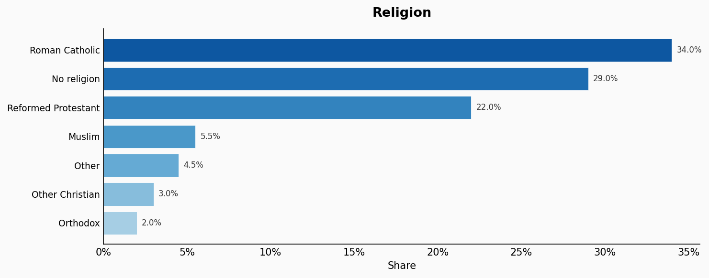

| Option | Share |
|---|---:|
| Roman Catholic | 34.0% |
| No religion | 29.0% |
| Reformed Protestant | 22.0% |
| Muslim | 5.5% |
| Other | 4.5% |
| Other Christian | 3.0% |
| Orthodox | 2.0% |

## Language

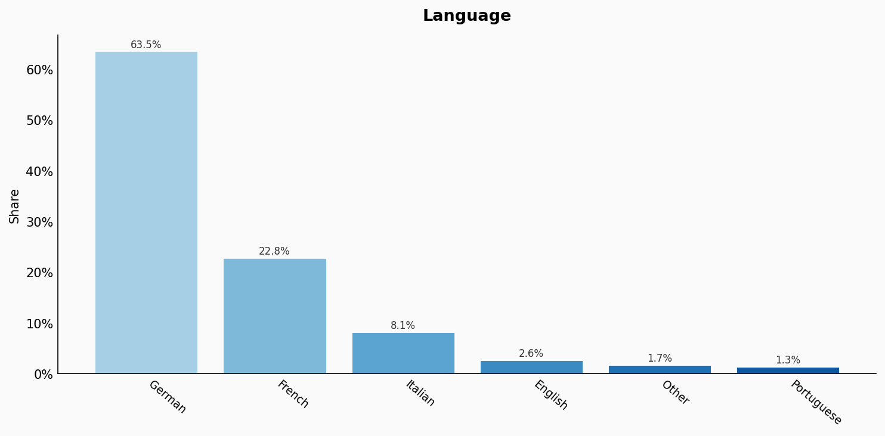

| Option | Share |
|---|---:|
| German | 63.5% |
| French | 22.8% |
| Italian | 8.1% |
| English | 2.6% |
| Other | 1.7% |
| Portuguese | 1.3% |

## Marital Status

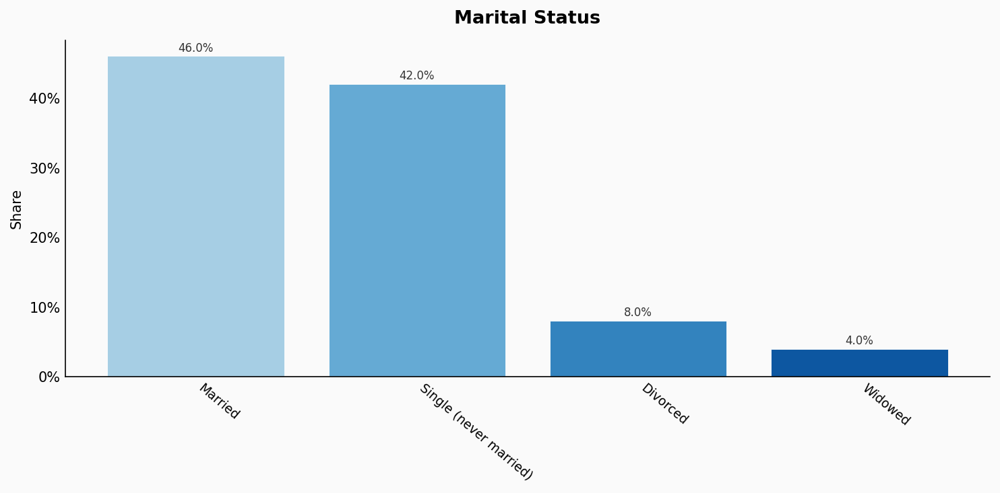

| Option | Share |
|---|---:|
| Married | 46.0% |
| Single (never married) | 42.0% |
| Divorced | 8.0% |
| Widowed | 4.0% |

## Education

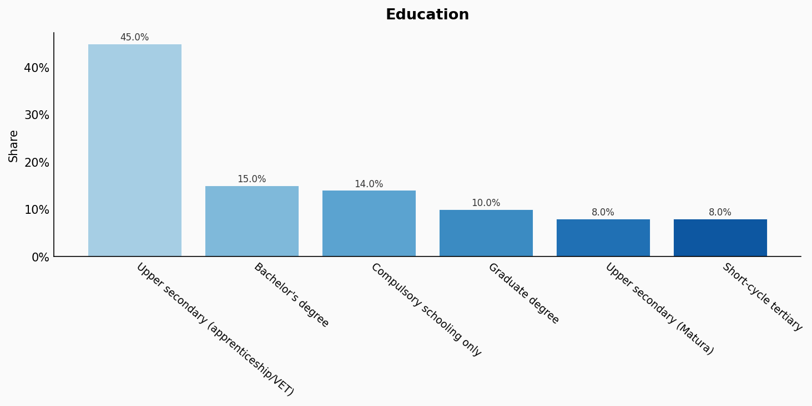

| Option | Share |
|---|---:|
| Upper secondary (apprenticeship/VET) | 45.0% |
| Bachelor's degree | 15.0% |
| Compulsory schooling only | 14.0% |
| Graduate degree | 10.0% |
| Upper secondary (Matura) | 8.0% |
| Short-cycle tertiary | 8.0% |

## Occupation

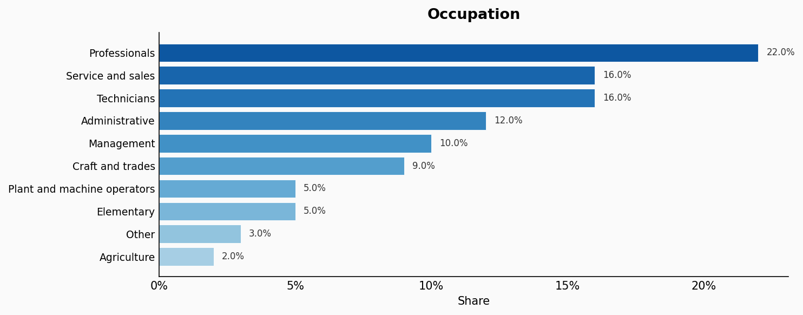

| Option | Share |
|---|---:|
| Professionals | 22.0% |
| Service and sales | 16.0% |
| Technicians | 16.0% |
| Administrative | 12.0% |
| Management | 10.0% |
| Craft and trades | 9.0% |
| Plant and machine operators | 5.0% |
| Elementary | 5.0% |
| Other | 3.0% |
| Agriculture | 2.0% |

## Housing Tenure

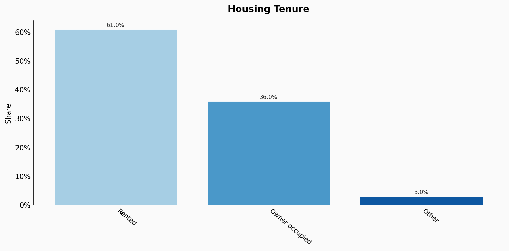

| Option | Share |
|---|---:|
| Rented | 61.0% |
| Owner occupied | 36.0% |
| Other | 3.0% |

## Place Of Birth

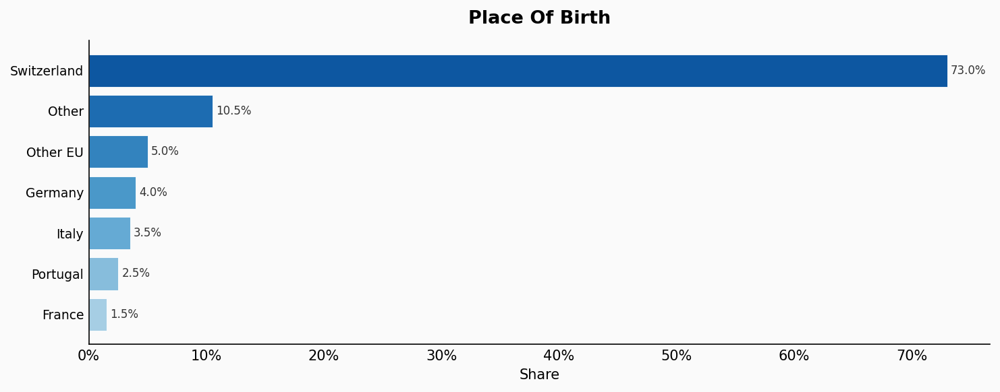

| Option | Share |
|---|---:|
| Switzerland | 73.0% |
| Other | 10.5% |
| Other EU | 5.0% |
| Germany | 4.0% |
| Italy | 3.5% |
| Portugal | 2.5% |
| France | 1.5% |

## Sexuality

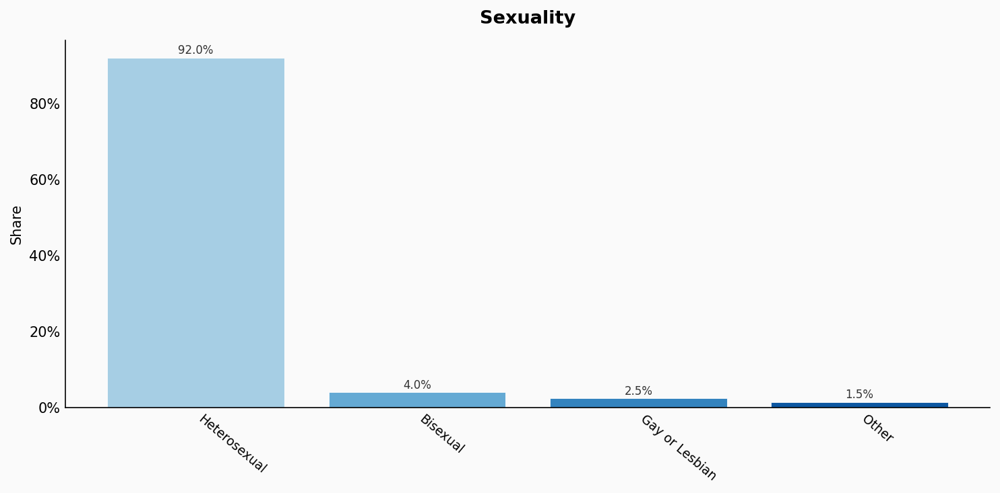

| Option | Share |
|---|---:|
| Heterosexual | 92.0% |
| Bisexual | 4.0% |
| Gay or Lesbian | 2.5% |
| Other | 1.5% |

## Sources

- [Strukturerhebung / Recensement de la population 2021, FSO Switzerland (2021)](https://www.bfs.admin.ch/bfs/en/home/statistics/population/surveys/se.html)
  *Covers: `age`, `sex`, `location`, `marital status`, `housing tenure`, `place of birth`*
- [Schweizerische Arbeitskräfteerhebung (SAKE) 2022, FSO Switzerland (2022)](https://www.bfs.admin.ch/bfs/en/home/statistics/work-income/surveys/sake.html)
  *Covers: `education`, `occupation`*
- [Sprachenerhebung 2021, FSO Switzerland (2021)](https://www.bfs.admin.ch/bfs/en/home/statistics/population/languages-religions/languages.html)
  *Covers: `language`*
- [Strukturerhebung - Religion 2020, FSO Switzerland (2020)](https://www.bfs.admin.ch/bfs/en/home/statistics/population/languages-religions/religions.html)
  *Covers: `religion`*
- [Eurobarometer Special Survey on Discrimination 2019, European Commission (2019)](https://europa.eu/eurobarometer/surveys/detail/2251)
  *Covers: `sexuality`*