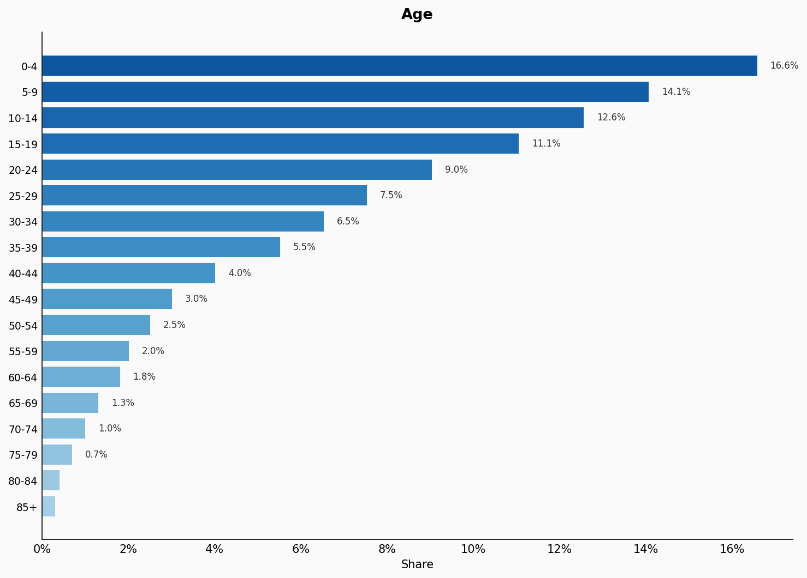
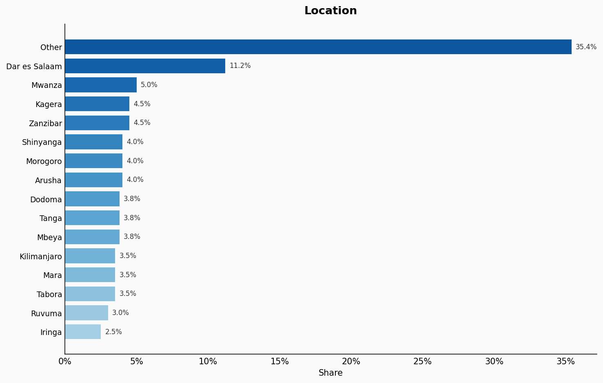
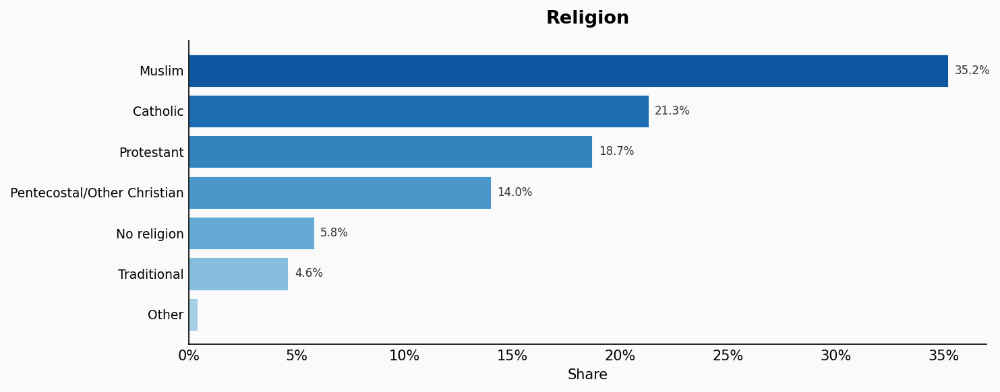
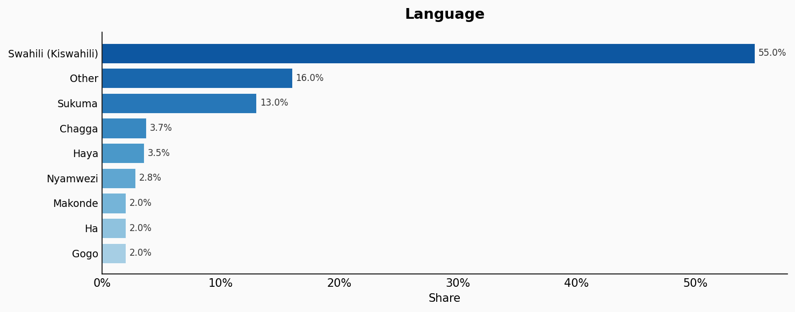
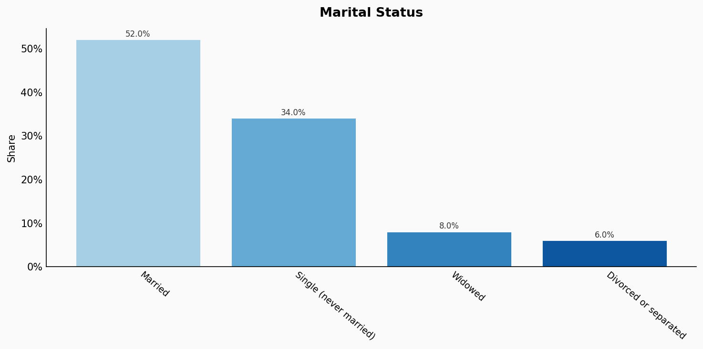
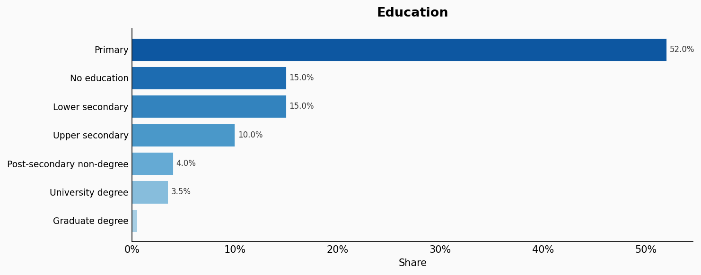
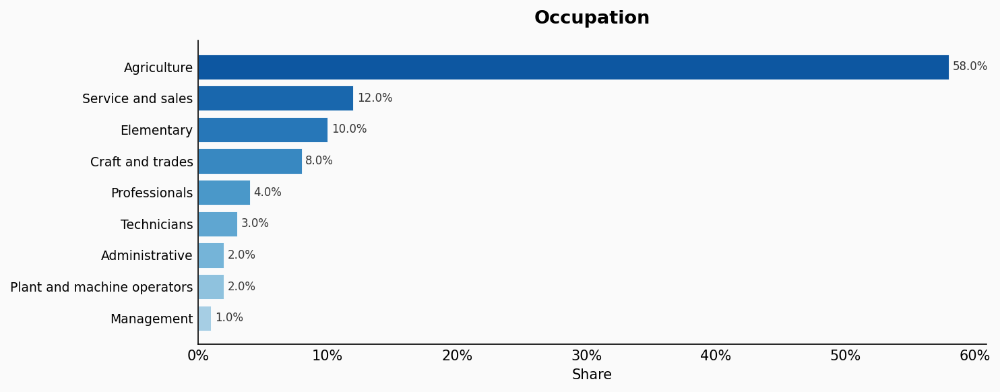
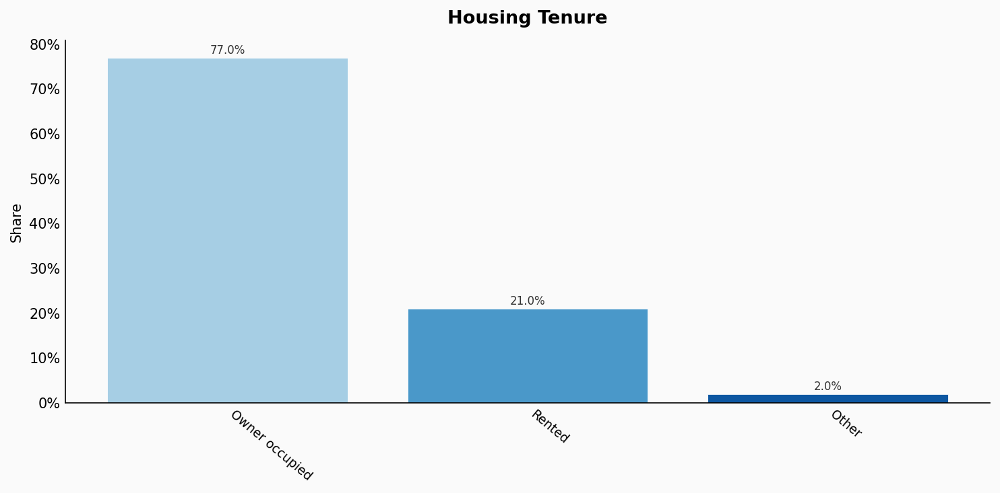
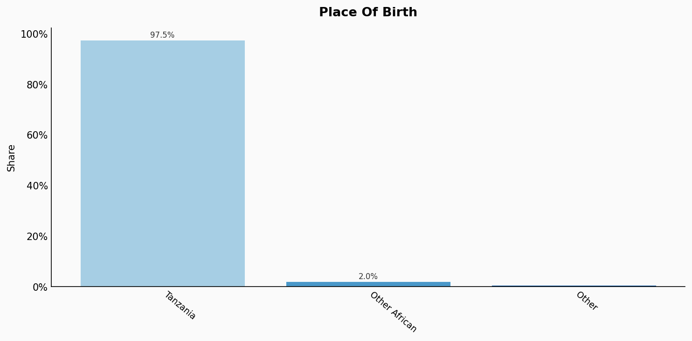

# Tanzania

**11 features:** age, sex, location, religion, language, marital status, education, occupation, housing tenure, place of birth, and sexuality.

## Age

| Option | Share |
|---|---:|
| 0-4 | 16.6% |
| 5-9 | 14.1% |
| 10-14 | 12.6% |
| 15-19 | 11.1% |
| 20-24 | 9.0% |
| 25-29 | 7.5% |
| 30-34 | 6.5% |
| 35-39 | 5.5% |
| 40-44 | 4.0% |
| 45-49 | 3.0% |
| 50-54 | 2.5% |
| 55-59 | 2.0% |
| 60-64 | 1.8% |
| 65-69 | 1.3% |
| 70-74 | 1.0% |
| 75-79 | 0.7% |
| 80-84 | 0.4% |
| 85+ | 0.3% |

## Sex

| Option | Share |
|---|---:|
| Female | 50.9% |
| Male | 49.1% |

## Location

| Option | Share |
|---|---:|
| Other | 35.4% |
| Dar es Salaam | 11.2% |
| Mwanza | 5.0% |
| Kagera | 4.5% |
| Zanzibar | 4.5% |
| Shinyanga | 4.0% |
| Morogoro | 4.0% |
| Arusha | 4.0% |
| Dodoma | 3.8% |
| Tanga | 3.8% |
| Mbeya | 3.8% |
| Kilimanjaro | 3.5% |
| Mara | 3.5% |
| Tabora | 3.5% |
| Ruvuma | 3.0% |
| Iringa | 2.5% |

## Religion

| Option | Share |
|---|---:|
| Muslim | 35.2% |
| Catholic | 21.3% |
| Protestant | 18.7% |
| Pentecostal/Other Christian | 14.0% |
| No religion | 5.8% |
| Traditional | 4.6% |
| Other | 0.4% |

## Language

| Option | Share |
|---|---:|
| Swahili (Kiswahili) | 55.0% |
| Other | 16.0% |
| Sukuma | 13.0% |
| Chagga | 3.7% |
| Haya | 3.5% |
| Nyamwezi | 2.8% |
| Makonde | 2.0% |
| Ha | 2.0% |
| Gogo | 2.0% |

## Marital Status

| Option | Share |
|---|---:|
| Married | 52.0% |
| Single (never married) | 34.0% |
| Widowed | 8.0% |
| Divorced or separated | 6.0% |

## Education

| Option | Share |
|---|---:|
| Primary | 52.0% |
| No education | 15.0% |
| Lower secondary | 15.0% |
| Upper secondary | 10.0% |
| Post-secondary non-degree | 4.0% |
| University degree | 3.5% |
| Graduate degree | 0.5% |

## Occupation

| Option | Share |
|---|---:|
| Agriculture | 58.0% |
| Service and sales | 12.0% |
| Elementary | 10.0% |
| Craft and trades | 8.0% |
| Professionals | 4.0% |
| Technicians | 3.0% |
| Administrative | 2.0% |
| Plant and machine operators | 2.0% |
| Management | 1.0% |

## Housing Tenure

| Option | Share |
|---|---:|
| Owner occupied | 77.0% |
| Rented | 21.0% |
| Other | 2.0% |

## Place Of Birth

| Option | Share |
|---|---:|
| Tanzania | 97.5% |
| Other African | 2.0% |
| Other | 0.5% |

## Sexuality

| Option | Share |
|---|---:|
| Heterosexual | 97.0% |
| Bisexual | 1.5% |
| Gay or Lesbian | 1.0% |
| Other | 0.5% |

## Sources

- [Population and Housing Census 2022, National Bureau of Statistics Tanzania (NBS) (2022)](https://www.nbs.go.tz/index.php/en/census-surveys/population-and-housing-census/2022-phc)
  *Covers: `age`, `sex`, `location`, `marital status`, `housing tenure`, `place of birth`, `religion`*
- [Integrated Labour Force Survey 2020/21, NBS Tanzania (2021)](https://www.nbs.go.tz/index.php/en/census-surveys/labour-and-employment)
  *Covers: `education`, `occupation`*
- [Population and Housing Census 2012 - Language, NBS Tanzania (2012)](https://www.nbs.go.tz/index.php/en/census-surveys/population-and-housing-census/2012-phc)
  *Covers: `language`*
- [Afrobarometer Tanzania 2022 (2022)](https://www.afrobarometer.org/country/tanzania/)
  *Covers: `sexuality`*