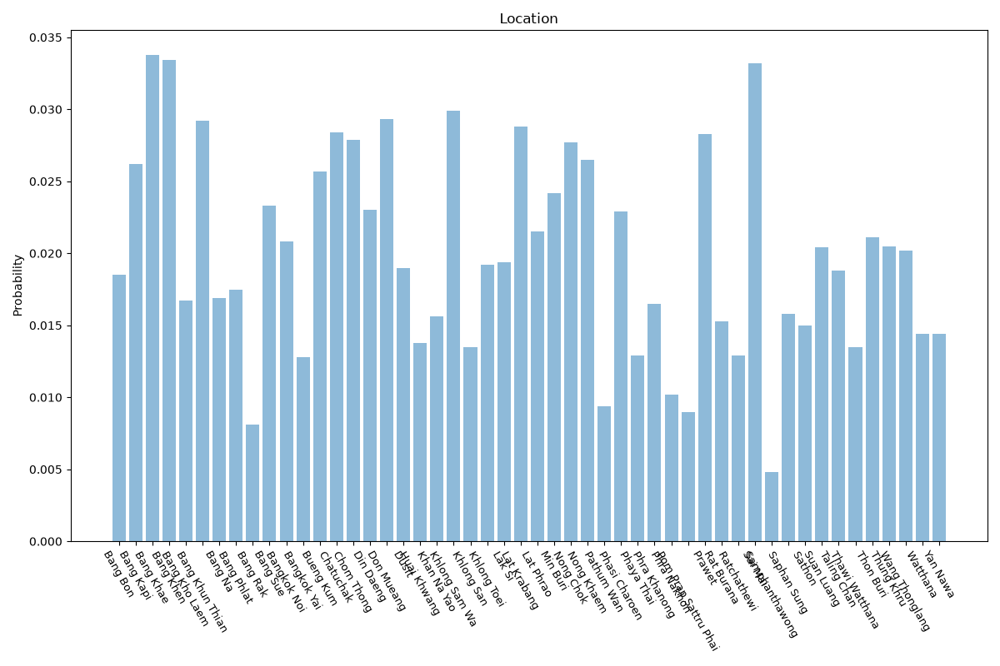

# Bangkok
**2 features:** location and residence.

## Location

## Residence

## Sources

- [Registration statistics, Department of Provincial Administration (via NSO Thailand) (2023)](https://www.nso.go.th/) — location
- [World Urbanization Prospects 2018, United Nations (2018)](https://population.un.org/wup/) — residence