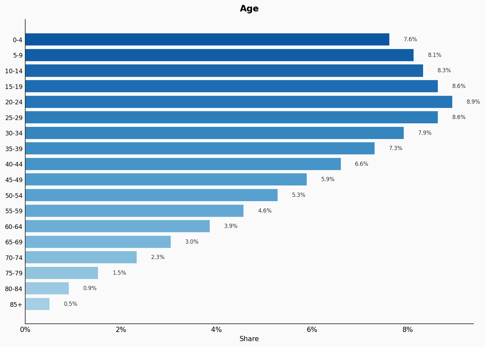
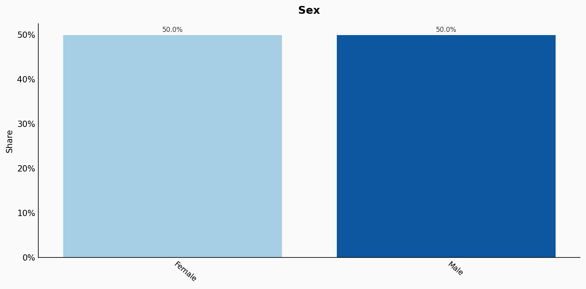
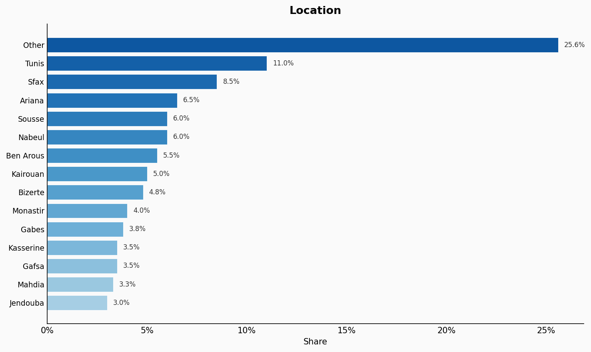
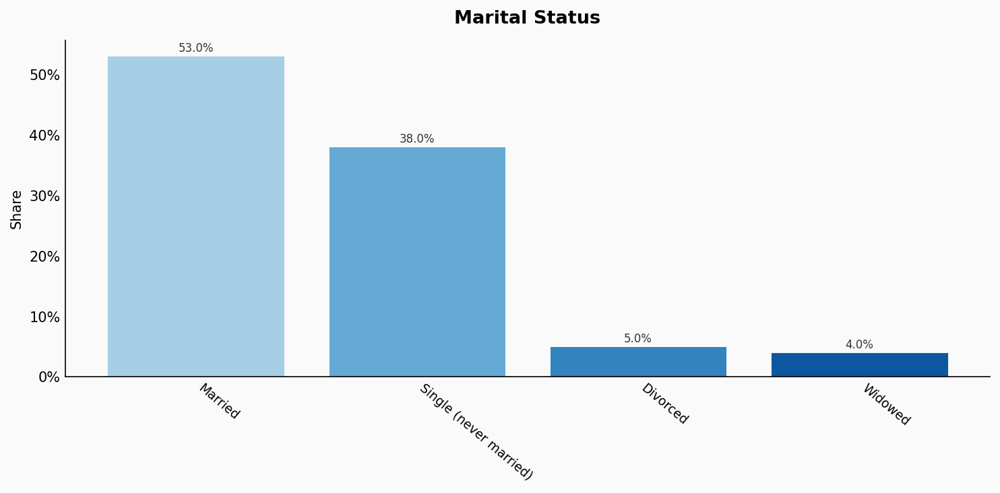
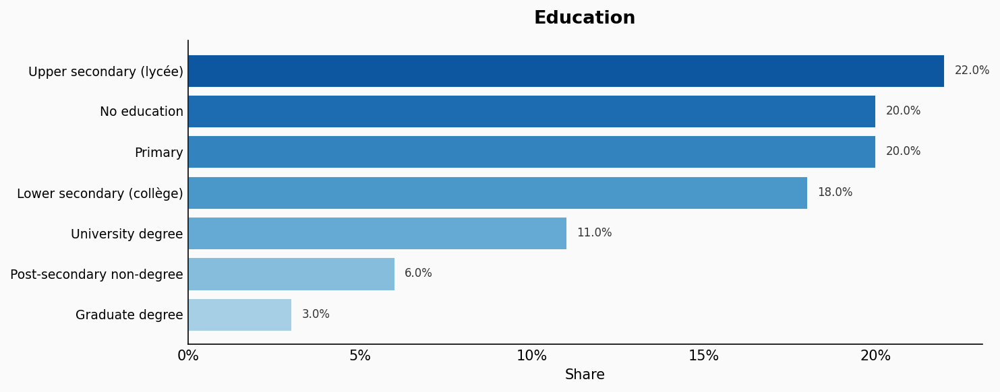
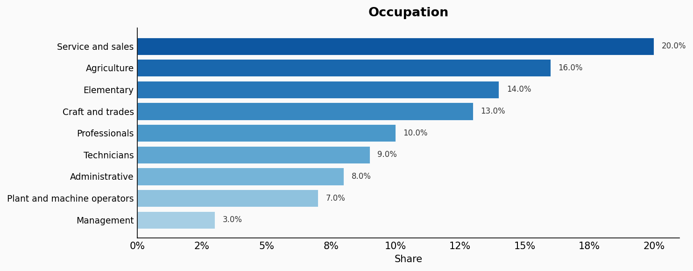
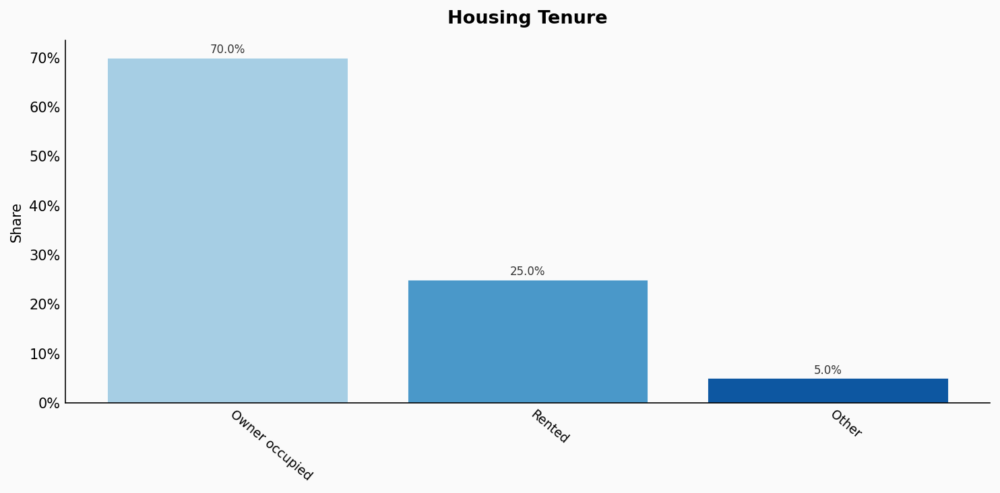
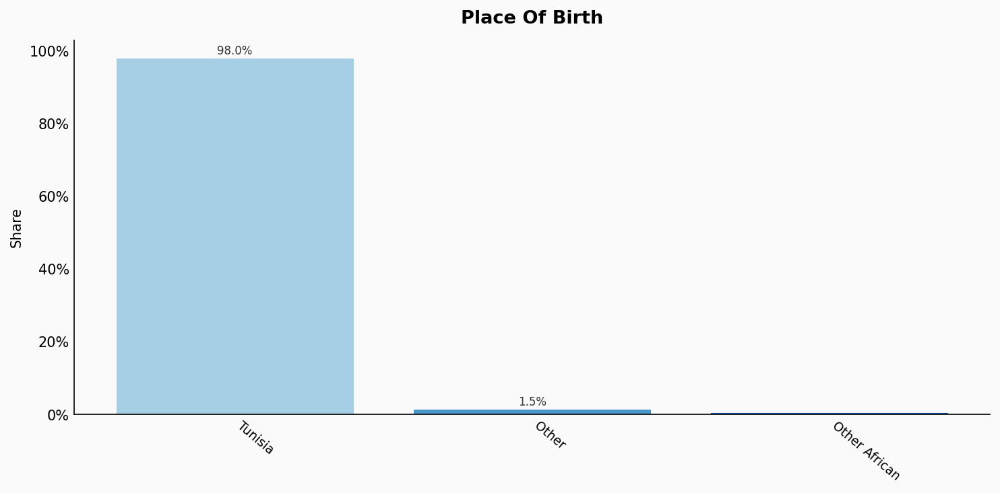

# Tunisia

**11 features:** age, sex, location, religion, language, marital status, education, occupation, housing tenure, place of birth, and sexuality.

## Age

| Option | Share |
|---|---:|
| 0-4 | 7.6% |
| 5-9 | 8.1% |
| 10-14 | 8.3% |
| 15-19 | 8.6% |
| 20-24 | 8.9% |
| 25-29 | 8.6% |
| 30-34 | 7.9% |
| 35-39 | 7.3% |
| 40-44 | 6.6% |
| 45-49 | 5.9% |
| 50-54 | 5.3% |
| 55-59 | 4.6% |
| 60-64 | 3.9% |
| 65-69 | 3.0% |
| 70-74 | 2.3% |
| 75-79 | 1.5% |
| 80-84 | 0.9% |
| 85+ | 0.5% |

## Sex

| Option | Share |
|---|---:|
| Female | 50.0% |
| Male | 50.0% |

## Location

| Option | Share |
|---|---:|
| Other | 25.6% |
| Tunis | 11.0% |
| Sfax | 8.5% |
| Ariana | 6.5% |
| Sousse | 6.0% |
| Nabeul | 6.0% |
| Ben Arous | 5.5% |
| Kairouan | 5.0% |
| Bizerte | 4.8% |
| Monastir | 4.0% |
| Gabes | 3.8% |
| Kasserine | 3.5% |
| Gafsa | 3.5% |
| Mahdia | 3.3% |
| Jendouba | 3.0% |

## Religion

| Option | Share |
|---|---:|
| Muslim (Sunni Maliki) | 99.0% |
| Christian | 0.5% |
| Other | 0.4% |
| Jewish | 0.1% |

## Language

| Option | Share |
|---|---:|
| Arabic (Tunisian Darija) | 85.0% |
| Arabic (Modern Standard) | 8.0% |
| French | 5.0% |
| Berber (Amazigh) | 1.5% |
| Other | 0.5% |

## Marital Status

| Option | Share |
|---|---:|
| Married | 53.0% |
| Single (never married) | 38.0% |
| Divorced | 5.0% |
| Widowed | 4.0% |

## Education

| Option | Share |
|---|---:|
| Upper secondary (lycée) | 22.0% |
| No education | 20.0% |
| Primary | 20.0% |
| Lower secondary (collège) | 18.0% |
| University degree | 11.0% |
| Post-secondary non-degree | 6.0% |
| Graduate degree | 3.0% |

## Occupation

| Option | Share |
|---|---:|
| Service and sales | 20.0% |
| Agriculture | 16.0% |
| Elementary | 14.0% |
| Craft and trades | 13.0% |
| Professionals | 10.0% |
| Technicians | 9.0% |
| Administrative | 8.0% |
| Plant and machine operators | 7.0% |
| Management | 3.0% |

## Housing Tenure

| Option | Share |
|---|---:|
| Owner occupied | 70.0% |
| Rented | 25.0% |
| Other | 5.0% |

## Place Of Birth

| Option | Share |
|---|---:|
| Tunisia | 98.0% |
| Other | 1.5% |
| Other African | 0.5% |

## Sexuality

| Option | Share |
|---|---:|
| Heterosexual | 97.0% |
| Bisexual | 1.5% |
| Gay or Lesbian | 1.0% |
| Other | 0.5% |

## Sources

- [Recensement Général de la Population et de l'Habitat 2014, Institut National de la Statistique (INS) Tunisie (2014)](https://www.ins.tn/en/publication/general-census-population-and-housing-2014)
  *Covers: `age`, `sex`, `location`, `marital status`, `housing tenure`, `place of birth`*
- [Enquête Nationale sur la Population et l'Emploi 2021, INS Tunisie (2021)](https://www.ins.tn/en/themes/emploi)
  *Covers: `education`, `occupation`*
- [Pew Research Center - Global Religious Futures: Tunisia 2010 (2010)](https://www.pewresearch.org/religion/2012/12/18/global-religious-landscape-exec/)
  *Covers: `religion`*
- [Ethnologue: Languages of Tunisia (2023) / INS Estimates (2023)](https://www.ethnologue.com/country/TN/)
  *Covers: `language`*
- [Arab Barometer Wave VI - Tunisia 2021 (2021)](https://www.arabbarometer.org/)
  *Covers: `sexuality`*