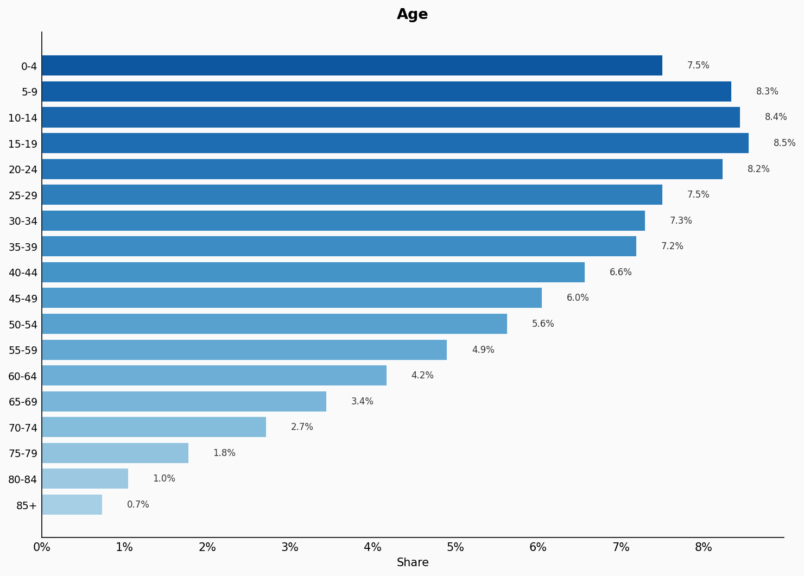
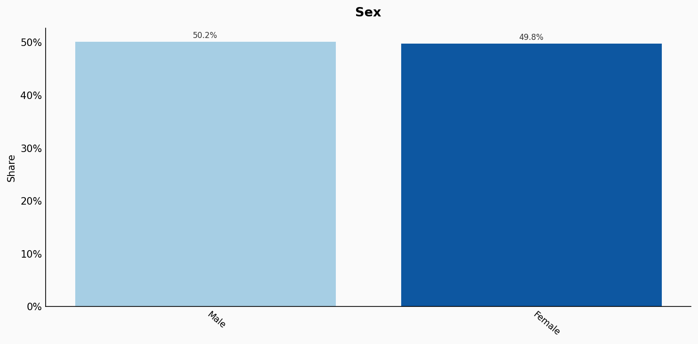
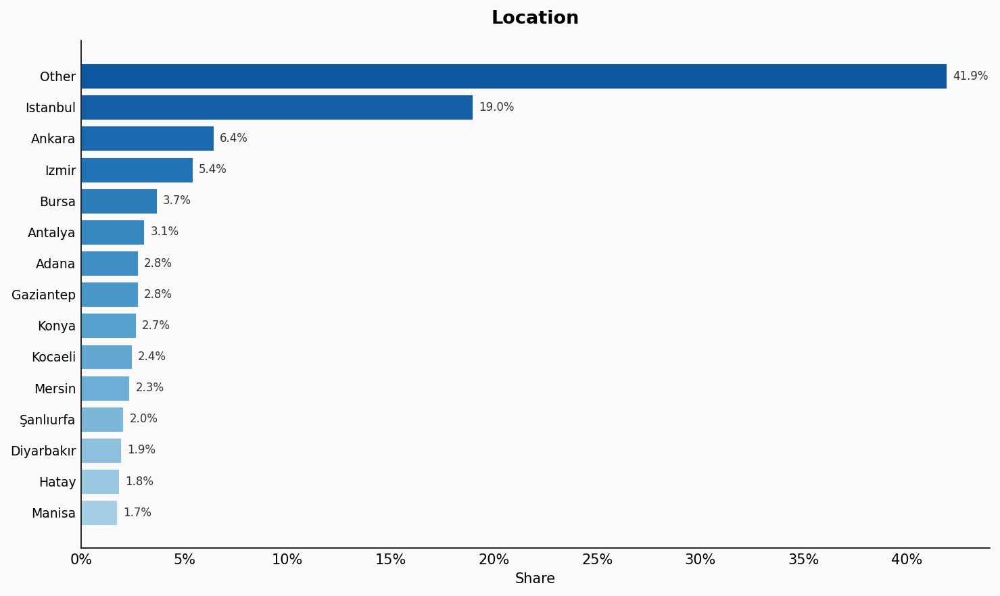
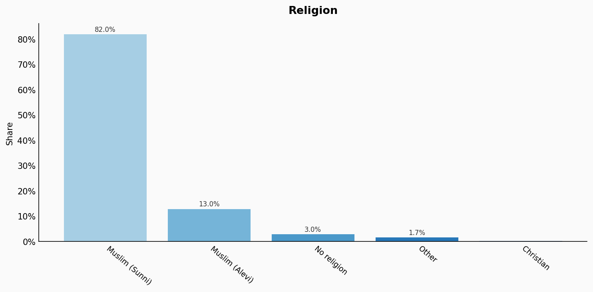
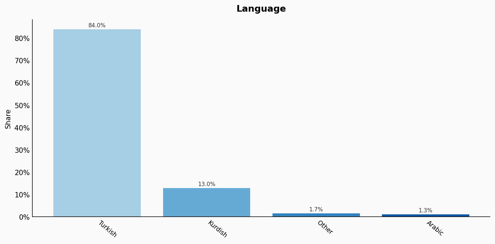
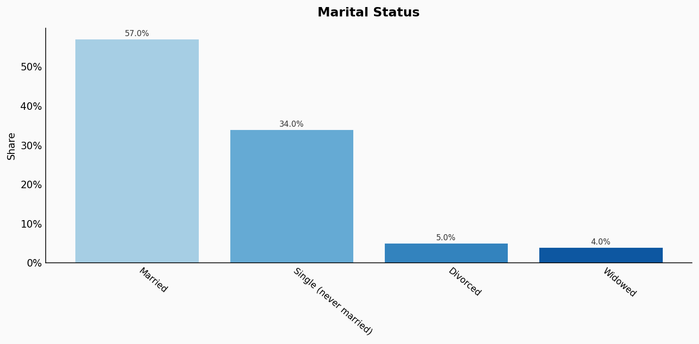
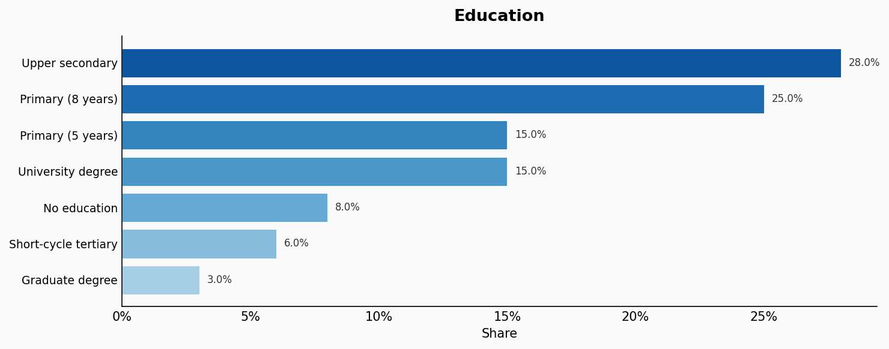
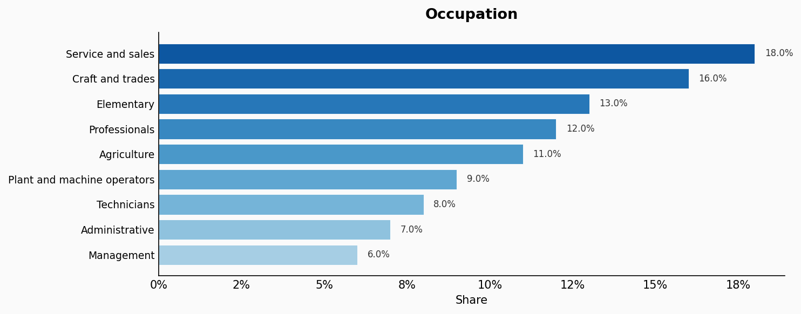
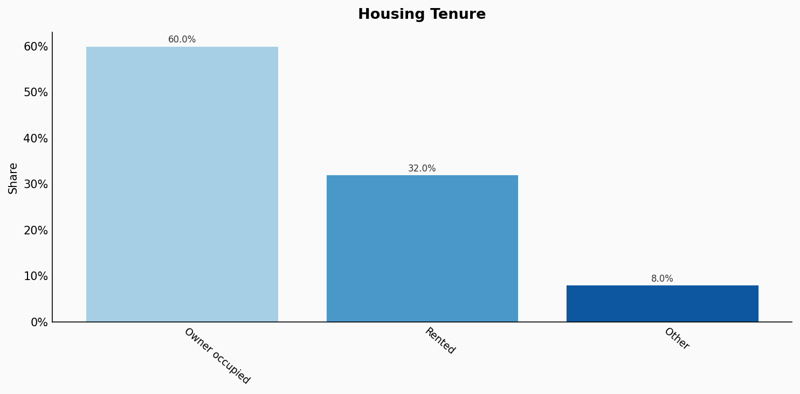
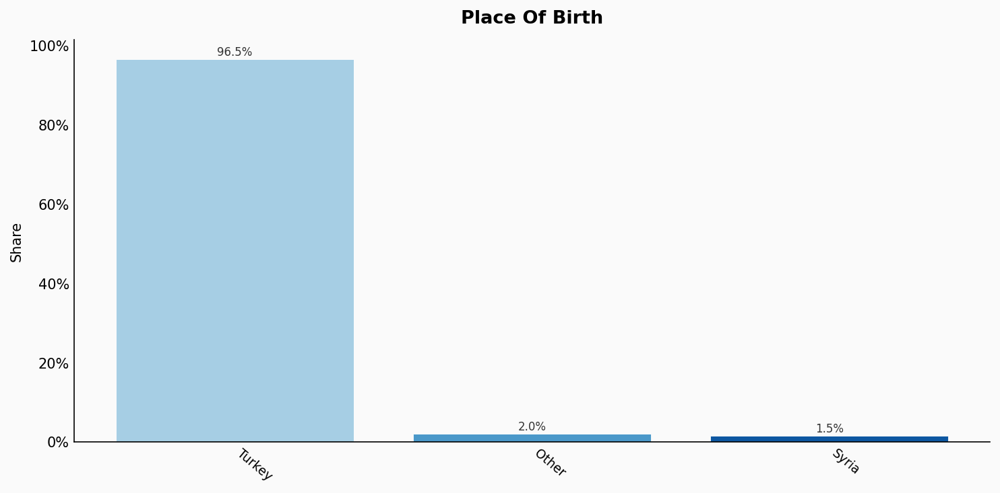

# Turkey

**11 features:** age, sex, location, religion, language, marital status, education, occupation, housing tenure, place of birth, and sexuality.

## Age

| Option | Share |
|---|---:|
| 0-4 | 7.5% |
| 5-9 | 8.3% |
| 10-14 | 8.4% |
| 15-19 | 8.5% |
| 20-24 | 8.2% |
| 25-29 | 7.5% |
| 30-34 | 7.3% |
| 35-39 | 7.2% |
| 40-44 | 6.6% |
| 45-49 | 6.0% |
| 50-54 | 5.6% |
| 55-59 | 4.9% |
| 60-64 | 4.2% |
| 65-69 | 3.4% |
| 70-74 | 2.7% |
| 75-79 | 1.8% |
| 80-84 | 1.0% |
| 85+ | 0.7% |

## Sex

| Option | Share |
|---|---:|
| Male | 50.2% |
| Female | 49.8% |

## Location

| Option | Share |
|---|---:|
| Other | 41.9% |
| Istanbul | 19.0% |
| Ankara | 6.4% |
| Izmir | 5.4% |
| Bursa | 3.7% |
| Antalya | 3.1% |
| Adana | 2.8% |
| Gaziantep | 2.8% |
| Konya | 2.7% |
| Kocaeli | 2.4% |
| Mersin | 2.3% |
| Şanlıurfa | 2.0% |
| Diyarbakır | 1.9% |
| Hatay | 1.8% |
| Manisa | 1.7% |

## Religion

| Option | Share |
|---|---:|
| Muslim (Sunni) | 82.0% |
| Muslim (Alevi) | 13.0% |
| No religion | 3.0% |
| Other | 1.7% |
| Christian | 0.3% |

## Language

| Option | Share |
|---|---:|
| Turkish | 84.0% |
| Kurdish | 13.0% |
| Other | 1.7% |
| Arabic | 1.3% |

## Marital Status

| Option | Share |
|---|---:|
| Married | 57.0% |
| Single (never married) | 34.0% |
| Divorced | 5.0% |
| Widowed | 4.0% |

## Education

| Option | Share |
|---|---:|
| Upper secondary | 28.0% |
| Primary (8 years) | 25.0% |
| Primary (5 years) | 15.0% |
| University degree | 15.0% |
| No education | 8.0% |
| Short-cycle tertiary | 6.0% |
| Graduate degree | 3.0% |

## Occupation

| Option | Share |
|---|---:|
| Service and sales | 18.0% |
| Craft and trades | 16.0% |
| Elementary | 13.0% |
| Professionals | 12.0% |
| Agriculture | 11.0% |
| Plant and machine operators | 9.0% |
| Technicians | 8.0% |
| Administrative | 7.0% |
| Management | 6.0% |

## Housing Tenure

| Option | Share |
|---|---:|
| Owner occupied | 60.0% |
| Rented | 32.0% |
| Other | 8.0% |

## Place Of Birth

| Option | Share |
|---|---:|
| Turkey | 96.5% |
| Other | 2.0% |
| Syria | 1.5% |

## Sexuality

| Option | Share |
|---|---:|
| Heterosexual | 96.0% |
| Bisexual | 2.0% |
| Gay or Lesbian | 1.5% |
| Other | 0.5% |

## Sources

- [Adrese Dayalı Nüfus Kayıt Sistemi 2023, Türkiye İstatistik Kurumu (TUIK) (2023)](https://www.tuik.gov.tr/Home/Index)
  *Covers: `age`, `sex`, `location`, `marital status`, `housing tenure`*
- [Hanehalkı İşgücü Araştırması 2022, TUIK (2022)](https://www.tuik.gov.tr/Home/Index)
  *Covers: `education`, `occupation`*
- [WIN/Gallup International Global Index of Religiosity and Atheism 2019 (2019)](https://www.wingia.com/)
  *Covers: `religion`*
- [Ethnologue / KONDA Research - Languages of Turkey 2020 (2020)](https://konda.com.tr/en/)
  *Covers: `language`*
- [Göç İstatistikleri 2022, TUIK (2022)](https://www.tuik.gov.tr/Home/Index)
  *Covers: `place of birth`*
- [ILGA-Europe Rainbow Map 2023 / Kaos GL Survey 2022 (2022)](https://rainbow-europe.org/)
  *Covers: `sexuality`*