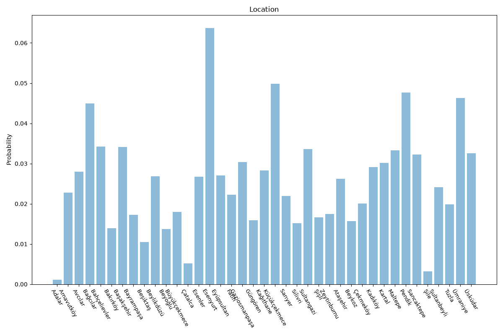

# Istanbul
**2 features:** location and residence.

## Location

## Residence

## Sources

- [Address-Based Population Registration System (ADNKS), TÜİK (2025)](https://www.tuik.gov.tr/) — location
- [World Urbanization Prospects 2018, United Nations (2018)](https://population.un.org/wup/) — residence