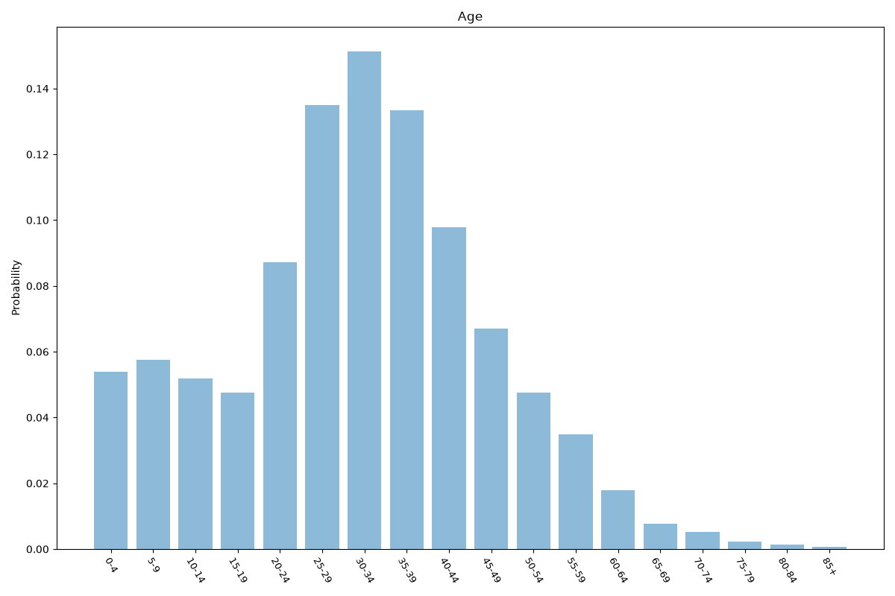
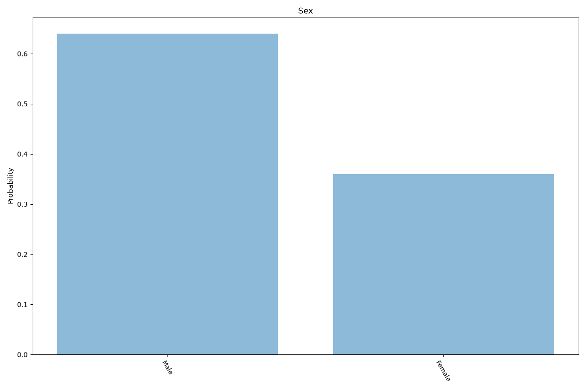
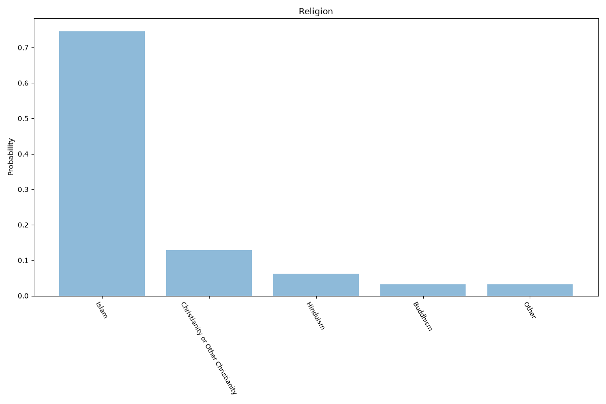
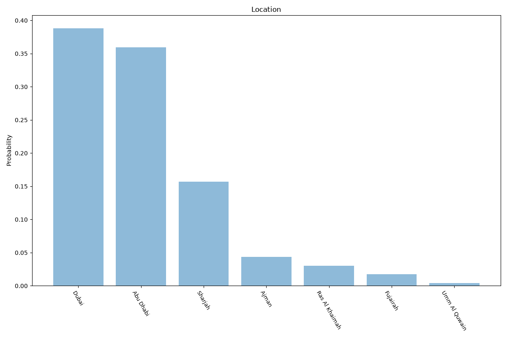

# United Arab Emirates
**4 features:** age, sex, religion and location.

## Age

## Sex

## Religion

## Location

## Sources

- [World Population Prospects 2024, United Nations (2024)](https://population.un.org/wpp/) — age, sex
- [2020 International Religious Freedom Report: United Arab Emirates, US Department of State (2020)](https://www.state.gov/reports/2020-report-on-international-religious-freedom/united-arab-emirates/) — religion
- [Emirate population estimates, Federal Competitiveness and Statistics Centre (UAE) (2023)](https://fcsc.gov.ae/en-us) — location