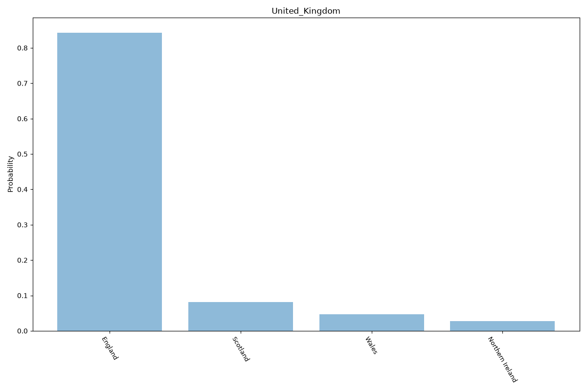

# United Kingdom

Composite: Made up of England, Scotland, Wales, and Northern Ireland.

\

## Sources

- [Census 2021 population estimates for England, Wales and Northern Ireland and Census 2022 for Scotland (ONS, NISRA, National Records of Scotland) (2021)](https://www.ons.gov.uk/peoplepopulationandcommunity/populationandmigration/populationestimates/bulletins/annualmidyearpopulationestimates/mid2021) — location