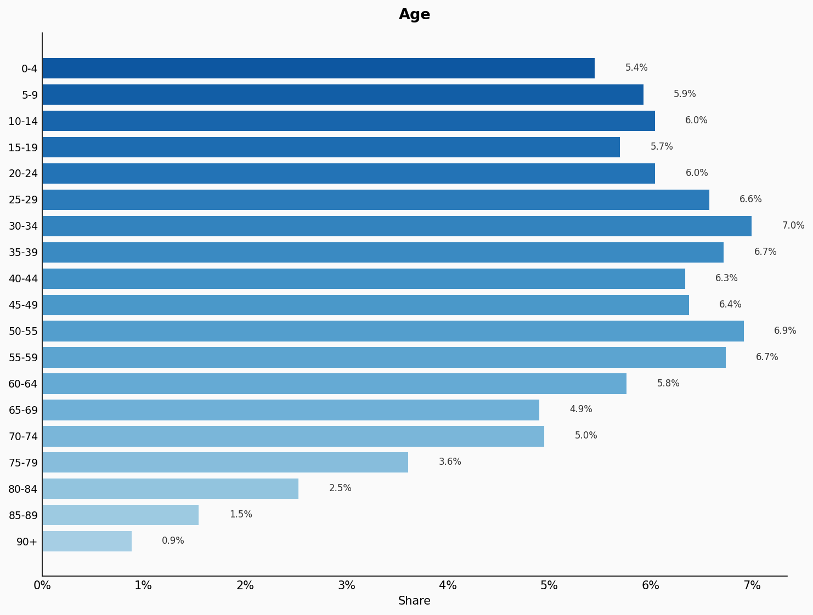
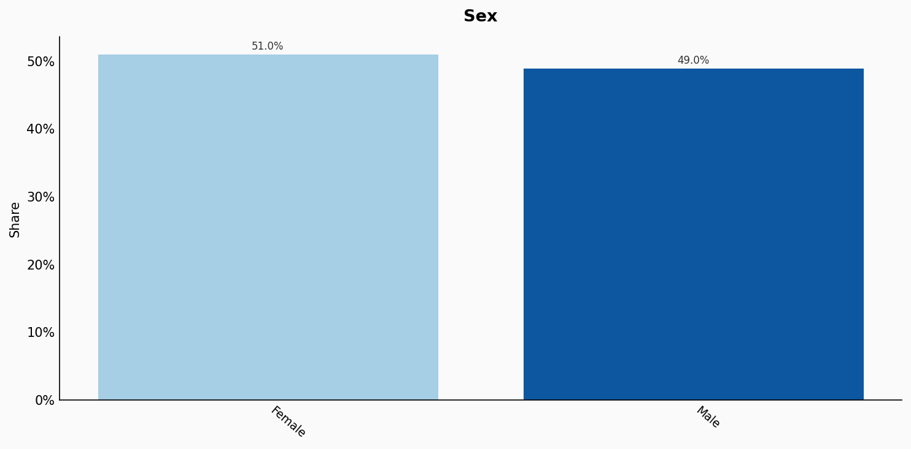
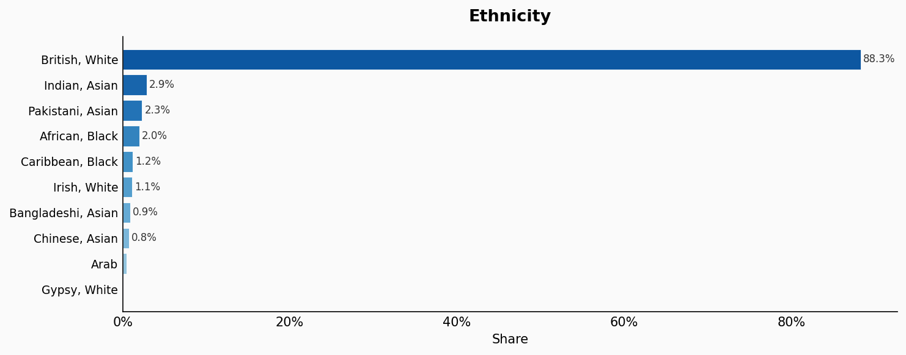
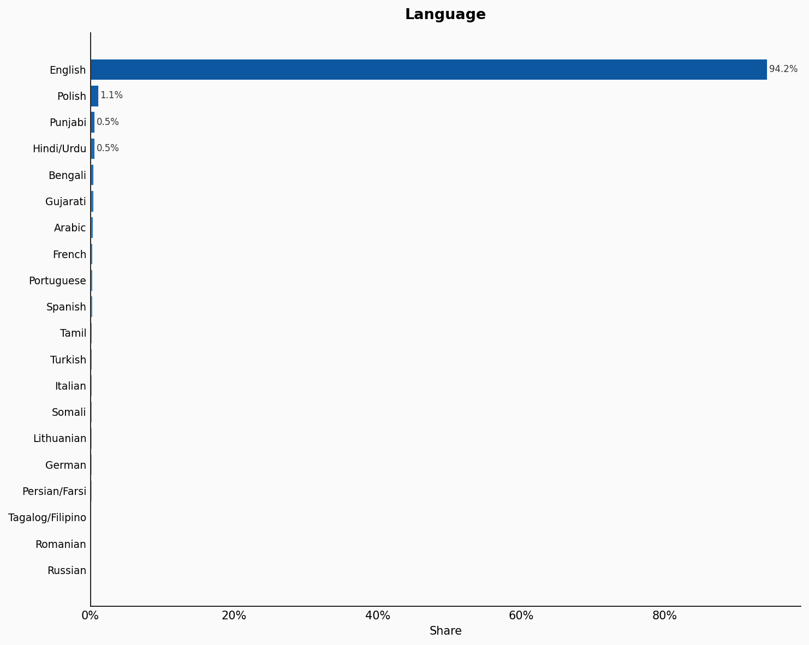
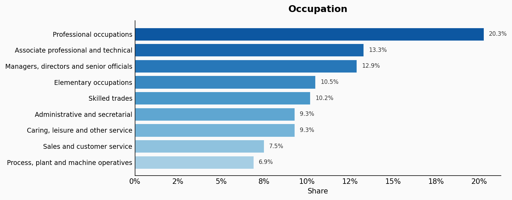
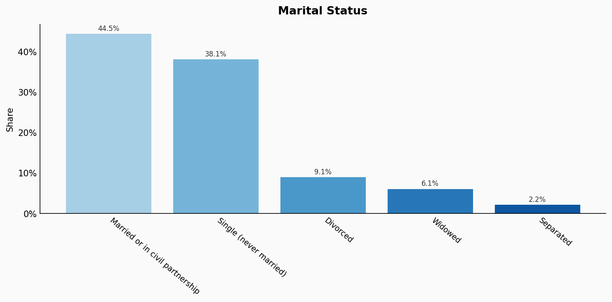
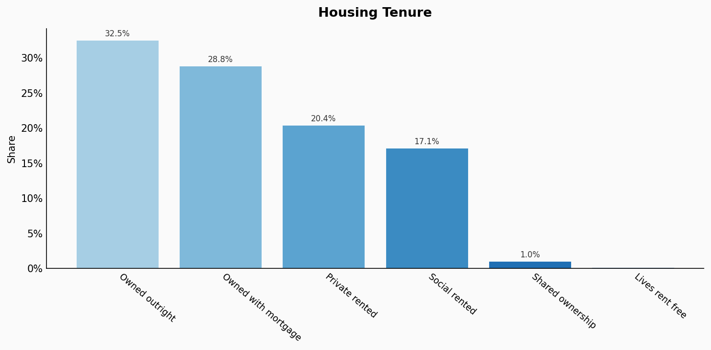
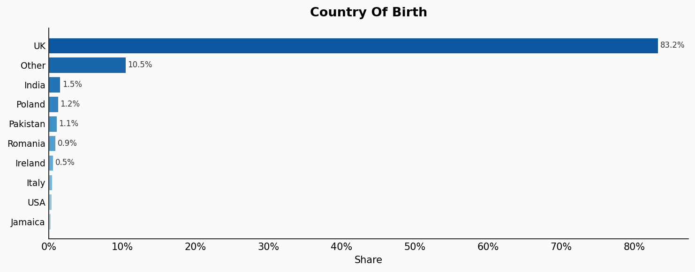
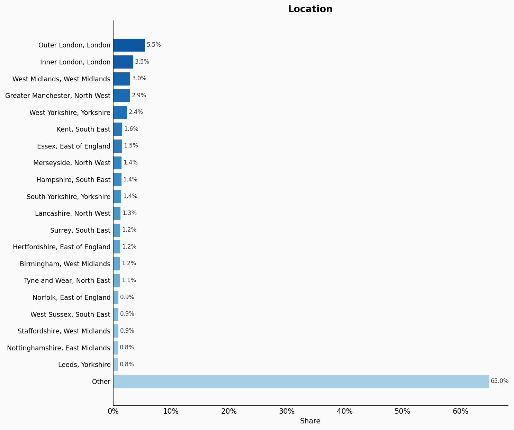

# England

**12 features:** age, sex, sexuality, ethnicity, religion, language, occupation, education, marital status, housing tenure, country of birth, and location.

## Age

| Option | Share |
|---|---:|
| 0-4 | 5.4% |
| 5-9 | 5.9% |
| 10-14 | 6.0% |
| 15-19 | 5.7% |
| 20-24 | 6.0% |
| 25-29 | 6.6% |
| 30-34 | 7.0% |
| 35-39 | 6.7% |
| 40-44 | 6.3% |
| 45-49 | 6.4% |
| 50-55 | 6.9% |
| 55-59 | 6.7% |
| 60-64 | 5.8% |
| 65-69 | 4.9% |
| 70-74 | 5.0% |
| 75-79 | 3.6% |
| 80-84 | 2.5% |
| 85-89 | 1.5% |
| 90+ | 0.9% |

## Sex

| Option | Share |
|---|---:|
| Female | 51.0% |
| Male | 49.0% |

## Sexuality

| Option | Share |
|---|---:|
| Heterosexual | 94.0% |
| Unsure | 2.9% |
| Homosexual | 1.8% |
| Bisexual | 1.3% |

## Ethnicity

| Option | Share |
|---|---:|
| British, White | 88.3% |
| Indian, Asian | 2.9% |
| Pakistani, Asian | 2.3% |
| African, Black | 2.0% |
| Caribbean, Black | 1.2% |
| Irish, White | 1.1% |
| Bangladeshi, Asian | 0.9% |
| Chinese, Asian | 0.8% |
| Arab | 0.4% |
| Gypsy, White | 0.1% |

## Religion

| Option | Share |
|---|---:|
| Christianity | 59.6% |
| No religion | 32.1% |
| Islam | 5.0% |
| Hinduism | 1.5% |
| Sikhism | 0.8% |
| Judaism | 0.5% |
| Buddhism | 0.5% |

## Language

| Option | Share |
|---|---:|
| English | 94.2% |
| Polish | 1.1% |
| Punjabi | 0.5% |
| Hindi/Urdu | 0.5% |
| Bengali | 0.4% |
| Gujarati | 0.4% |
| Arabic | 0.3% |
| French | 0.3% |
| Portuguese | 0.3% |
| Spanish | 0.2% |
| Tamil | 0.2% |
| Turkish | 0.2% |
| Italian | 0.2% |
| Somali | 0.2% |
| Lithuanian | 0.2% |
| German | 0.2% |
| Persian/Farsi | 0.2% |
| Tagalog/Filipino | 0.1% |
| Romanian | 0.1% |
| Russian | 0.1% |

## Occupation

| Option | Share |
|---|---:|
| Professional occupations | 20.3% |
| Associate professional and technical | 13.3% |
| Managers, directors and senior officials | 12.9% |
| Elementary occupations | 10.5% |
| Skilled trades | 10.2% |
| Administrative and secretarial | 9.3% |
| Caring, leisure and other service | 9.3% |
| Sales and customer service | 7.5% |
| Process, plant and machine operatives | 6.9% |

## Education

| Option | Share |
|---|---:|
| Level 4+ | 33.9% |
| No qualifications | 18.1% |
| Level 3 | 16.9% |
| Level 2 | 13.3% |
| Level 1 | 9.7% |
| Apprenticeship | 5.3% |
| Other | 2.8% |

## Marital Status

| Option | Share |
|---|---:|
| Married or in civil partnership | 44.5% |
| Single (never married) | 38.1% |
| Divorced | 9.1% |
| Widowed | 6.1% |
| Separated | 2.2% |

## Housing Tenure

| Option | Share |
|---|---:|
| Owned outright | 32.5% |
| Owned with mortgage | 28.8% |
| Private rented | 20.4% |
| Social rented | 17.1% |
| Shared ownership | 1.0% |
| Lives rent free | 0.1% |

## Country Of Birth

| Option | Share |
|---|---:|
| UK | 83.2% |
| Other | 10.5% |
| India | 1.5% |
| Poland | 1.2% |
| Pakistan | 1.1% |
| Romania | 0.9% |
| Ireland | 0.5% |
| Italy | 0.5% |
| USA | 0.3% |
| Jamaica | 0.2% |

## Location

| Option | Share |
|---|---:|
| Outer London, London | 5.5% |
| Inner London, London | 3.5% |
| West Midlands, West Midlands | 3.0% |
| Greater Manchester, North West | 2.9% |
| West Yorkshire, Yorkshire | 2.4% |
| Kent, South East | 1.6% |
| Essex, East of England | 1.5% |
| Merseyside, North West | 1.4% |
| Hampshire, South East | 1.4% |
| South Yorkshire, Yorkshire | 1.4% |
| Lancashire, North West | 1.3% |
| Surrey, South East | 1.2% |
| Hertfordshire, East of England | 1.2% |
| Birmingham, West Midlands | 1.2% |
| Tyne and Wear, North East | 1.1% |
| Norfolk, East of England | 0.9% |
| West Sussex, South East | 0.9% |
| Staffordshire, West Midlands | 0.9% |
| Nottinghamshire, East Midlands | 0.8% |
| Leeds, Yorkshire | 0.8% |
| Other | 65.0% |

## Sources

- [Population and household estimates, England and Wales: Census 2021, ONS (2021)](https://www.ons.gov.uk/peoplepopulationandcommunity/populationandmigration/populationestimates/datasets/populationandhouseholdestimatesenglandandwalescensus2021)
  *Covers: `age`, `sex`, `location`*
- [Sexual orientation, UK: 2020, ONS (2020)](https://www.ons.gov.uk/peoplepopulationandcommunity/culturalidentity/sexuality/bulletins/sexualidentityuk/2020)
  *Covers: `sexuality`*
- [Religion in England and Wales 2011, ONS (2011)](https://www.ons.gov.uk/peoplepopulationandcommunity/culturalidentity/religion/articles/religioninenglandandwales2011/2012-12-11)
  *Covers: `ethnicity`, `religion`, `language`*
- [Occupation (TS063), Census 2021, ONS (2021)](https://www.ons.gov.uk/datasets/TS063/editions/2021/versions/1)
  *Covers: `occupation`*
- [Highest level of qualification (TS067), Census 2021, ONS (2021)](https://www.ons.gov.uk/datasets/TS067/editions/2021/versions/1)
  *Covers: `education`*
- [Legal partnership status (TS002), Census 2021, ONS (2021)](https://www.ons.gov.uk/datasets/TS002/editions/2021/versions/3)
  *Covers: `marital status`*
- [Tenure of household (TS054), Census 2021, ONS (2021)](https://www.ons.gov.uk/datasets/TS054/editions/2021/versions/1)
  *Covers: `housing tenure`*
- [International migration, England and Wales: Census 2021, ONS (2021)](https://www.ons.gov.uk/peoplepopulationandcommunity/populationandmigration/internationalmigration/bulletins/internationalmigrationenglandandwales/census2021)
  *Covers: `country of birth`*