# London

**12 features:** ethnicity, language, religion, place of birth, age, sex, sexuality, marital status, occupation, education, housing tenure, and location.

## Ethnicity

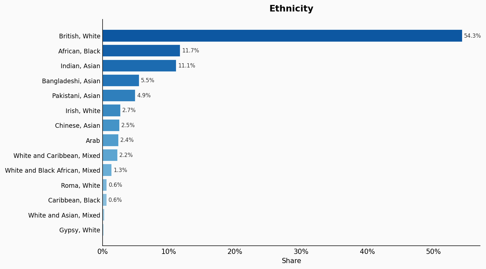

| Option | Share |
|---|---:|
| British, White | 54.3% |
| African, Black | 11.7% |
| Indian, Asian | 11.1% |
| Bangladeshi, Asian | 5.5% |
| Pakistani, Asian | 4.9% |
| Irish, White | 2.7% |
| Chinese, Asian | 2.5% |
| Arab | 2.4% |
| White and Caribbean, Mixed | 2.2% |
| White and Black African, Mixed | 1.3% |
| Roma, White | 0.6% |
| Caribbean, Black | 0.6% |
| White and Asian, Mixed | 0.2% |
| Gypsy, White | 0.1% |

## Language

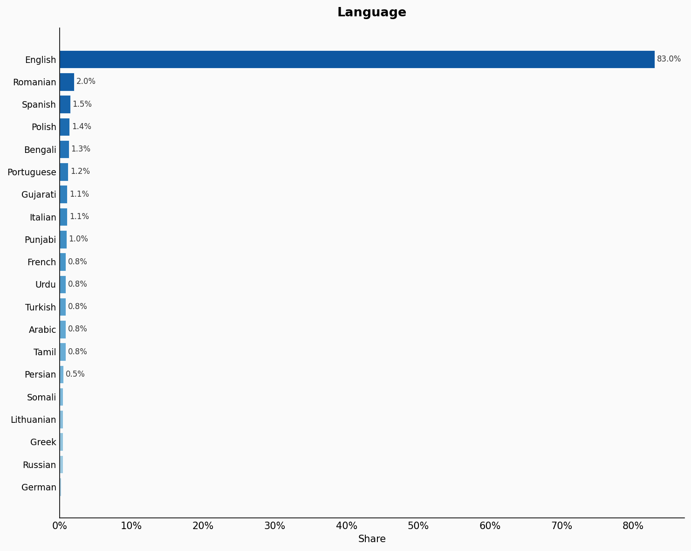

| Option | Share |
|---|---:|
| English | 83.0% |
| Romanian | 2.0% |
| Spanish | 1.5% |
| Polish | 1.4% |
| Bengali | 1.3% |
| Portuguese | 1.2% |
| Gujarati | 1.1% |
| Italian | 1.1% |
| Punjabi | 1.0% |
| French | 0.8% |
| Urdu | 0.8% |
| Turkish | 0.8% |
| Arabic | 0.8% |
| Tamil | 0.8% |
| Persian | 0.5% |
| Somali | 0.4% |
| Lithuanian | 0.4% |
| Greek | 0.4% |
| Russian | 0.4% |
| German | 0.2% |

## Religion

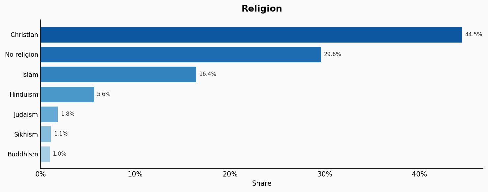

| Option | Share |
|---|---:|
| Christian | 44.5% |
| No religion | 29.6% |
| Islam | 16.4% |
| Hinduism | 5.6% |
| Judaism | 1.8% |
| Sikhism | 1.1% |
| Buddhism | 1.0% |

## Place Of Birth

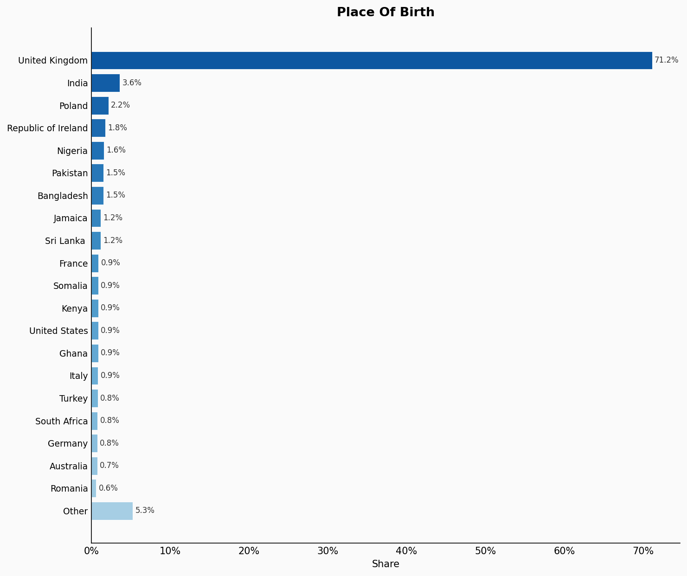

| Option | Share |
|---|---:|
| United Kingdom | 71.2% |
| India | 3.6% |
| Poland | 2.2% |
| Republic of Ireland | 1.8% |
| Nigeria | 1.6% |
| Pakistan | 1.5% |
| Bangladesh | 1.5% |
| Jamaica | 1.2% |
| Sri Lanka  | 1.2% |
| France | 0.9% |
| Somalia | 0.9% |
| Kenya | 0.9% |
| United States | 0.9% |
| Ghana | 0.9% |
| Italy | 0.9% |
| Turkey | 0.8% |
| South Africa | 0.8% |
| Germany | 0.8% |
| Australia | 0.7% |
| Romania | 0.6% |
| Other | 5.3% |

## Age

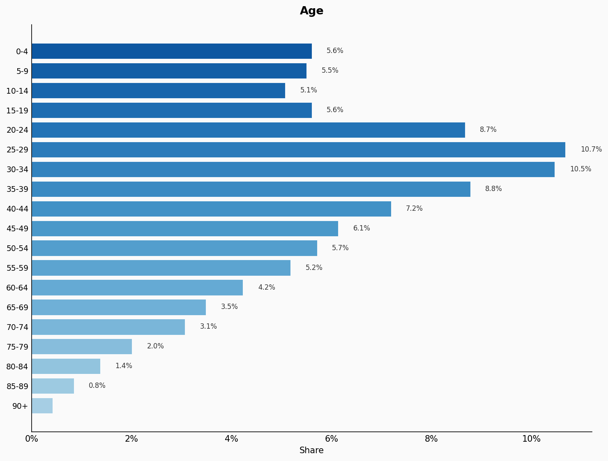

| Option | Share |
|---|---:|
| 0-4 | 5.6% |
| 5-9 | 5.5% |
| 10-14 | 5.1% |
| 15-19 | 5.6% |
| 20-24 | 8.7% |
| 25-29 | 10.7% |
| 30-34 | 10.5% |
| 35-39 | 8.8% |
| 40-44 | 7.2% |
| 45-49 | 6.1% |
| 50-54 | 5.7% |
| 55-59 | 5.2% |
| 60-64 | 4.2% |
| 65-69 | 3.5% |
| 70-74 | 3.1% |
| 75-79 | 2.0% |
| 80-84 | 1.4% |
| 85-89 | 0.8% |
| 90+ | 0.4% |

## Sex

| Option | Share |
|---|---:|
| Female | 50.8% |
| Male | 49.2% |

## Sexuality

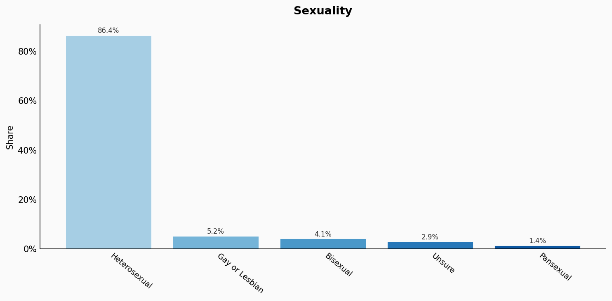

| Option | Share |
|---|---:|
| Heterosexual | 86.4% |
| Gay or Lesbian | 5.2% |
| Bisexual | 4.1% |
| Unsure | 2.9% |
| Pansexual | 1.4% |

## Marital Status

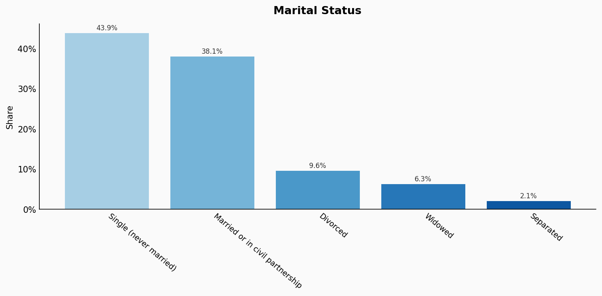

| Option | Share |
|---|---:|
| Single (never married) | 43.9% |
| Married or in civil partnership | 38.1% |
| Divorced | 9.6% |
| Widowed | 6.3% |
| Separated | 2.1% |

## Occupation

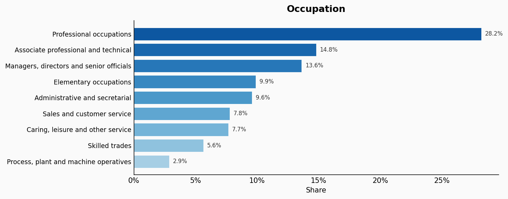

| Option | Share |
|---|---:|
| Professional occupations | 28.2% |
| Associate professional and technical | 14.8% |
| Managers, directors and senior officials | 13.6% |
| Elementary occupations | 9.9% |
| Administrative and secretarial | 9.6% |
| Sales and customer service | 7.8% |
| Caring, leisure and other service | 7.7% |
| Skilled trades | 5.6% |
| Process, plant and machine operatives | 2.9% |

## Education

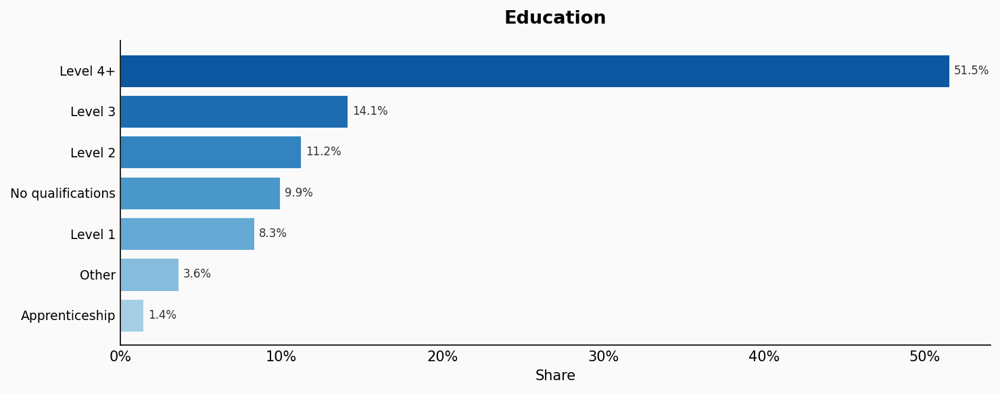

| Option | Share |
|---|---:|
| Level 4+ | 51.5% |
| Level 3 | 14.1% |
| Level 2 | 11.2% |
| No qualifications | 9.9% |
| Level 1 | 8.3% |
| Other | 3.6% |
| Apprenticeship | 1.4% |

## Housing Tenure

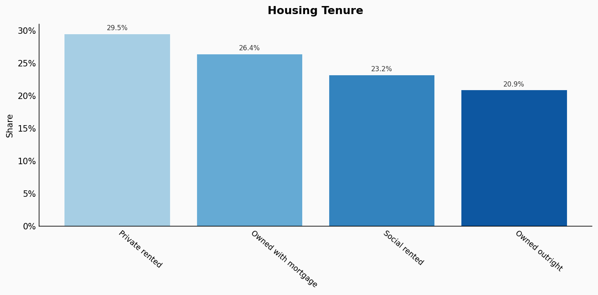

| Option | Share |
|---|---:|
| Private rented | 29.5% |
| Owned with mortgage | 26.4% |
| Social rented | 23.2% |
| Owned outright | 20.9% |

## Location

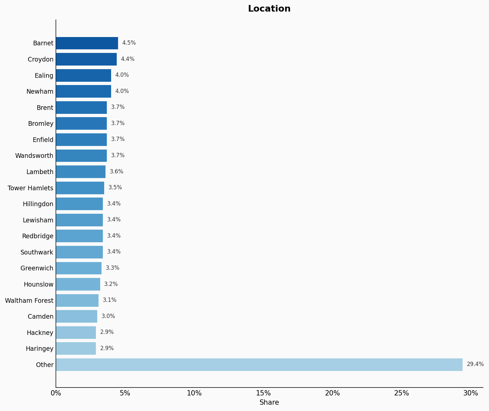

| Option | Share |
|---|---:|
| Barnet | 4.5% |
| Croydon | 4.4% |
| Ealing | 4.0% |
| Newham | 4.0% |
| Brent | 3.7% |
| Bromley | 3.7% |
| Enfield | 3.7% |
| Wandsworth | 3.7% |
| Lambeth | 3.6% |
| Tower Hamlets | 3.5% |
| Hillingdon | 3.4% |
| Lewisham | 3.4% |
| Redbridge | 3.4% |
| Southwark | 3.4% |
| Greenwich | 3.3% |
| Hounslow | 3.2% |
| Waltham Forest | 3.1% |
| Camden | 3.0% |
| Hackney | 2.9% |
| Haringey | 2.9% |
| Other | 29.4% |

## Sources

- [Census 2021, Office for National Statistics (2021)](https://www.nomisweb.co.uk/sources/census_2021_bulk)
  *Covers: `age`, `sex`, `marital status`, `occupation`, `education`, `housing tenure`, `location`*
- [Sexual orientation, England and Wales, Census 2021, ONS (2021)](https://www.ons.gov.uk/peoplepopulationandcommunity/culturalidentity/sexuality/bulletins/sexualorientationenglandandwales/census2021)
  *Covers: `sexuality`*