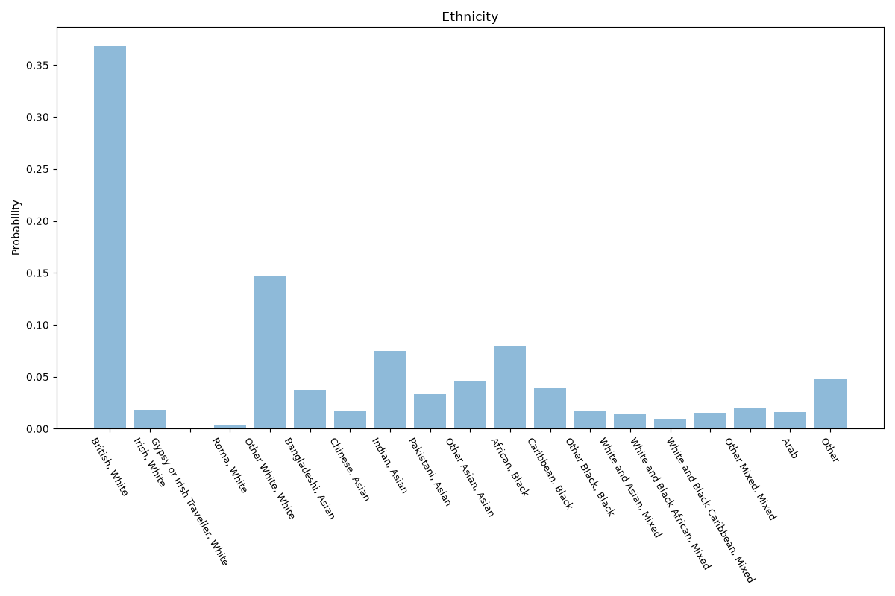
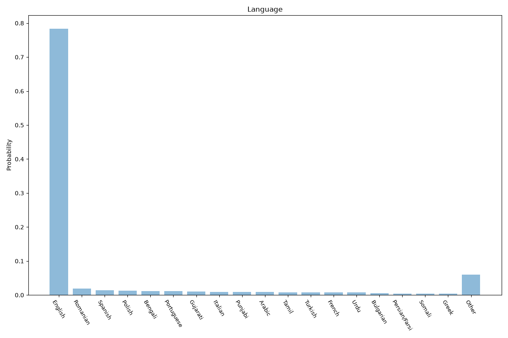
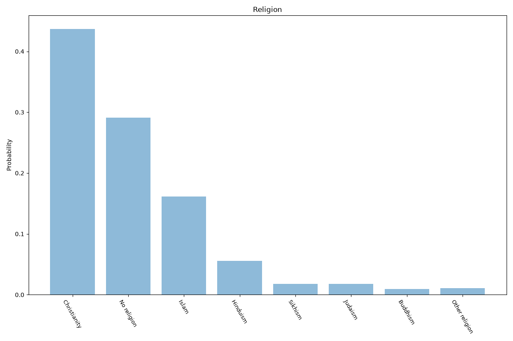
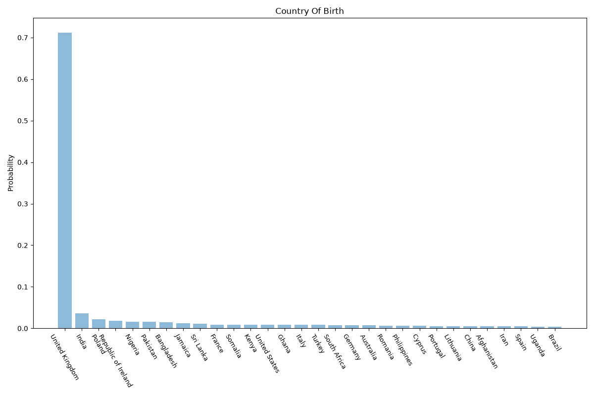

# London
**4 features:** ethnicity, language, religion and country of birth.

## Ethnicity

## Language

## Religion

## Country Of Birth

## Sources

- [Ethnic group (TS021), Census 2021, ONS (2021)](https://www.ons.gov.uk/datasets/TS021/editions/2021/versions/1) — ethnicity
- [Main language (TS024), Census 2021, ONS (2021)](https://www.ons.gov.uk/datasets/TS024/editions/2021/versions/1) — language
- [Religion (TS030), Census 2021, ONS (2021)](https://www.ons.gov.uk/datasets/TS030/editions/2021/versions/1) — religion
- [Country of birth (TS012), Census 2021, ONS (2021)](https://www.ons.gov.uk/datasets/TS012/editions/2021/versions/1) — country of birth