# Northern Ireland

**12 features:** age, sex, sexuality, ethnicity, religion, language, occupation, education, marital status, housing tenure, country of birth, and location.

## Age

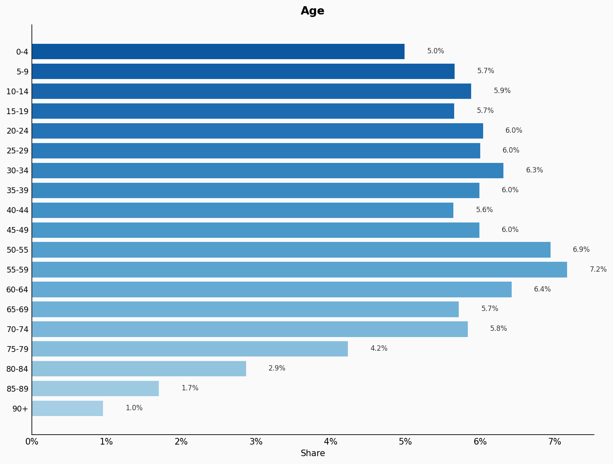

| Option | Share |
|---|---:|
| 0-4 | 5.0% |
| 5-9 | 5.7% |
| 10-14 | 5.9% |
| 15-19 | 5.7% |
| 20-24 | 6.0% |
| 25-29 | 6.0% |
| 30-34 | 6.3% |
| 35-39 | 6.0% |
| 40-44 | 5.6% |
| 45-49 | 6.0% |
| 50-55 | 6.9% |
| 55-59 | 7.2% |
| 60-64 | 6.4% |
| 65-69 | 5.7% |
| 70-74 | 5.8% |
| 75-79 | 4.2% |
| 80-84 | 2.9% |
| 85-89 | 1.7% |
| 90+ | 1.0% |

## Sex

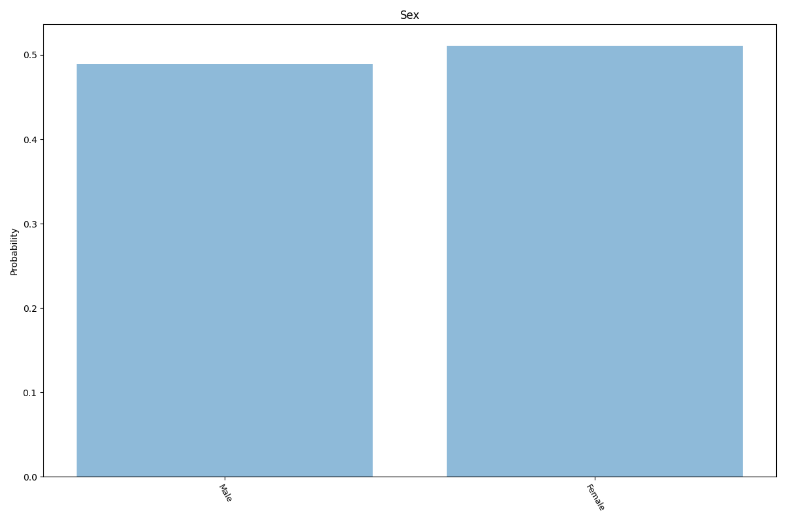

| Option | Share |
|---|---:|
| Female | 51.1% |
| Male | 48.9% |

## Sexuality

| Option | Share |
|---|---:|
| Heterosexual | 94.0% |
| Unsure | 2.9% |
| Homosexual | 1.8% |
| Bisexual | 1.3% |

## Ethnicity

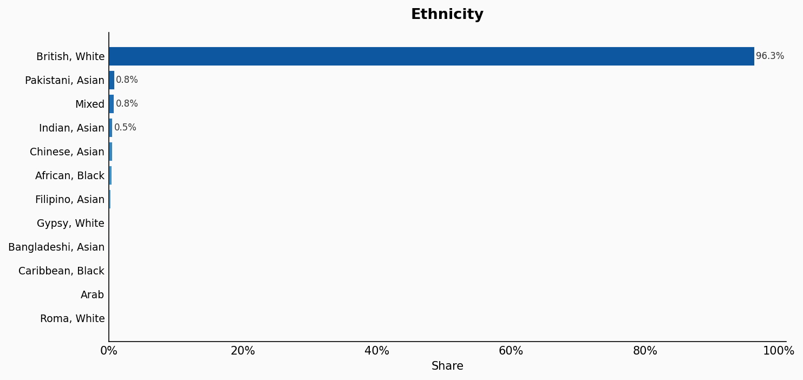

| Option | Share |
|---|---:|
| British, White | 96.3% |
| Pakistani, Asian | 0.8% |
| Mixed | 0.8% |
| Indian, Asian | 0.5% |
| Chinese, Asian | 0.5% |
| African, Black | 0.4% |
| Filipino, Asian | 0.2% |
| Gypsy, White | 0.1% |
| Bangladeshi, Asian | 0.1% |
| Caribbean, Black | 0.1% |
| Arab | 0.1% |
| Roma, White | 0.1% |

## Religion

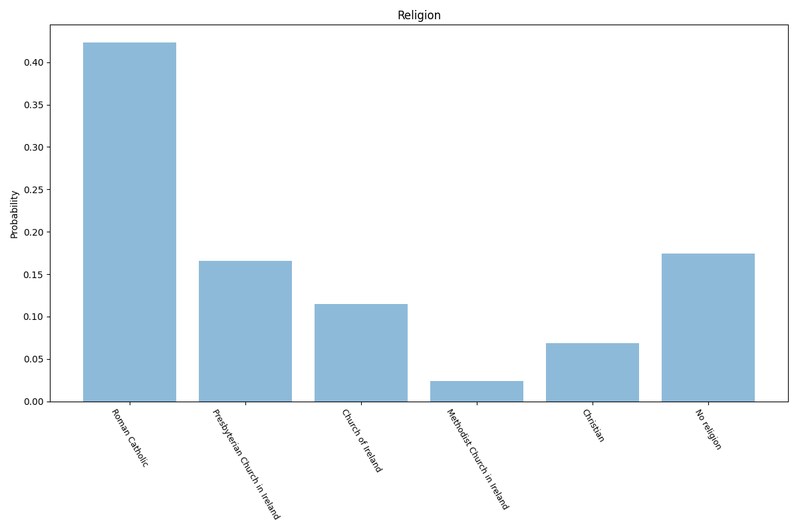

| Option | Share |
|---|---:|
| Roman Catholic | 43.6% |
| No religion | 17.9% |
| Presbyterian Church in Ireland | 17.1% |
| Church of Ireland | 11.8% |
| Christian | 7.1% |
| Methodist Church in Ireland | 2.5% |

## Language

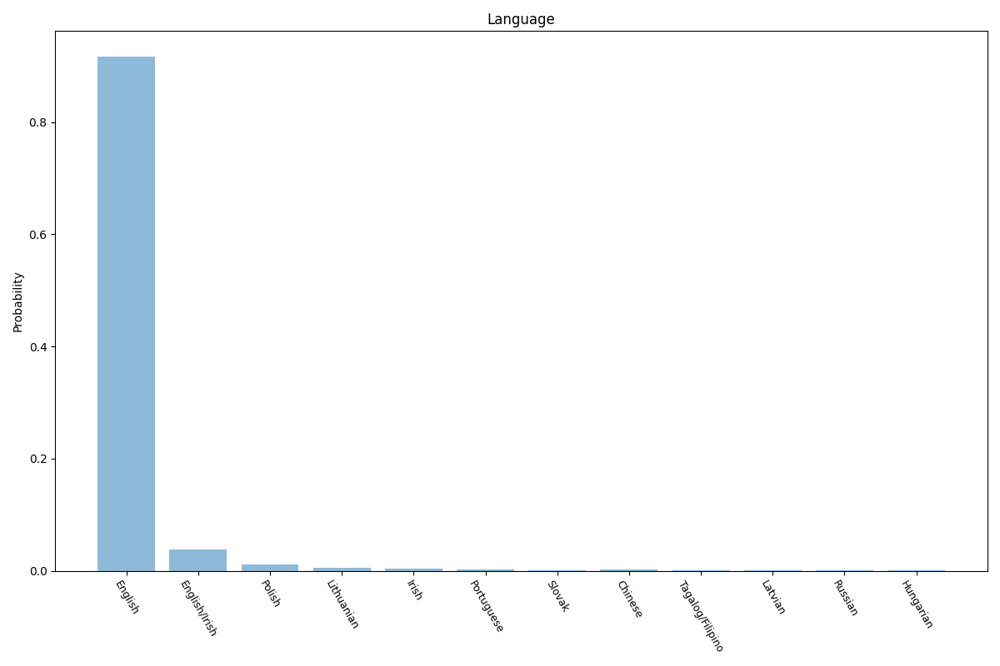

| Option | Share |
|---|---:|
| English | 93.3% |
| English/Irish | 3.8% |
| Polish | 1.1% |
| Lithuanian | 0.5% |
| Irish | 0.3% |
| Portuguese | 0.3% |
| Chinese | 0.2% |
| Slovak | 0.1% |
| Hungarian | 0.1% |
| Latvian | 0.1% |
| Russian | 0.1% |
| Tagalog/Filipino | 0.1% |

## Occupation

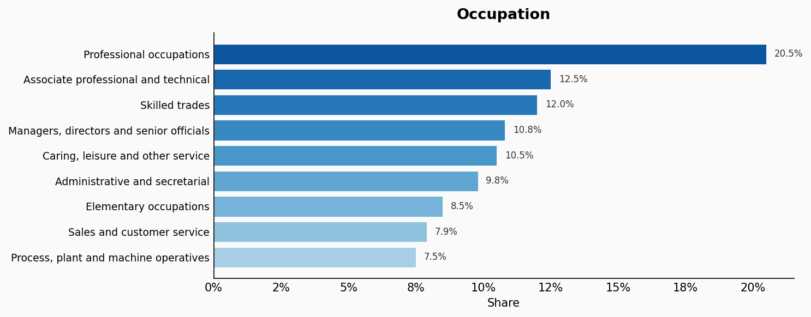

| Option | Share |
|---|---:|
| Professional occupations | 20.5% |
| Associate professional and technical | 12.5% |
| Skilled trades | 12.0% |
| Managers, directors and senior officials | 10.8% |
| Caring, leisure and other service | 10.5% |
| Administrative and secretarial | 9.8% |
| Elementary occupations | 8.5% |
| Sales and customer service | 7.9% |
| Process, plant and machine operatives | 7.5% |

## Education

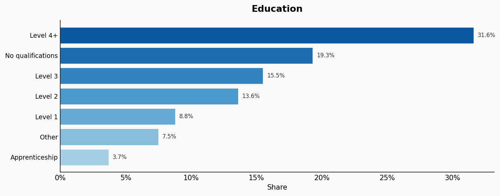

| Option | Share |
|---|---:|
| Level 4+ | 31.6% |
| No qualifications | 19.3% |
| Level 3 | 15.5% |
| Level 2 | 13.6% |
| Level 1 | 8.8% |
| Other | 7.5% |
| Apprenticeship | 3.7% |

## Marital Status

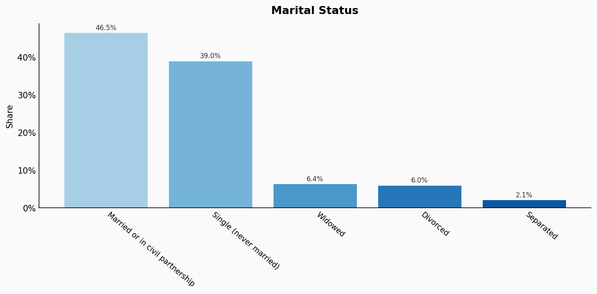

| Option | Share |
|---|---:|
| Married or in civil partnership | 46.5% |
| Single (never married) | 39.0% |
| Widowed | 6.4% |
| Divorced | 6.0% |
| Separated | 2.1% |

## Housing Tenure

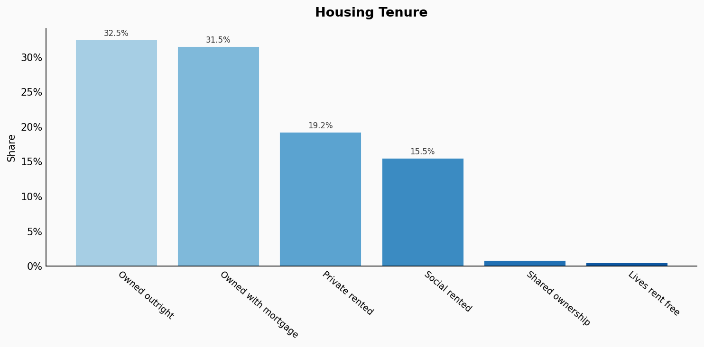

| Option | Share |
|---|---:|
| Owned outright | 32.5% |
| Owned with mortgage | 31.5% |
| Private rented | 19.2% |
| Social rented | 15.5% |
| Shared ownership | 0.8% |
| Lives rent free | 0.5% |

## Country Of Birth

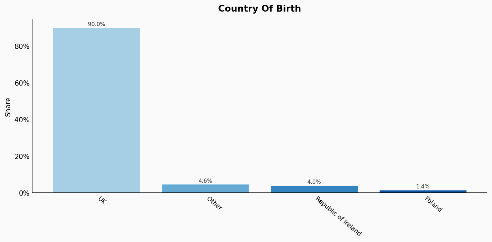

| Option | Share |
|---|---:|
| UK | 90.0% |
| Other | 4.6% |
| Republic of Ireland | 4.0% |
| Poland | 1.4% |

## Location

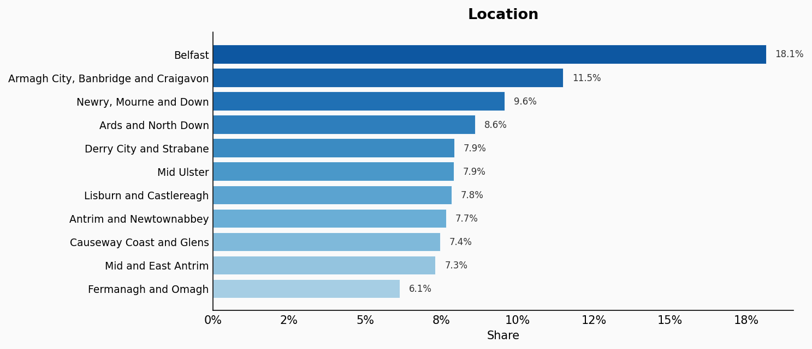

| Option | Share |
|---|---:|
| Belfast | 18.1% |
| Armagh City, Banbridge and Craigavon | 11.5% |
| Newry, Mourne and Down | 9.6% |
| Ards and North Down | 8.6% |
| Derry City and Strabane | 7.9% |
| Mid Ulster | 7.9% |
| Lisburn and Castlereagh | 7.8% |
| Antrim and Newtownabbey | 7.7% |
| Causeway Coast and Glens | 7.4% |
| Mid and East Antrim | 7.3% |
| Fermanagh and Omagh | 6.1% |

## Sources

- [Census 2021 main statistics for Northern Ireland (phase 1), NISRA (2021)](https://www.nisra.gov.uk/statistics/census/2021-census)
  *Covers: `location`*
- [Census 2021 main statistics for Northern Ireland (phase 2 & 3), NISRA (2021)](https://www.nisra.gov.uk/statistics/census-2021-results/main-statistics)
  *Covers: `occupation`, `education`, `marital status`, `housing tenure`, `country of birth`*