# Northern Ireland
**13 features:** age, sex, sexuality, ethnicity, religion, residence, language, occupation, education, marital status, housing tenure, country of birth and location.

## Age

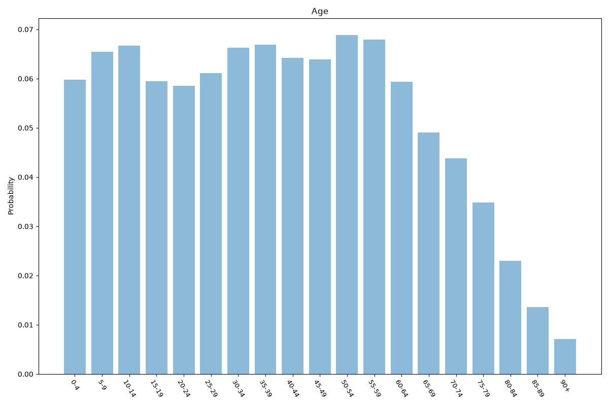

## Sex

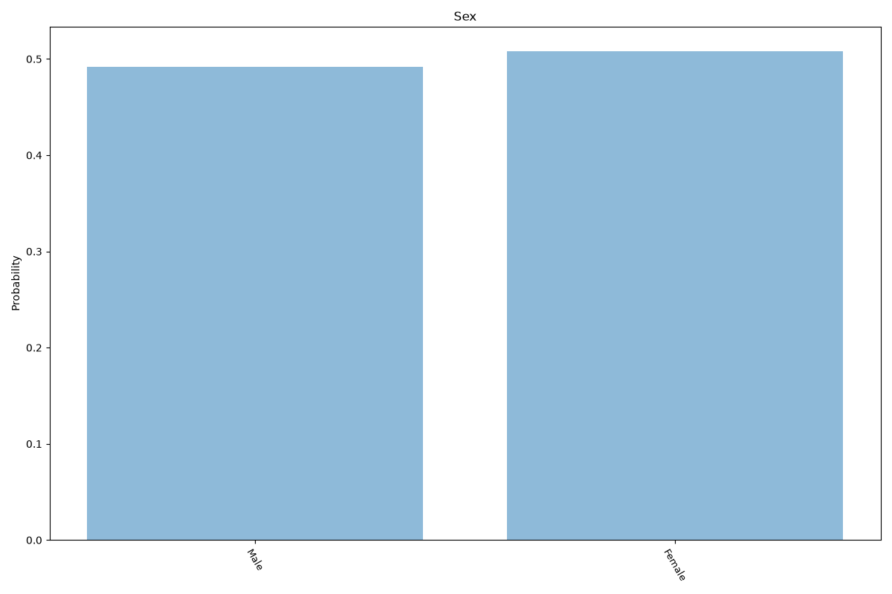

## Sexuality

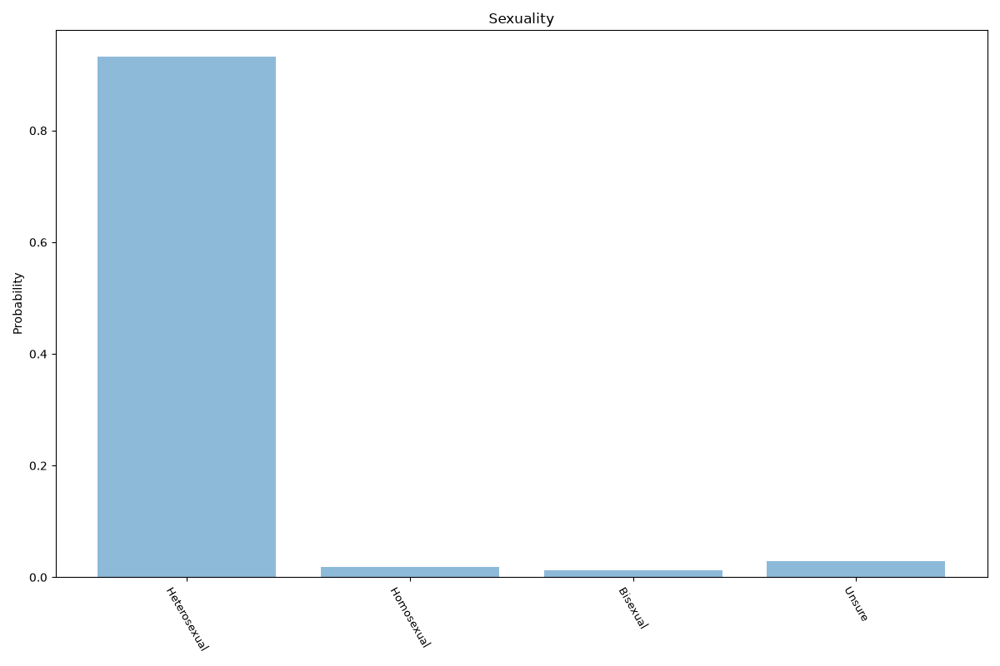

## Ethnicity

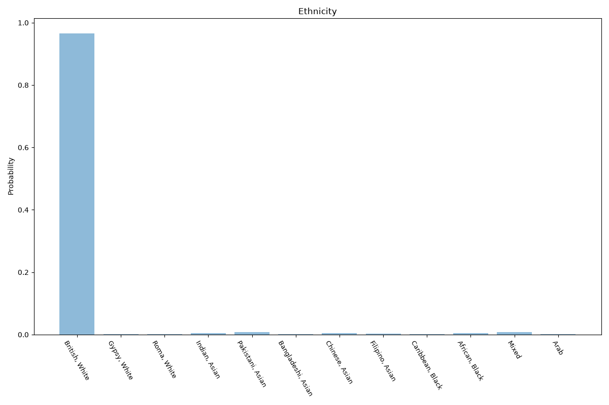

## Religion

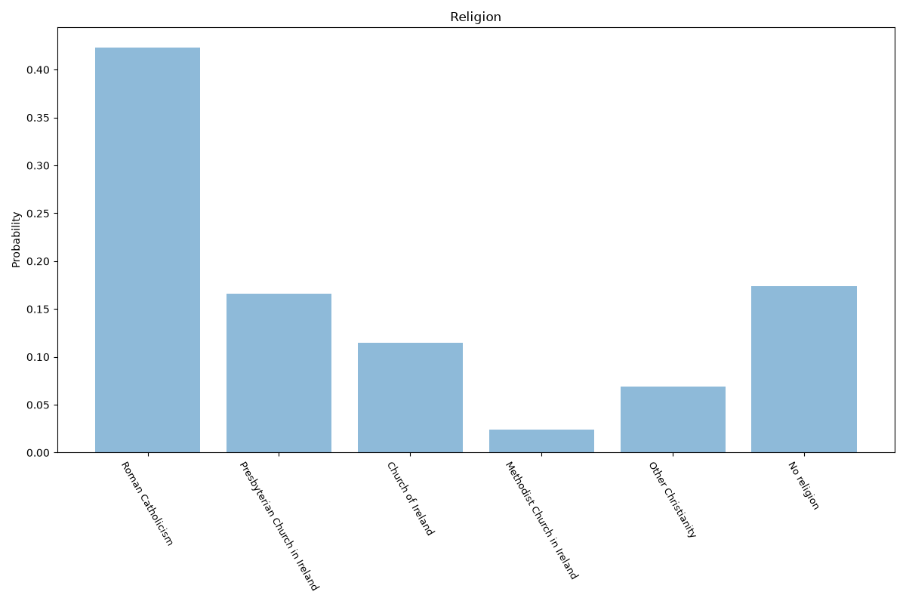

## Residence

## Language

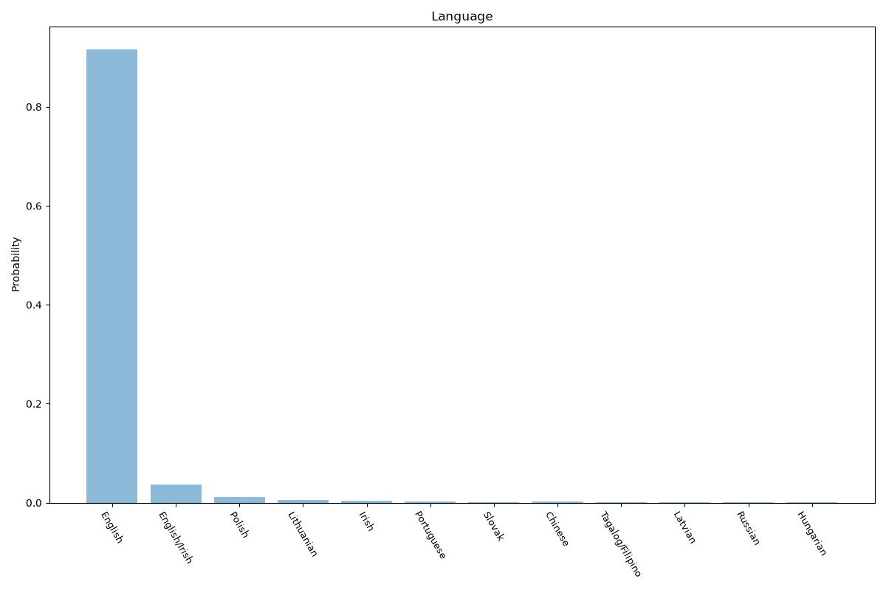

## Occupation

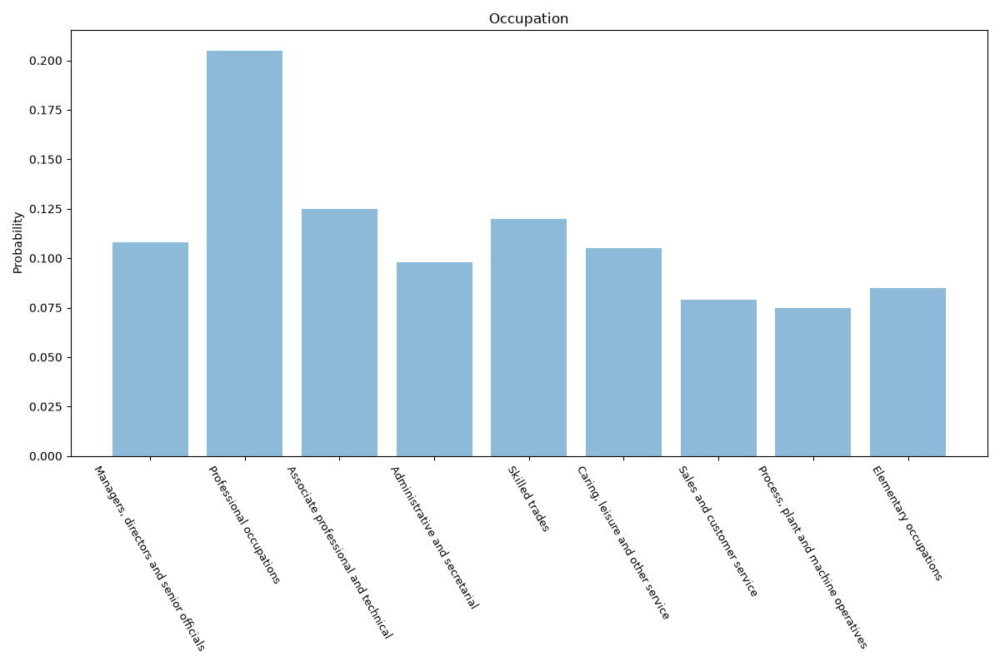

## Education

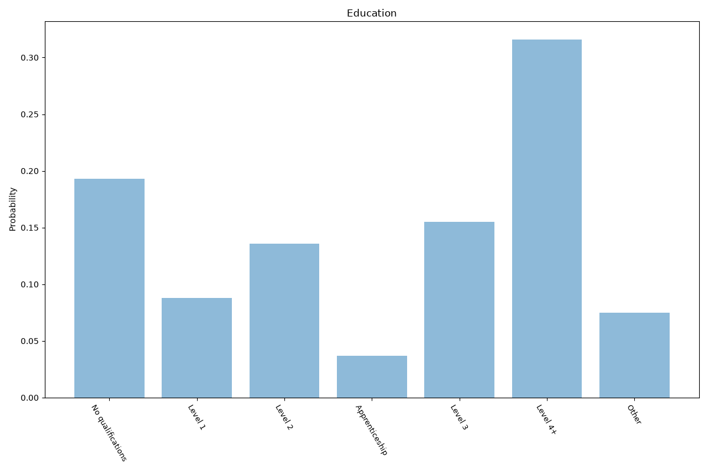

## Marital Status

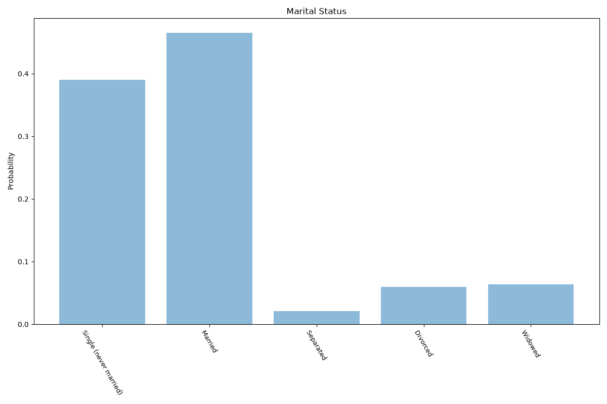

## Housing Tenure

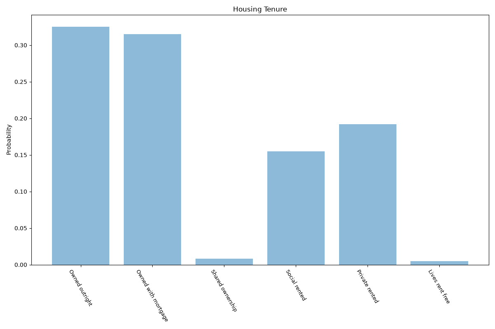

## Country Of Birth

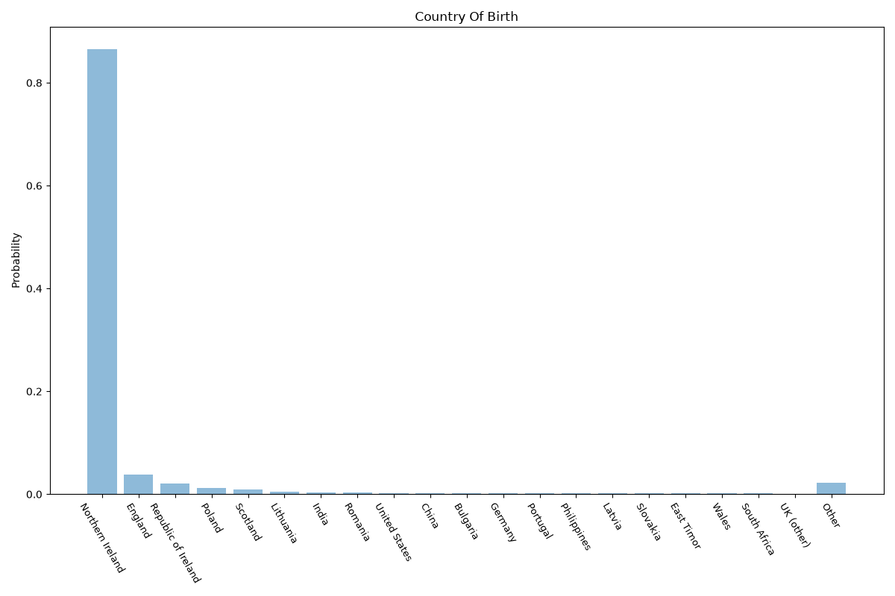

## Location

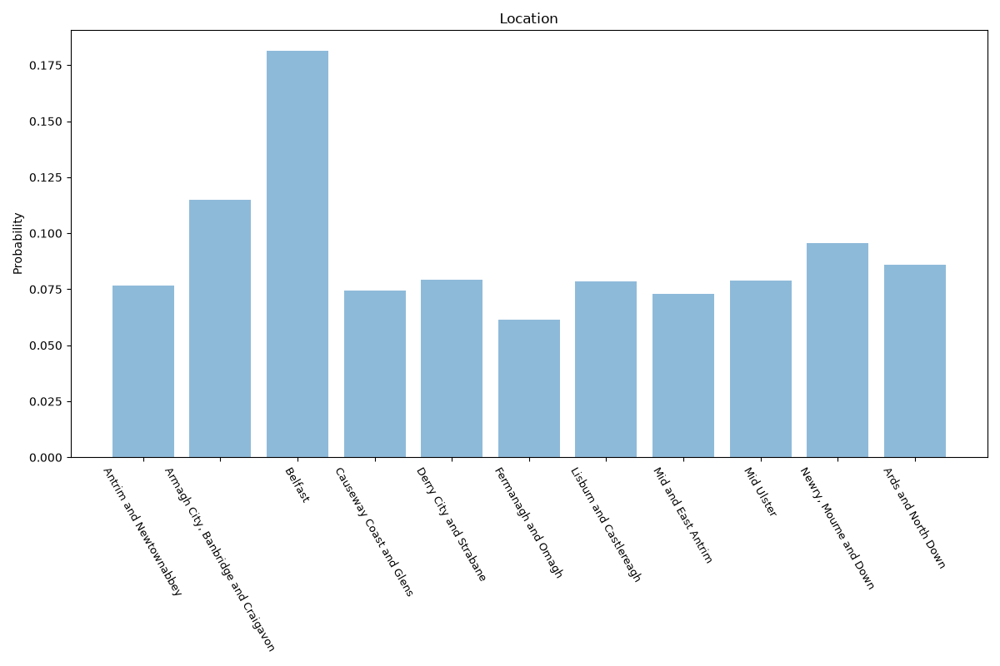

## Sources

- [Country of birth - full detail (MS-A18), Census 2021, NISRA (2021)](https://www.nisra.gov.uk/publications/census-2021-main-statistics-demography-tables-country-birth) — country of birth
- [Five year age bands and sex (MS-A08), Census 2021, NISRA (2021)](https://www.nisra.gov.uk/publications/census-2021-main-statistics-demography-tables-age-and-sex) — age, sex
- [Sexual orientation, UK: 2020, ONS (2020)](https://www.ons.gov.uk/peoplepopulationandcommunity/culturalidentity/sexuality/bulletins/sexualidentityuk/2020) — sexuality
- [Census 2021 main statistics ethnicity tables, NISRA (2021)](https://www.nisra.gov.uk/publications/census-2021-main-statistics-ethnicity-tables) — ethnicity
- [Census 2021 main statistics religion tables, NISRA (2021)](https://www.nisra.gov.uk/publications/census-2021-main-statistics-religion-tables) — religion
- [Census 2021 main statistics language tables, NISRA (2021)](https://www.nisra.gov.uk/publications/census-2021-main-statistics-language-tables) — language
- [Census 2021 main statistics for Northern Ireland (phase 1), NISRA (2021)](https://www.nisra.gov.uk/statistics/census/2021-census) — location
- [Census 2021 main statistics for Northern Ireland (phase 2 & 3), NISRA (2021)](https://www.nisra.gov.uk/statistics/census-2021-results/main-statistics) — occupation, education, marital status, housing tenure
- [Urban population (% of total population), World Bank (2025)](https://data.worldbank.org/indicator/SP.URB.TOTL.IN.ZS) — residence