# Scotland

**12 features:** age, sex, sexuality, ethnicity, religion, language, occupation, education, marital status, housing tenure, country of birth, and location.

## Age

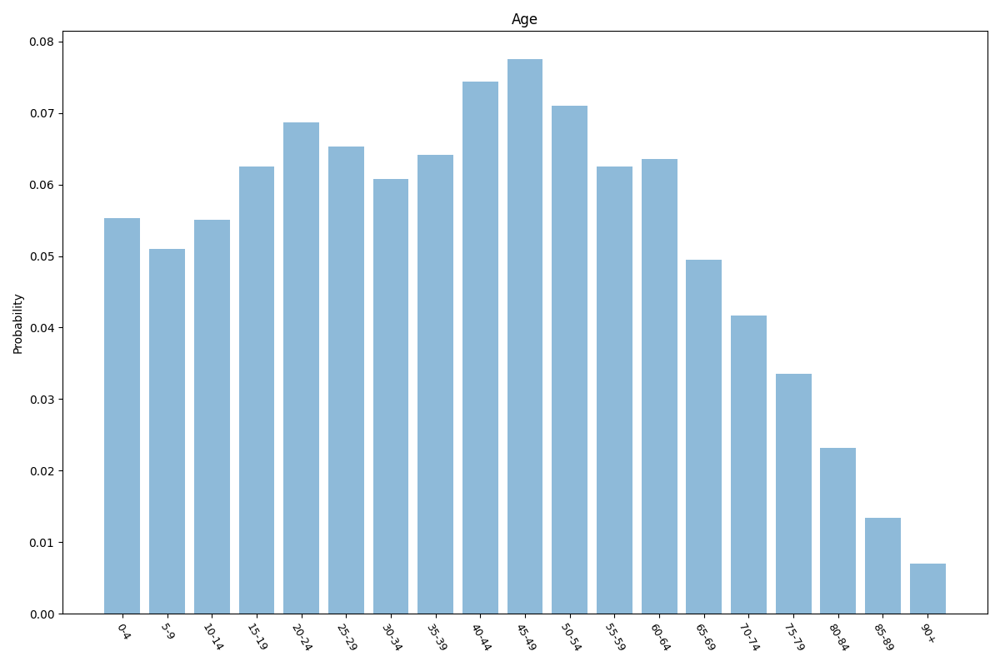

| Option | Share |
|---|---:|
| 0-4 | 5.5% |
| 5-9 | 5.1% |
| 10-14 | 5.5% |
| 15-19 | 6.2% |
| 20-24 | 6.9% |
| 25-29 | 6.5% |
| 30-34 | 6.1% |
| 35-39 | 6.4% |
| 40-44 | 7.4% |
| 45-49 | 7.8% |
| 50-54 | 7.1% |
| 55-59 | 6.2% |
| 60-64 | 6.4% |
| 65-69 | 4.9% |
| 70-74 | 4.2% |
| 75-79 | 3.4% |
| 80-84 | 2.3% |
| 85-89 | 1.3% |
| 90+ | 0.7% |

## Sex

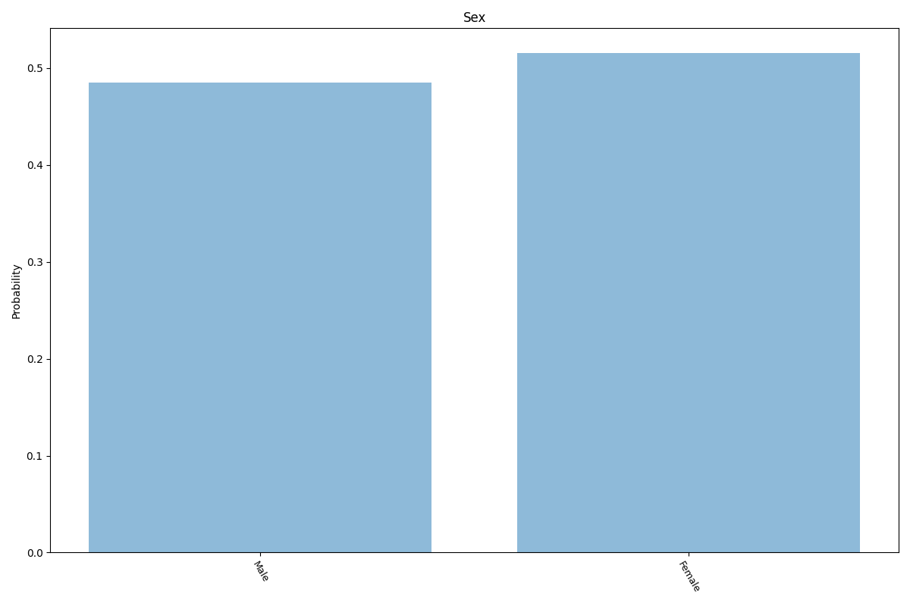

| Option | Share |
|---|---:|
| Female | 51.5% |
| Male | 48.5% |

## Sexuality

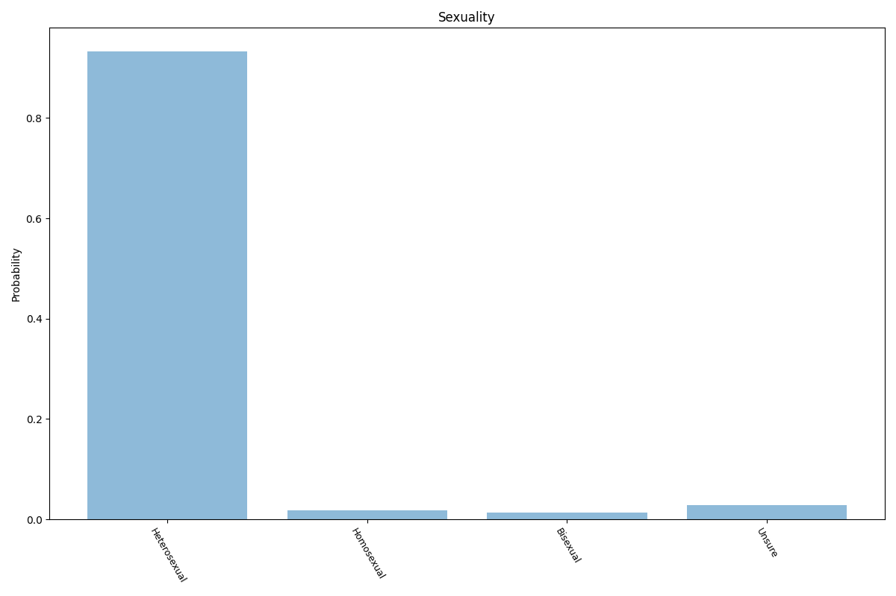

| Option | Share |
|---|---:|
| Heterosexual | 94.0% |
| Unsure | 2.9% |
| Homosexual | 1.8% |
| Bisexual | 1.3% |

## Ethnicity

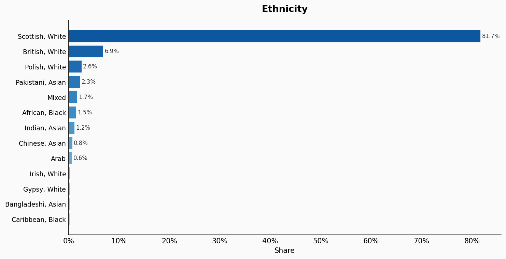

| Option | Share |
|---|---:|
| Scottish, White | 81.7% |
| British, White | 6.9% |
| Polish, White | 2.6% |
| Pakistani, Asian | 2.3% |
| Mixed | 1.7% |
| African, Black | 1.5% |
| Indian, Asian | 1.2% |
| Chinese, Asian | 0.8% |
| Arab | 0.6% |
| Irish, White | 0.2% |
| Gypsy, White | 0.2% |
| Bangladeshi, Asian | 0.2% |
| Caribbean, Black | 0.2% |

## Religion

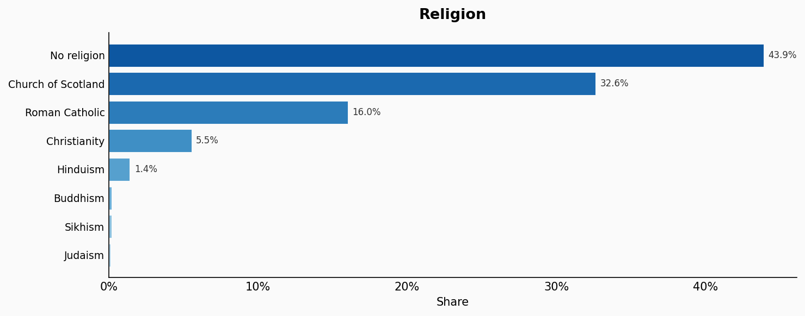

| Option | Share |
|---|---:|
| No religion | 43.9% |
| Church of Scotland | 32.6% |
| Roman Catholic | 16.0% |
| Christianity | 5.5% |
| Hinduism | 1.4% |
| Buddhism | 0.2% |
| Sikhism | 0.2% |
| Judaism | 0.1% |

## Language

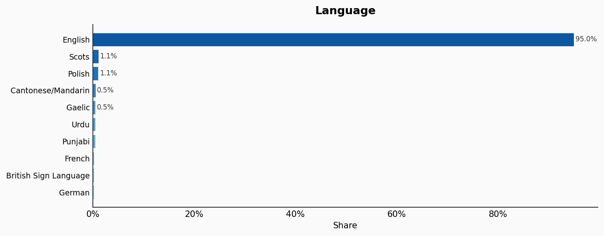

| Option | Share |
|---|---:|
| English | 95.0% |
| Scots | 1.1% |
| Polish | 1.1% |
| Cantonese/Mandarin | 0.5% |
| Gaelic | 0.5% |
| Urdu | 0.5% |
| Punjabi | 0.5% |
| French | 0.3% |
| British Sign Language | 0.3% |
| German | 0.2% |

## Occupation

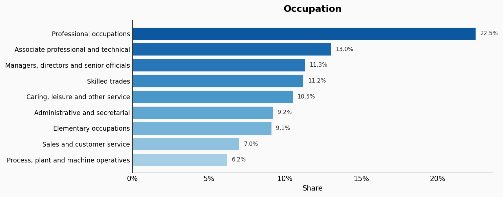

| Option | Share |
|---|---:|
| Professional occupations | 22.5% |
| Associate professional and technical | 13.0% |
| Managers, directors and senior officials | 11.3% |
| Skilled trades | 11.2% |
| Caring, leisure and other service | 10.5% |
| Administrative and secretarial | 9.2% |
| Elementary occupations | 9.1% |
| Sales and customer service | 7.0% |
| Process, plant and machine operatives | 6.2% |

## Education

| Option | Share |
|---|---:|
| Level 4+ | 32.5% |
| Level 3 | 16.8% |
| No qualifications | 14.8% |
| Level 2 | 12.8% |
| Level 1 | 8.9% |
| Other | 8.5% |
| Apprenticeship | 5.7% |

## Marital Status

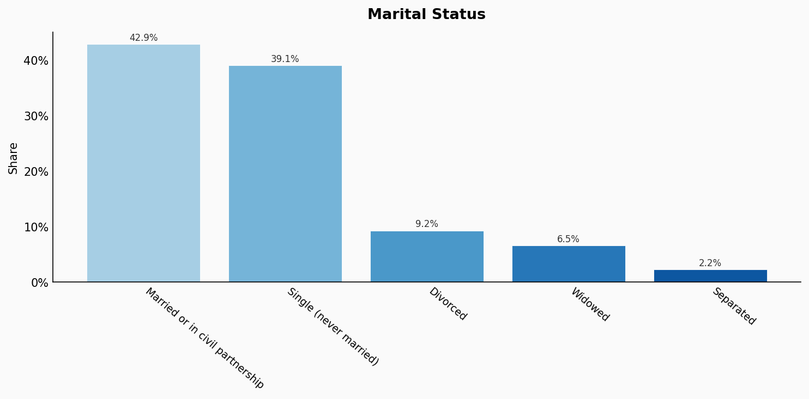

| Option | Share |
|---|---:|
| Married or in civil partnership | 42.9% |
| Single (never married) | 39.1% |
| Divorced | 9.2% |
| Widowed | 6.5% |
| Separated | 2.2% |

## Housing Tenure

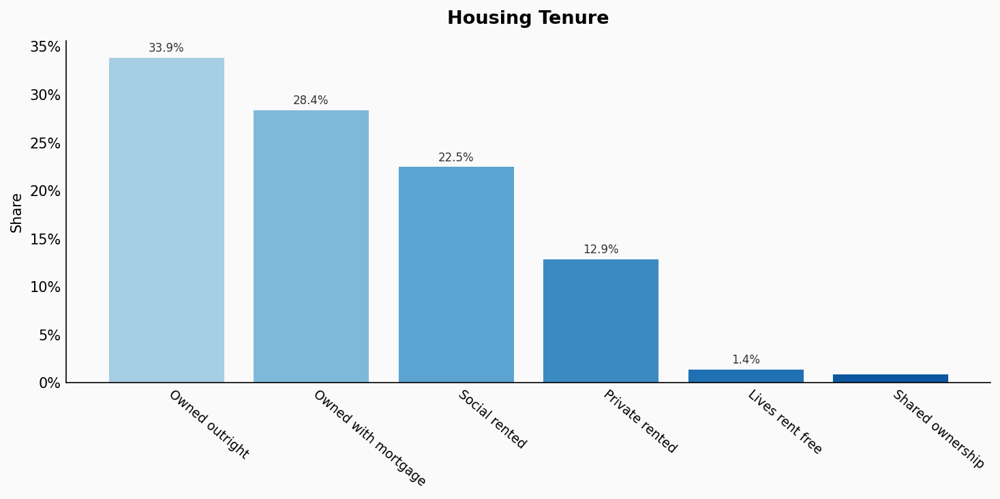

| Option | Share |
|---|---:|
| Owned outright | 33.9% |
| Owned with mortgage | 28.4% |
| Social rented | 22.5% |
| Private rented | 12.9% |
| Lives rent free | 1.4% |
| Shared ownership | 0.9% |

## Country Of Birth

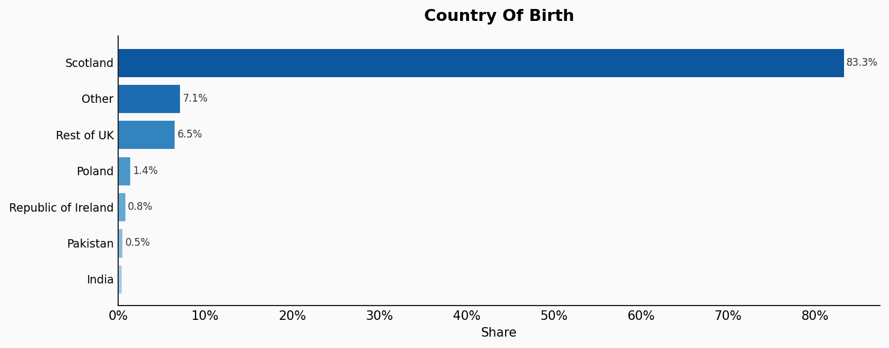

| Option | Share |
|---|---:|
| Scotland | 83.3% |
| Other | 7.1% |
| Rest of UK | 6.5% |
| Poland | 1.4% |
| Republic of Ireland | 0.8% |
| Pakistan | 0.5% |
| India | 0.4% |

## Location

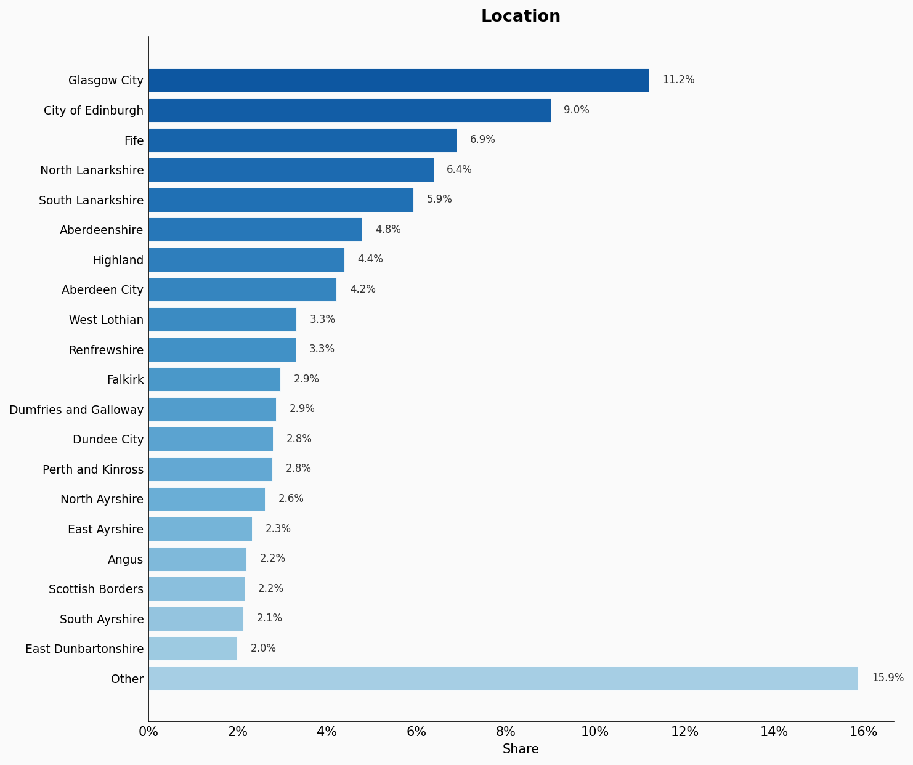

| Option | Share |
|---|---:|
| Glasgow City | 11.2% |
| City of Edinburgh | 9.0% |
| Fife | 6.9% |
| North Lanarkshire | 6.4% |
| South Lanarkshire | 5.9% |
| Aberdeenshire | 4.8% |
| Highland | 4.4% |
| Aberdeen City | 4.2% |
| West Lothian | 3.3% |
| Renfrewshire | 3.3% |
| Falkirk | 2.9% |
| Dumfries and Galloway | 2.9% |
| Dundee City | 2.8% |
| Perth and Kinross | 2.8% |
| North Ayrshire | 2.6% |
| East Ayrshire | 2.3% |
| Angus | 2.2% |
| Scottish Borders | 2.2% |
| South Ayrshire | 2.1% |
| East Dunbartonshire | 2.0% |
| Other | 15.9% |

## Sources

- [Demography of Scotland, Scotland's Census 2011, National Records of Scotland](https://www.scotlandscensus.gov.uk/census-results/at-a-glance/population/)
  *Covers: `age`, `sex`, `sexuality`, `ethnicity`, `religion`, `language`, `location`*
- [Housing, Scotland's Census 2022, National Records of Scotland (2022)](https://www.scotlandscensus.gov.uk/2022-reports/scotland-s-census-2022-housing/)
  *Covers: `housing tenure`*
- [Scotland's Census 2022 (estimated from national averages), National Records of Scotland (2022)](https://www.scotlandscensus.gov.uk/2022-reports/scotland-s-census-2022-education-labour-market-and-travel-to-work/)
  *Covers: `occupation`, `education`, `marital status`, `country of birth`*