# Scotland
**13 features:** age, sex, sexuality, ethnicity, religion, residence, language, occupation, education, marital status, housing tenure, country of birth and location.

## Age

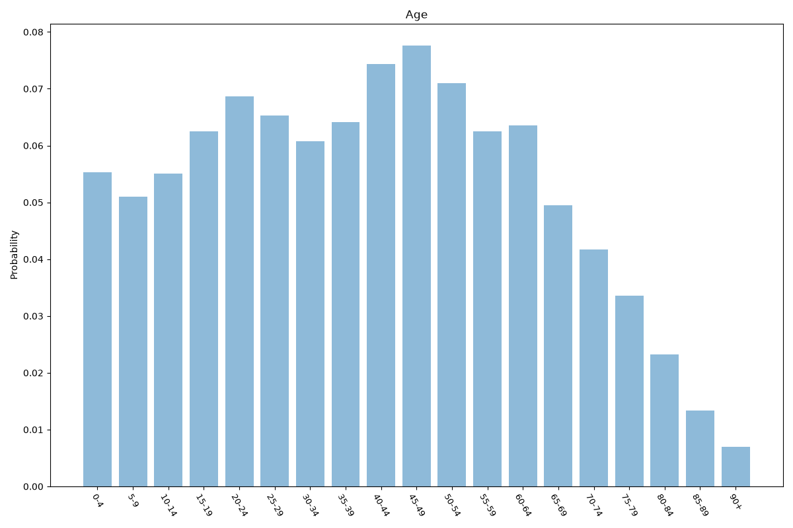

## Sex

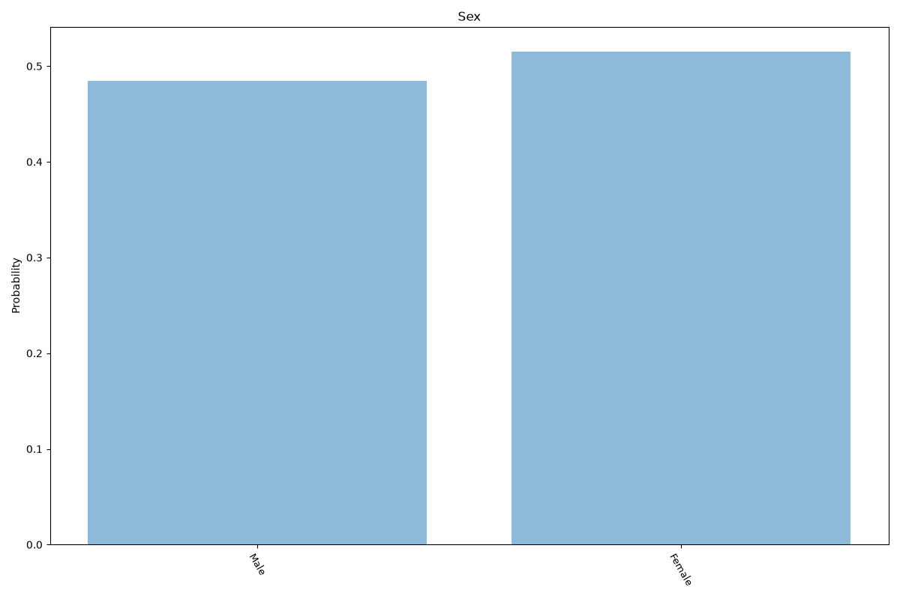

## Sexuality

## Ethnicity

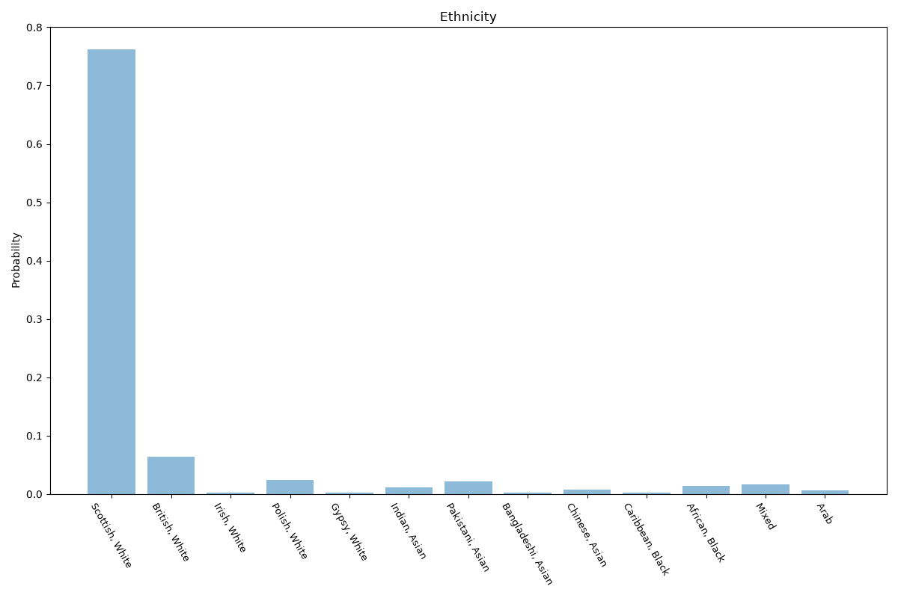

## Religion

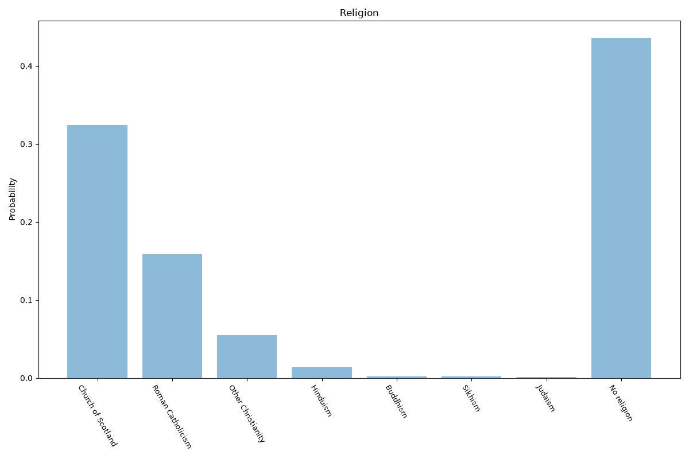

## Residence

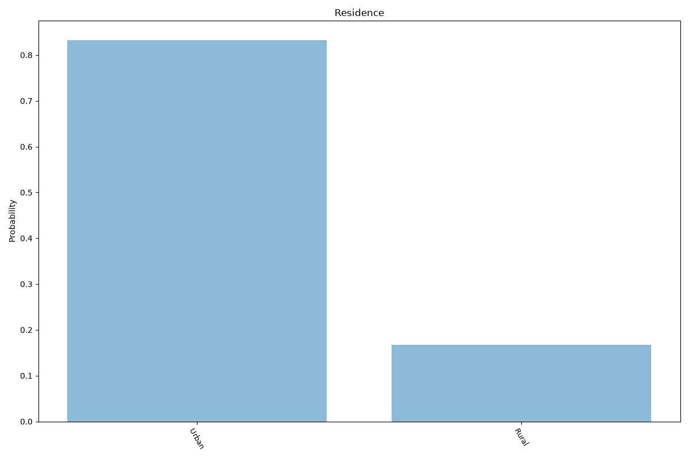

## Language

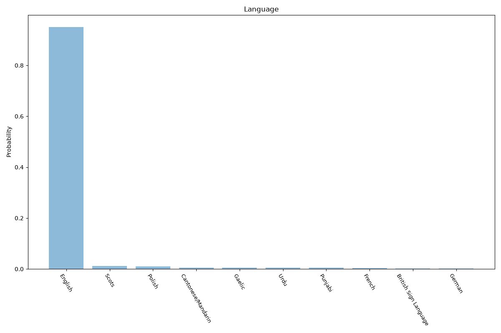

## Occupation

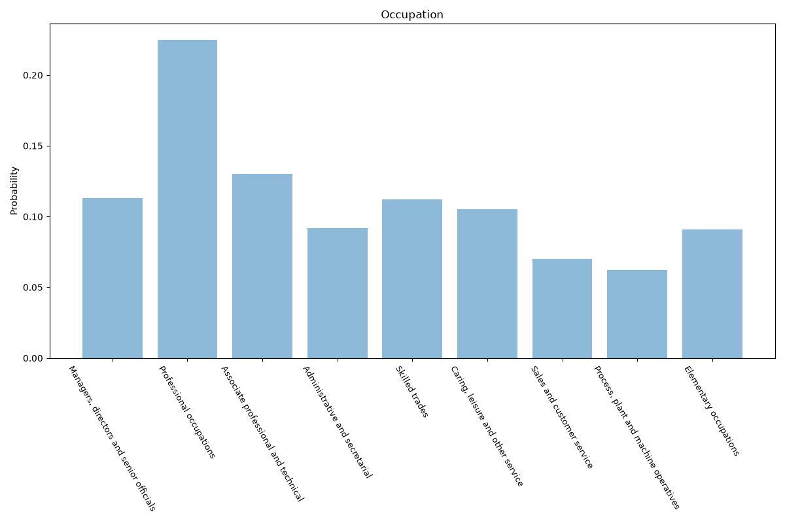

## Education

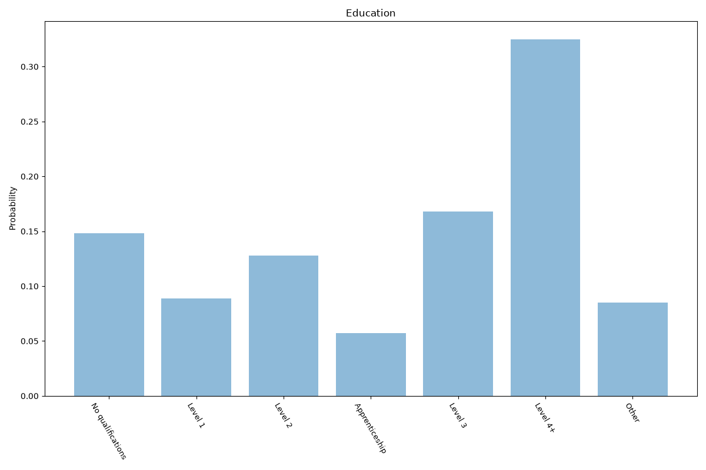

## Marital Status

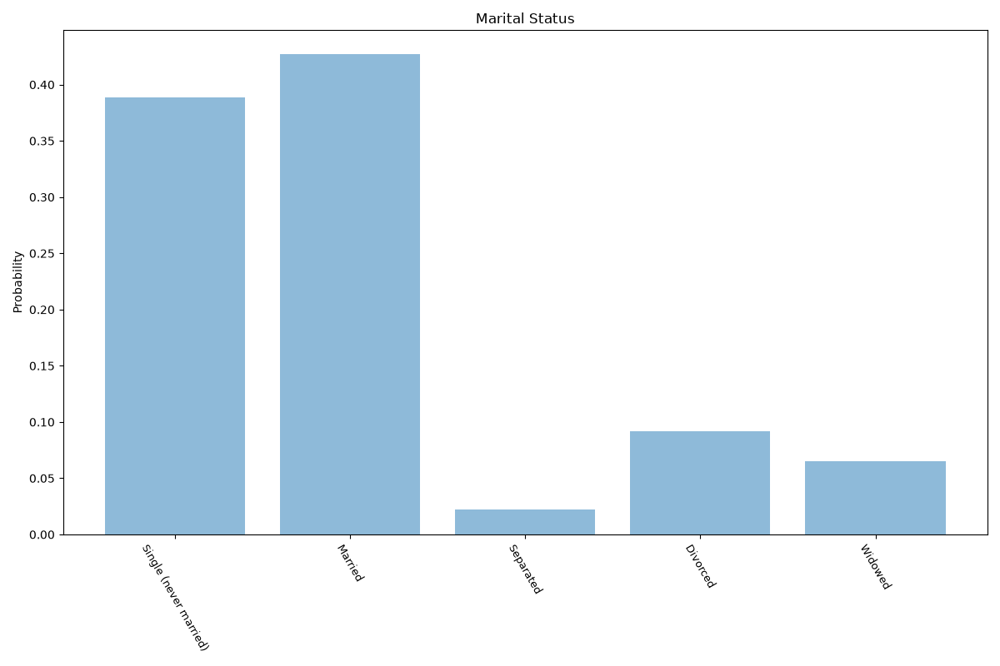

## Housing Tenure

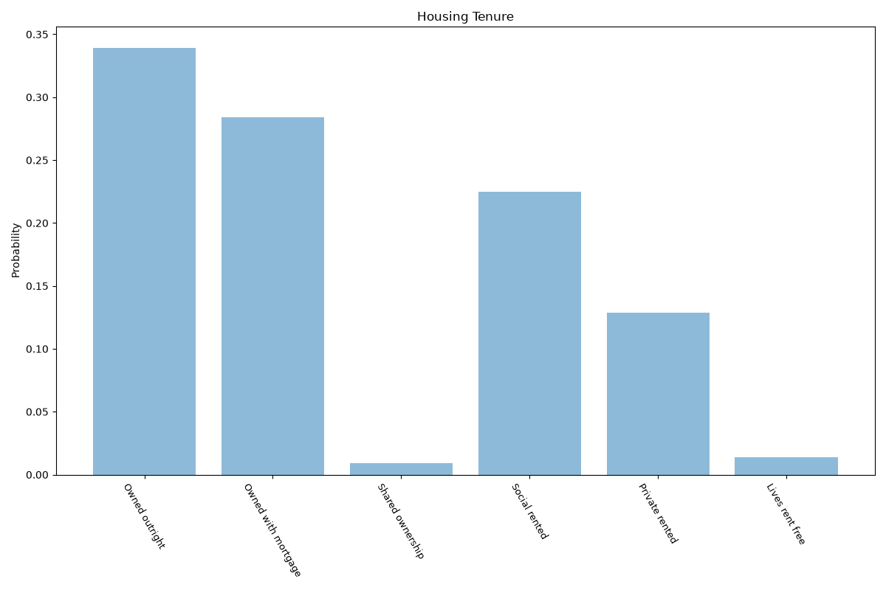

## Country Of Birth

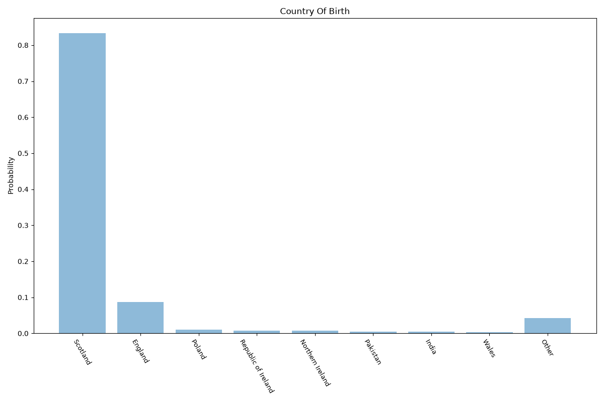

## Location

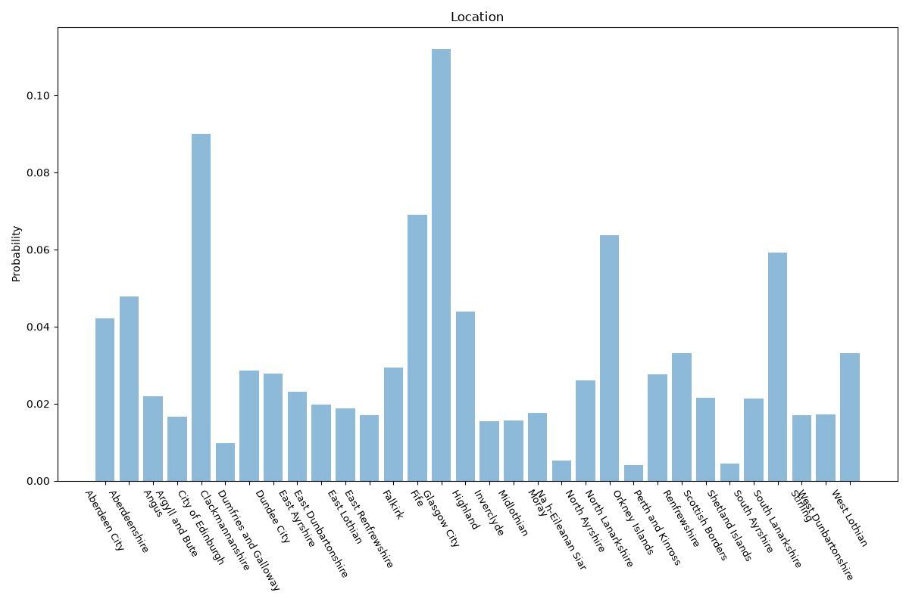

## Sources

- [Country of birth, Scotland's Census 2011, National Records of Scotland (2011)](https://www.scotlandscensus.gov.uk/census-results/at-a-glance/country-of-birth/) — country of birth
- [Demography of Scotland, Scotland's Census 2011, National Records of Scotland (2011)](https://www.scotlandscensus.gov.uk/census-results/at-a-glance/population/) — age, sex, sexuality, ethnicity, religion, language, location
- [Housing, Scotland's Census 2022, National Records of Scotland (2022)](https://www.scotlandscensus.gov.uk/2022-reports/scotland-s-census-2022-housing/) — housing tenure
- [Scotland's Census 2022, National Records of Scotland (2022)](https://www.scotlandscensus.gov.uk/2022-reports/scotland-s-census-2022-education-labour-market-and-travel-to-work/) — occupation, education, marital status
- [Urban population (% of total population), World Bank (2025)](https://data.worldbank.org/indicator/SP.URB.TOTL.IN.ZS) — residence