# Wales

**13 features:** age, sex, sexuality, ethnicity, religion, language, relationship, occupation, education, marital status, housing tenure, country of birth, and location.

## Age

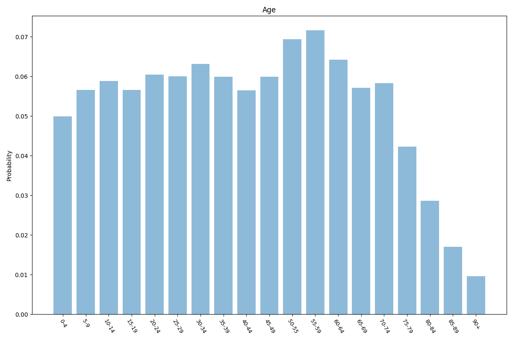

| Option | Share |
|---|---:|
| 0-4 | 5.0% |
| 5-9 | 5.7% |
| 10-14 | 5.9% |
| 15-19 | 5.7% |
| 20-24 | 6.0% |
| 25-29 | 6.0% |
| 30-34 | 6.3% |
| 35-39 | 6.0% |
| 40-44 | 5.6% |
| 45-49 | 6.0% |
| 50-55 | 6.9% |
| 55-59 | 7.2% |
| 60-64 | 6.4% |
| 65-69 | 5.7% |
| 70-74 | 5.8% |
| 75-79 | 4.2% |
| 80-84 | 2.9% |
| 85-89 | 1.7% |
| 90+ | 1.0% |

## Sex

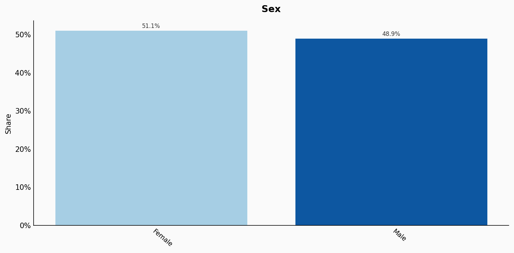

| Option | Share |
|---|---:|
| Female | 51.1% |
| Male | 48.9% |

## Sexuality

| Option | Share |
|---|---:|
| Heterosexual | 94.0% |
| Unsure | 2.9% |
| Homosexual | 1.8% |
| Bisexual | 1.3% |

## Ethnicity

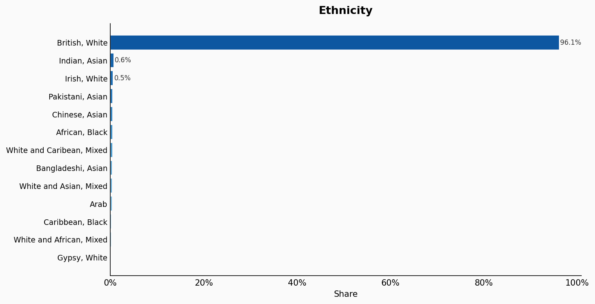

| Option | Share |
|---|---:|
| British, White | 96.1% |
| Indian, Asian | 0.6% |
| Irish, White | 0.5% |
| Pakistani, Asian | 0.4% |
| Chinese, Asian | 0.4% |
| African, Black | 0.4% |
| White and Caribean, Mixed | 0.4% |
| Bangladeshi, Asian | 0.3% |
| White and Asian, Mixed | 0.3% |
| Arab | 0.3% |
| Caribbean, Black | 0.1% |
| White and African, Mixed | 0.1% |
| Gypsy, White | 0.0% |

## Religion

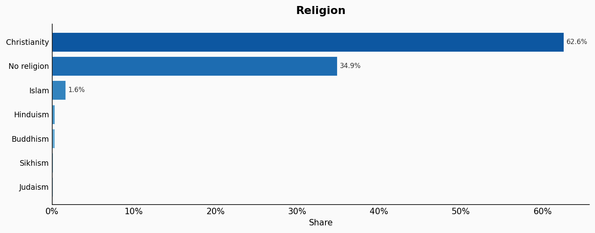

| Option | Share |
|---|---:|
| Christianity | 62.6% |
| No religion | 34.9% |
| Islam | 1.6% |
| Hinduism | 0.3% |
| Buddhism | 0.3% |
| Sikhism | 0.1% |
| Judaism | 0.1% |

## Language

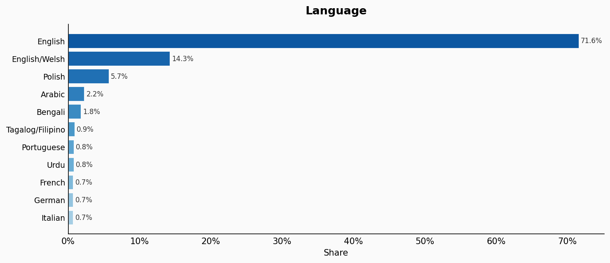

| Option | Share |
|---|---:|
| English | 71.6% |
| English/Welsh | 14.3% |
| Polish | 5.7% |
| Arabic | 2.2% |
| Bengali | 1.8% |
| Tagalog/Filipino | 0.9% |
| Portuguese | 0.8% |
| Urdu | 0.8% |
| French | 0.7% |
| German | 0.7% |
| Italian | 0.7% |

## Relationship

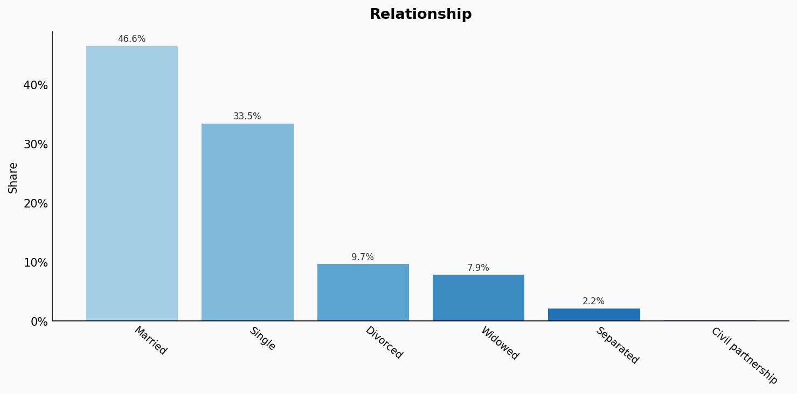

| Option | Share |
|---|---:|
| Married | 46.6% |
| Single | 33.5% |
| Divorced | 9.7% |
| Widowed | 7.9% |
| Separated | 2.2% |
| Civil partnership | 0.2% |

## Occupation

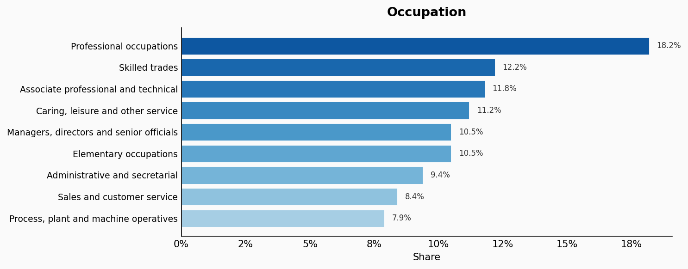

| Option | Share |
|---|---:|
| Professional occupations | 18.2% |
| Skilled trades | 12.2% |
| Associate professional and technical | 11.8% |
| Caring, leisure and other service | 11.2% |
| Managers, directors and senior officials | 10.5% |
| Elementary occupations | 10.5% |
| Administrative and secretarial | 9.4% |
| Sales and customer service | 8.4% |
| Process, plant and machine operatives | 7.9% |

## Education

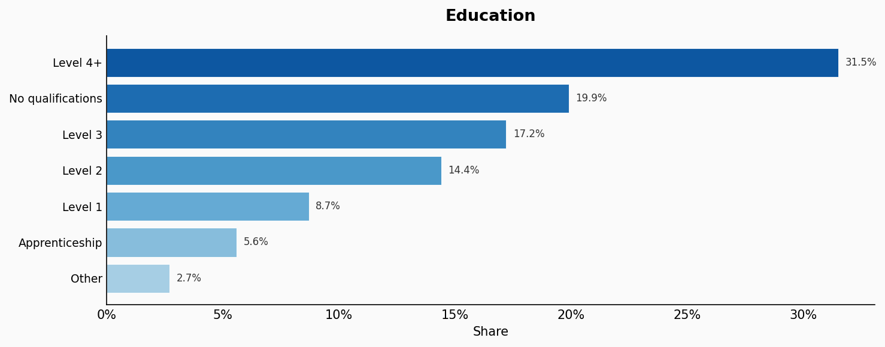

| Option | Share |
|---|---:|
| Level 4+ | 31.5% |
| No qualifications | 19.9% |
| Level 3 | 17.2% |
| Level 2 | 14.4% |
| Level 1 | 8.7% |
| Apprenticeship | 5.6% |
| Other | 2.7% |

## Marital Status

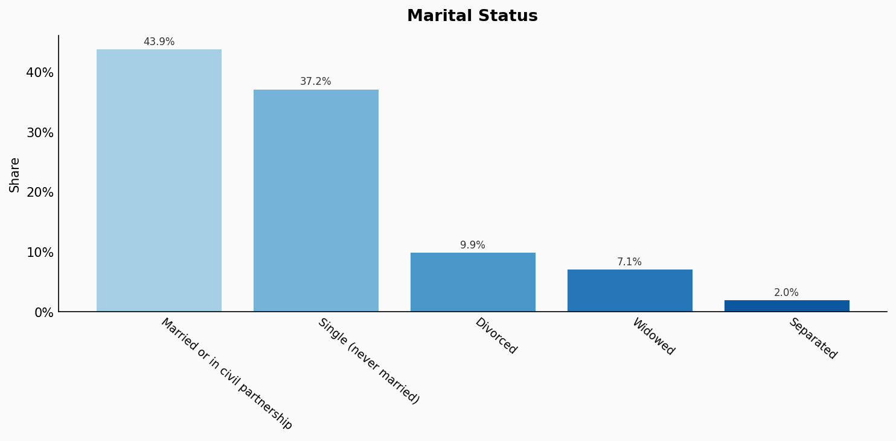

| Option | Share |
|---|---:|
| Married or in civil partnership | 43.9% |
| Single (never married) | 37.2% |
| Divorced | 9.9% |
| Widowed | 7.1% |
| Separated | 2.0% |

## Housing Tenure

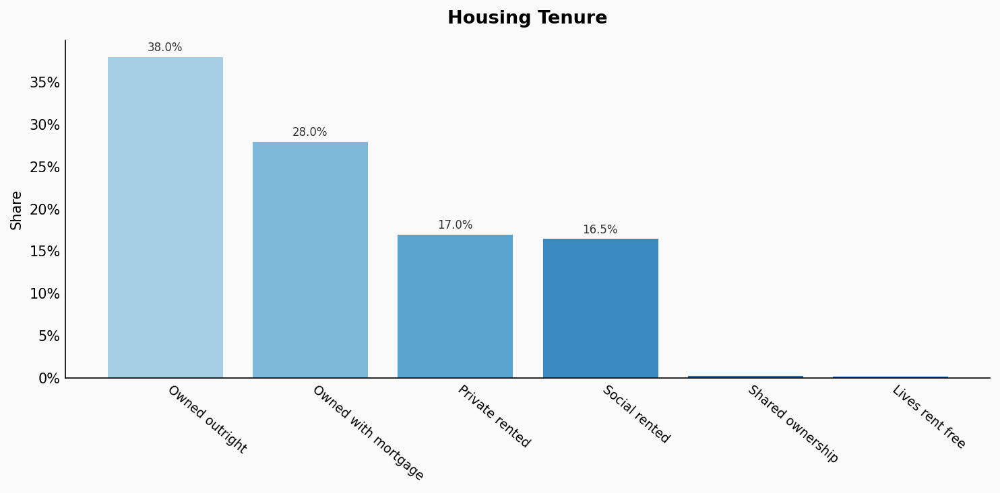

| Option | Share |
|---|---:|
| Owned outright | 38.0% |
| Owned with mortgage | 28.0% |
| Private rented | 17.0% |
| Social rented | 16.5% |
| Shared ownership | 0.3% |
| Lives rent free | 0.2% |

## Country Of Birth

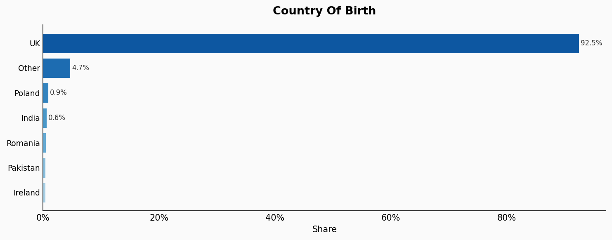

| Option | Share |
|---|---:|
| UK | 92.5% |
| Other | 4.7% |
| Poland | 0.9% |
| India | 0.6% |
| Romania | 0.5% |
| Pakistan | 0.4% |
| Ireland | 0.4% |

## Location

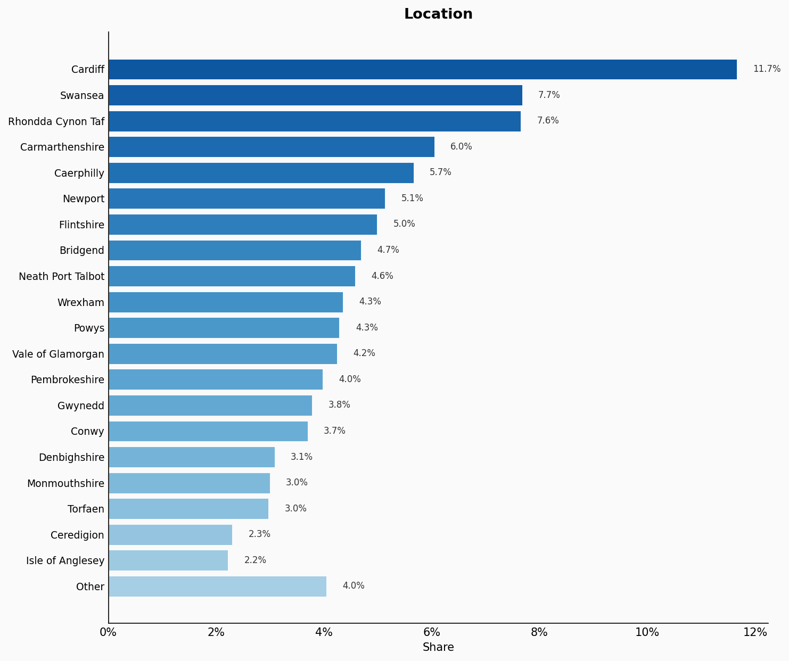

| Option | Share |
|---|---:|
| Cardiff | 11.7% |
| Swansea | 7.7% |
| Rhondda Cynon Taf | 7.6% |
| Carmarthenshire | 6.0% |
| Caerphilly | 5.7% |
| Newport | 5.1% |
| Flintshire | 5.0% |
| Bridgend | 4.7% |
| Neath Port Talbot | 4.6% |
| Wrexham | 4.3% |
| Powys | 4.3% |
| Vale of Glamorgan | 4.2% |
| Pembrokeshire | 4.0% |
| Gwynedd | 3.8% |
| Conwy | 3.7% |
| Denbighshire | 3.1% |
| Monmouthshire | 3.0% |
| Torfaen | 3.0% |
| Ceredigion | 2.3% |
| Isle of Anglesey | 2.2% |
| Other | 4.0% |

## Sources

- [Population and household estimates, England and Wales: Census 2021, ONS (2021)](https://www.ons.gov.uk/peoplepopulationandcommunity/populationandmigration/populationestimates/datasets/populationandhouseholdestimatesenglandandwalescensus2021)
  *Covers: `age`, `sex`, `location`*
- [Sexual orientation, UK: 2020, ONS (2020)](https://www.ons.gov.uk/peoplepopulationandcommunity/culturalidentity/sexuality/bulletins/sexualidentityuk/2020)
  *Covers: `sexuality`*
- [Religion in England and Wales 2011, ONS (2011)](https://www.ons.gov.uk/peoplepopulationandcommunity/culturalidentity/religion/articles/religioninenglandandwales2011/2012-12-11)
  *Covers: `ethnicity`, `religion`*
- [Occupation (TS063), Census 2021, ONS (2021)](https://www.ons.gov.uk/datasets/TS063/editions/2021/versions/1)
  *Covers: `occupation`*
- [Highest level of qualification (TS067), Census 2021, ONS (2021)](https://www.ons.gov.uk/datasets/TS067/editions/2021/versions/1)
  *Covers: `education`*
- [Legal partnership status (TS002), Census 2021, ONS (2021)](https://www.ons.gov.uk/datasets/TS002/editions/2021/versions/3)
  *Covers: `marital status`*
- [Tenure of household (TS054), Census 2021, ONS (2021)](https://www.ons.gov.uk/datasets/TS054/editions/2021/versions/1)
  *Covers: `housing tenure`*
- [International migration, England and Wales: Census 2021, ONS (2021)](https://www.ons.gov.uk/peoplepopulationandcommunity/populationandmigration/internationalmigration/bulletins/internationalmigrationenglandandwales/census2021)
  *Covers: `country of birth`*