# Wales
**12 features:** age, sex, sexuality, ethnicity, religion, language, occupation, education, marital status, housing tenure, country of birth and location.

## Age

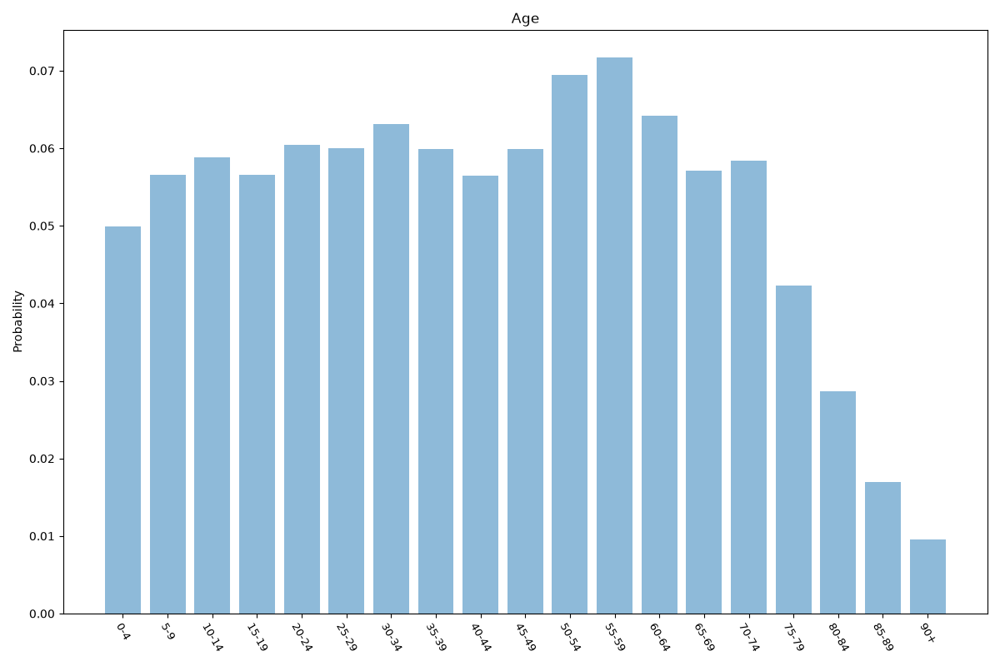

## Sex

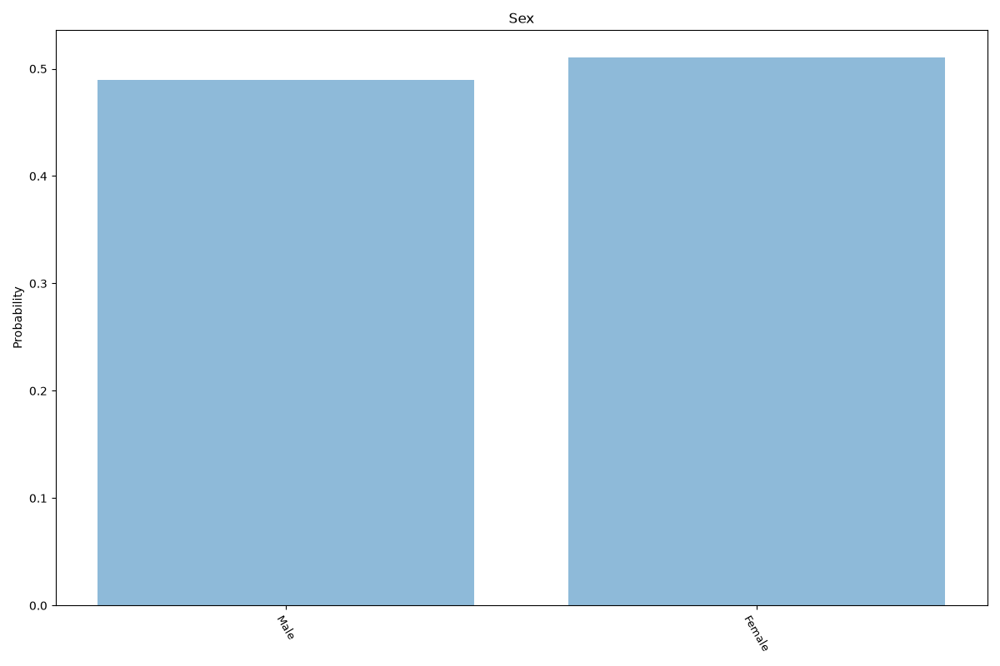

## Sexuality

## Ethnicity

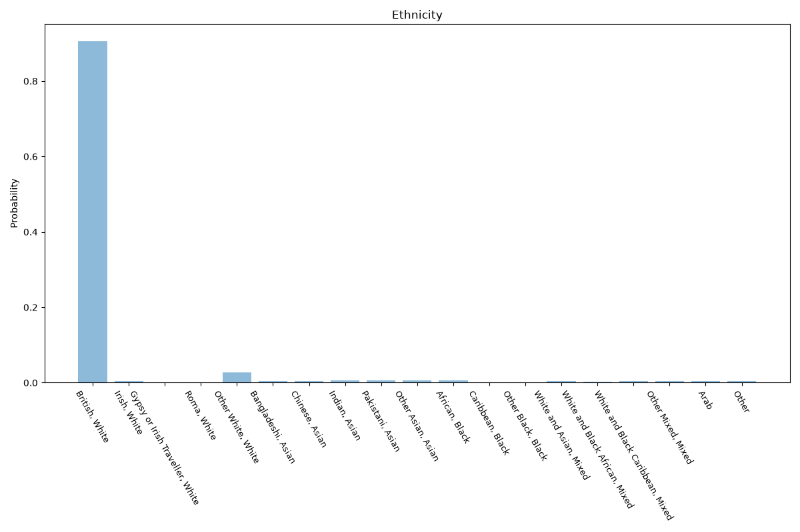

## Religion

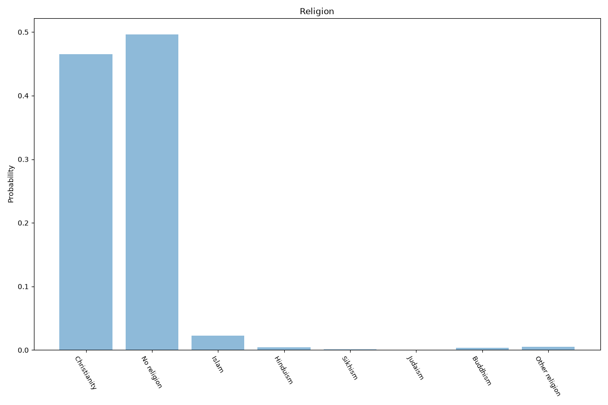

## Language

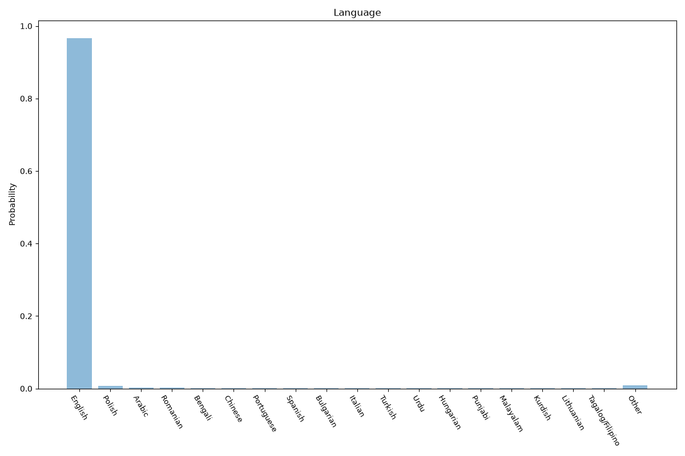

## Occupation

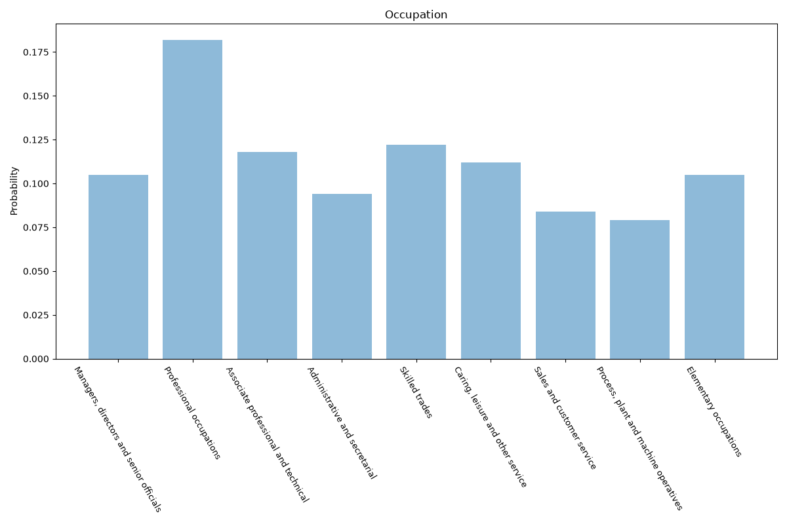

## Education

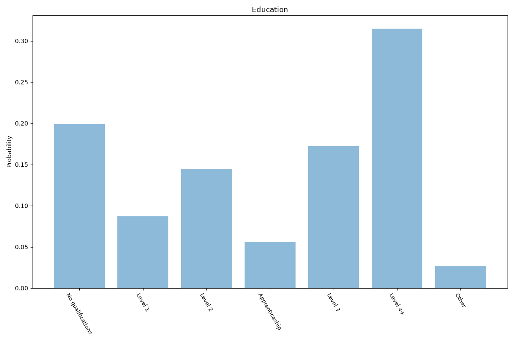

## Marital Status

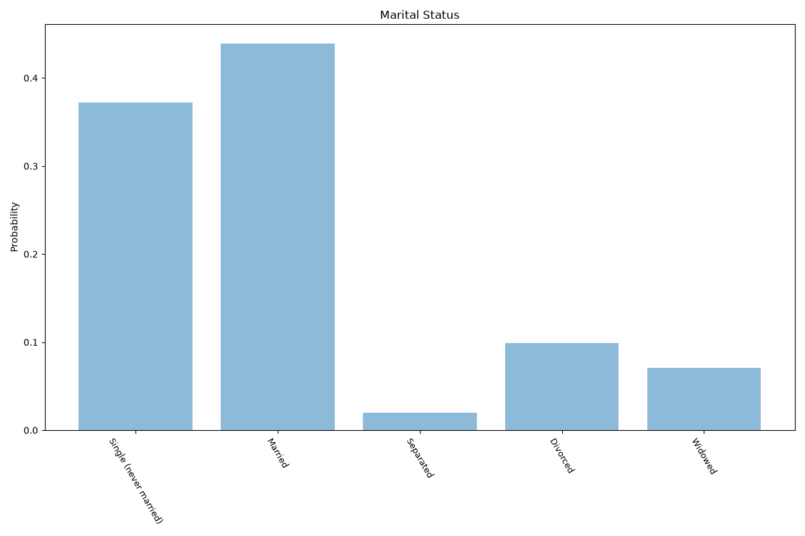

## Housing Tenure

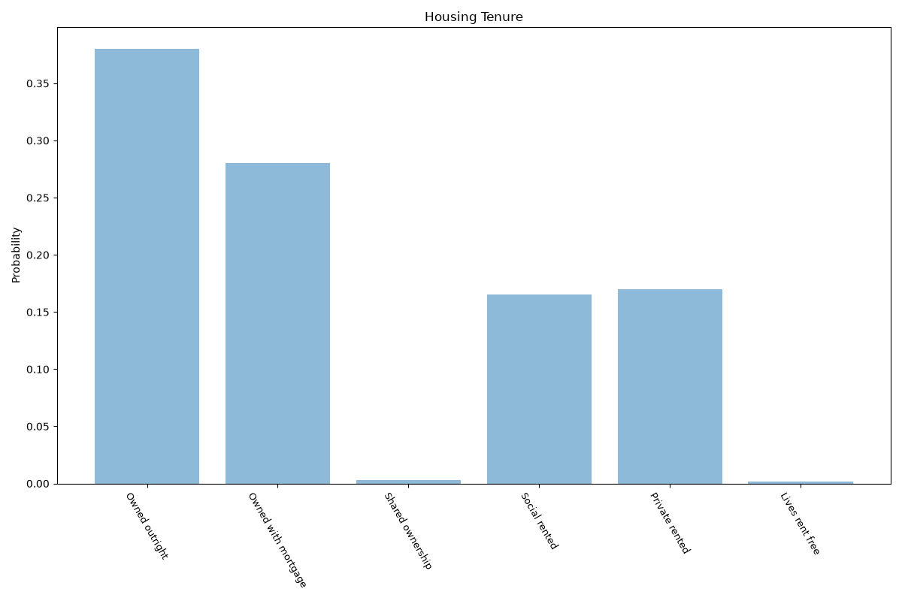

## Country Of Birth

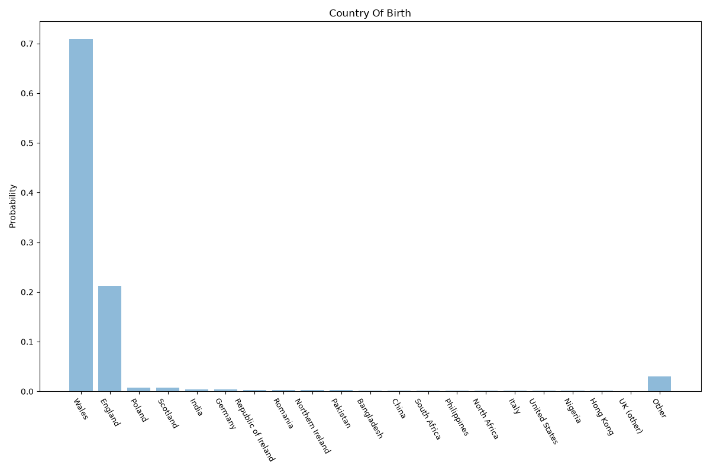

## Location

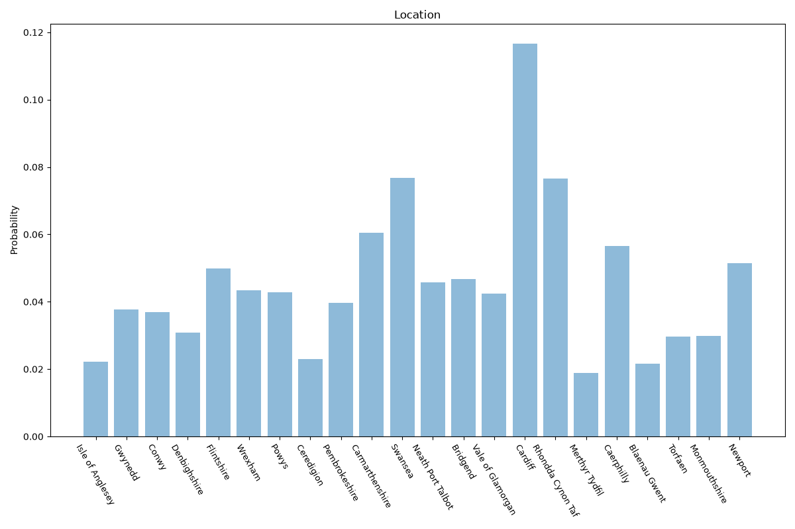

## Sources

- [Main language (TS024), Census 2021, ONS (2021)](https://www.ons.gov.uk/datasets/TS024/editions/2021/versions/1) — language
- [Population and household estimates, England and Wales: Census 2021, ONS (2021)](https://www.ons.gov.uk/peoplepopulationandcommunity/populationandmigration/populationestimates/datasets/populationandhouseholdestimatesenglandandwalescensus2021) — age, sex, location
- [Sexual orientation, UK: 2020, ONS (2020)](https://www.ons.gov.uk/peoplepopulationandcommunity/culturalidentity/sexuality/bulletins/sexualidentityuk/2020) — sexuality
- [Ethnic group (TS021), Census 2021, ONS (2021)](https://www.ons.gov.uk/datasets/TS021/editions/2021/versions/1) — ethnicity
- [Religion (TS030), Census 2021, ONS (2021)](https://www.ons.gov.uk/datasets/TS030/editions/2021/versions/1) — religion
- [Occupation (TS063), Census 2021, ONS (2021)](https://www.ons.gov.uk/datasets/TS063/editions/2021/versions/1) — occupation
- [Highest level of qualification (TS067), Census 2021, ONS (2021)](https://www.ons.gov.uk/datasets/TS067/editions/2021/versions/1) — education
- [Legal partnership status (TS002), Census 2021, ONS (2021)](https://www.ons.gov.uk/datasets/TS002/editions/2021/versions/3) — marital status
- [Tenure of household (TS054), Census 2021, ONS (2021)](https://www.ons.gov.uk/datasets/TS054/editions/2021/versions/1) — housing tenure
- [International migration, England and Wales: Census 2021, ONS (2021)](https://www.ons.gov.uk/peoplepopulationandcommunity/populationandmigration/internationalmigration/bulletins/internationalmigrationenglandandwales/census2021) — country of birth