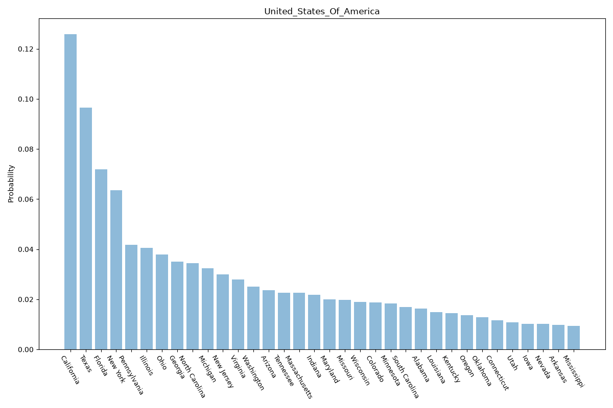

# United States Of America

Composite: Made up of California, Texas, Florida, New York, Pennsylvania, Illinois, Ohio, Georgia, North Carolina, Michigan, New Jersey, Virginia, Washington, Arizona, Tennessee, Massachusetts, Indiana, Maryland, Missouri, Wisconsin, Colorado, Minnesota, South Carolina, Alabama, Louisiana, Kentucky, Oregon, Oklahoma, Connecticut, Utah, Iowa, Nevada, Arkansas, and Mississippi.

\

## Sources

- [American Community Survey 2024 5-Year Estimates, US Census Bureau (via Census Reporter) (2024)](https://censusreporter.org/) — location