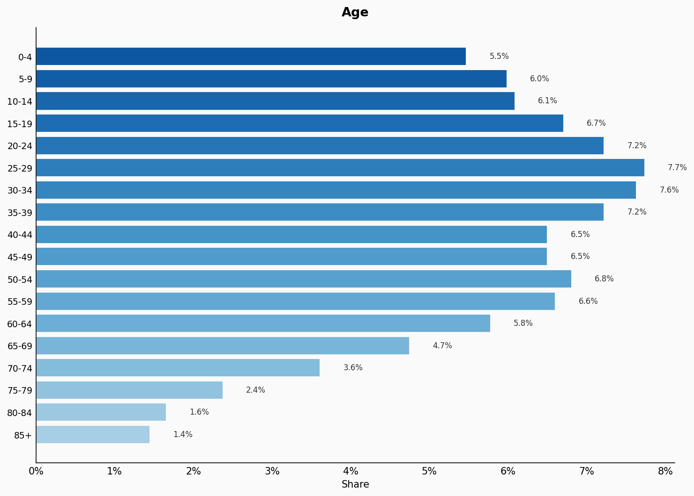
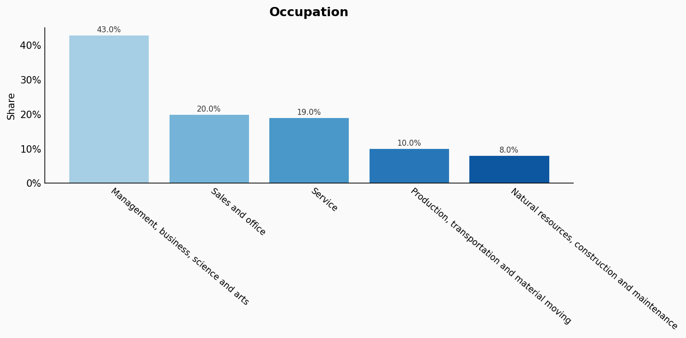
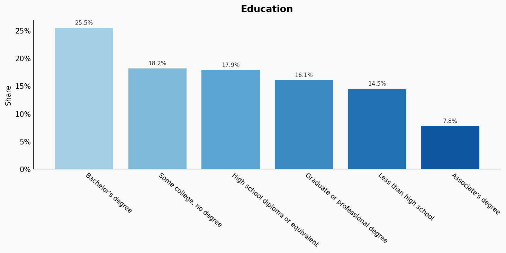
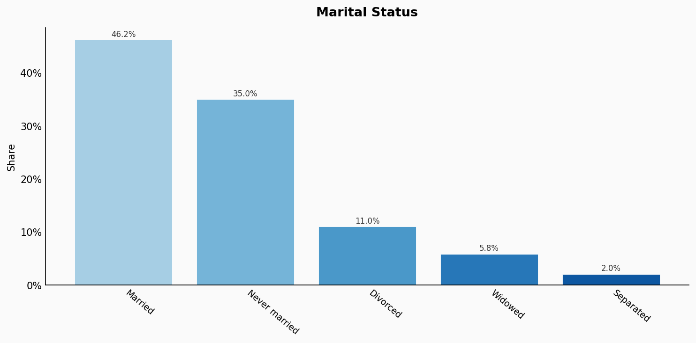
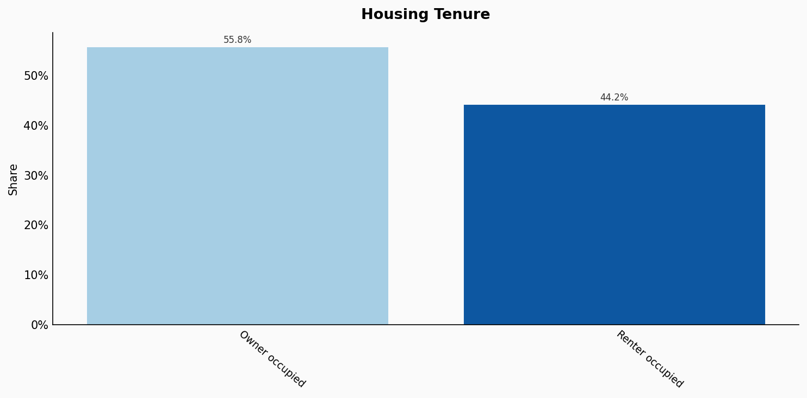
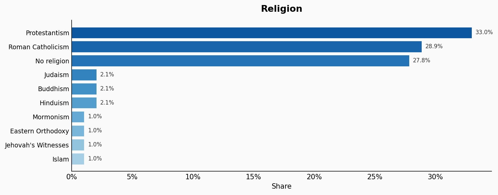
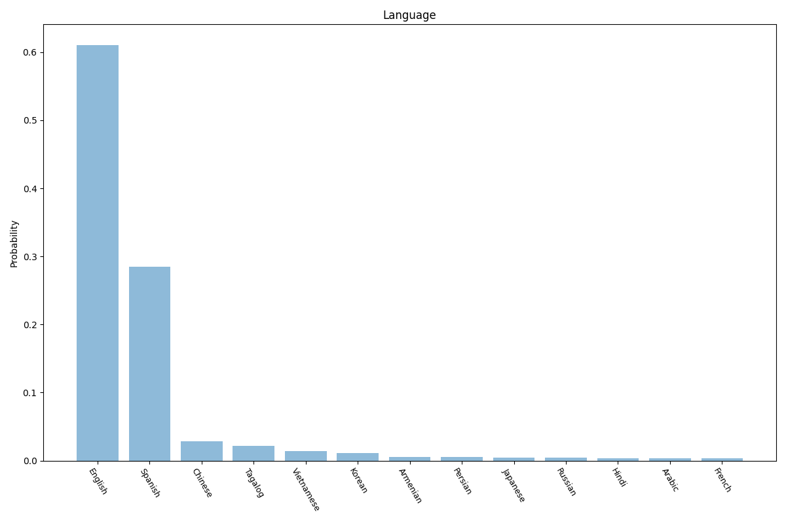
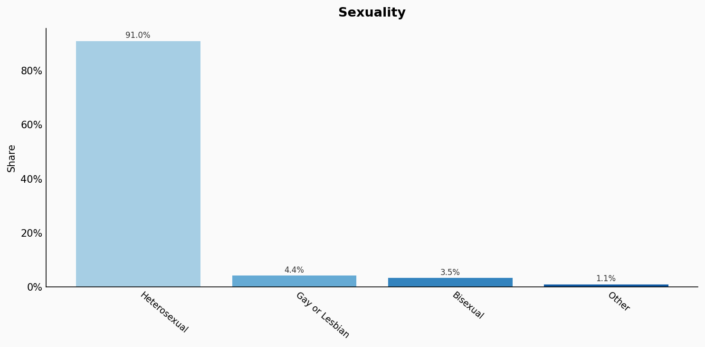
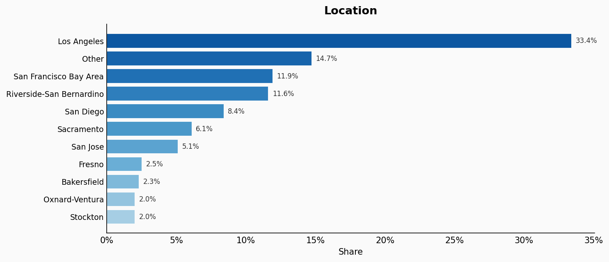

# California

**12 features:** age, sex, race, occupation, education, marital status, housing tenure, religion, language, sexuality, place of birth, and location.

## Age

| Option | Share |
|---|---:|
| 0-4 | 5.5% |
| 5-9 | 6.0% |
| 10-14 | 6.1% |
| 15-19 | 6.7% |
| 20-24 | 7.2% |
| 25-29 | 7.7% |
| 30-34 | 7.6% |
| 35-39 | 7.2% |
| 40-44 | 6.5% |
| 45-49 | 6.5% |
| 50-54 | 6.8% |
| 55-59 | 6.6% |
| 60-64 | 5.8% |
| 65-69 | 4.7% |
| 70-74 | 3.6% |
| 75-79 | 2.4% |
| 80-84 | 1.6% |
| 85+ | 1.4% |

## Sex

| Option | Share |
|---|---:|
| Female | 50.1% |
| Male | 49.9% |

## Race

| Option | Share |
|---|---:|
| Hispanic or Latino | 40.8% |
| White | 32.6% |
| Asian | 15.8% |
| Black or African American | 5.1% |
| Two or more races | 4.5% |
| Other | 0.6% |
| Native American | 0.3% |
| Pacific Islander | 0.3% |

## Occupation

| Option | Share |
|---|---:|
| Management, business, science and arts | 43.0% |
| Sales and office | 20.0% |
| Service | 19.0% |
| Production, transportation and material moving | 10.0% |
| Natural resources, construction and maintenance | 8.0% |

## Education

| Option | Share |
|---|---:|
| Bachelor's degree | 25.5% |
| Some college, no degree | 18.2% |
| High school diploma or equivalent | 17.9% |
| Graduate or professional degree | 16.1% |
| Less than high school | 14.5% |
| Associate's degree | 7.8% |

## Marital Status

| Option | Share |
|---|---:|
| Married | 46.2% |
| Never married | 35.0% |
| Divorced | 11.0% |
| Widowed | 5.8% |
| Separated | 2.0% |

## Housing Tenure

| Option | Share |
|---|---:|
| Owner occupied | 55.8% |
| Renter occupied | 44.2% |

## Religion

| Option | Share |
|---|---:|
| Protestantism | 33.0% |
| Roman Catholicism | 28.9% |
| No religion | 27.8% |
| Judaism | 2.1% |
| Buddhism | 2.1% |
| Hinduism | 2.1% |
| Mormonism | 1.0% |
| Eastern Orthodoxy | 1.0% |
| Jehovah's Witnesses | 1.0% |
| Islam | 1.0% |

## Language

| Option | Share |
|---|---:|
| English | 61.0% |
| Spanish | 28.5% |
| Chinese | 2.8% |
| Tagalog | 2.2% |
| Vietnamese | 1.4% |
| Korean | 1.1% |
| Armenian | 0.5% |
| Persian | 0.5% |
| Japanese | 0.4% |
| Russian | 0.4% |
| Hindi | 0.4% |
| Arabic | 0.4% |
| French | 0.4% |

## Sexuality

| Option | Share |
|---|---:|
| Heterosexual | 91.0% |
| Gay or Lesbian | 4.4% |
| Bisexual | 3.5% |
| Other | 1.1% |

## Place Of Birth

| Option | Share |
|---|---:|
| California | 53.4% |
| Other US state | 21.2% |
| Mexico | 10.1% |
| Other | 4.9% |
| Philippines | 2.3% |
| China | 2.2% |
| India | 1.6% |
| Vietnam | 1.5% |
| El Salvador | 1.0% |
| South Korea | 0.9% |
| Guatemala | 0.9% |

## Location

| Option | Share |
|---|---:|
| Los Angeles | 33.4% |
| Other | 14.7% |
| San Francisco Bay Area | 11.9% |
| Riverside-San Bernardino | 11.6% |
| San Diego | 8.4% |
| Sacramento | 6.1% |
| San Jose | 5.1% |
| Fresno | 2.5% |
| Bakersfield | 2.3% |
| Oxnard-Ventura | 2.0% |
| Stockton | 2.0% |

## Sources

- [American Community Survey 2021 5-Year Estimates, US Census Bureau (2021)](https://censusreporter.org/profiles/04000US06-california/)
  *Covers: `age`, `sex`, `race`, `occupation`, `education`, `marital status`, `housing tenure`, `location`*
- [Religious Landscape Study - California, Pew Research Center](https://www.pewresearch.org/religion/religious-landscape-study/state/california/)
  *Covers: `religion`*
- [Language Mapper, Modern Language Association](https://www.mla.org/Resources/Research/Language-Mapper)
  *Covers: `language`*
- [LGBT Identification in U.S., Gallup (2022)](https://news.gallup.com/poll/389792/lgbt-identification-ticks-up.aspx)
  *Covers: `sexuality`*
- [American Community Survey 2021 5-Year Estimates, US Census Bureau (2021)](https://censusreporter.org/profiles/04000US06-california/)
  *Covers: `place of birth`*