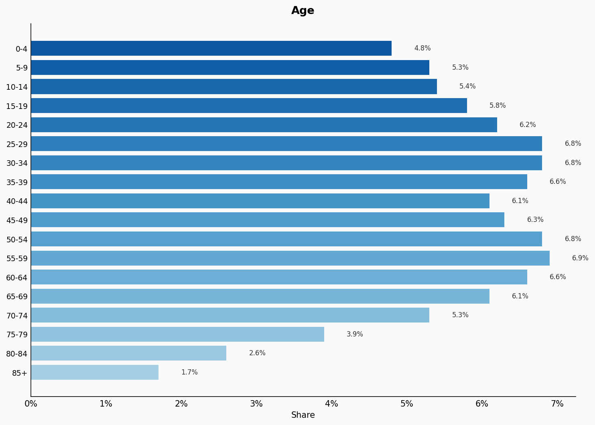
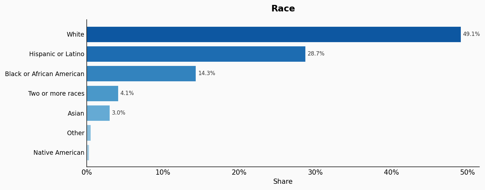
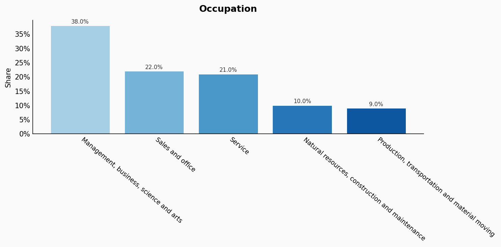
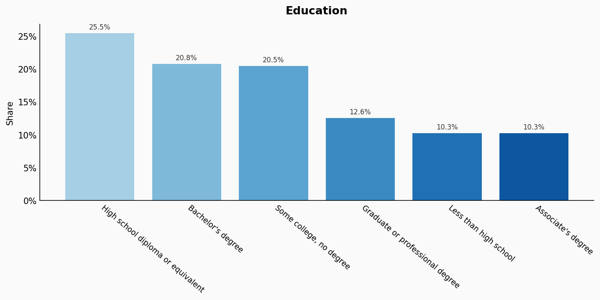
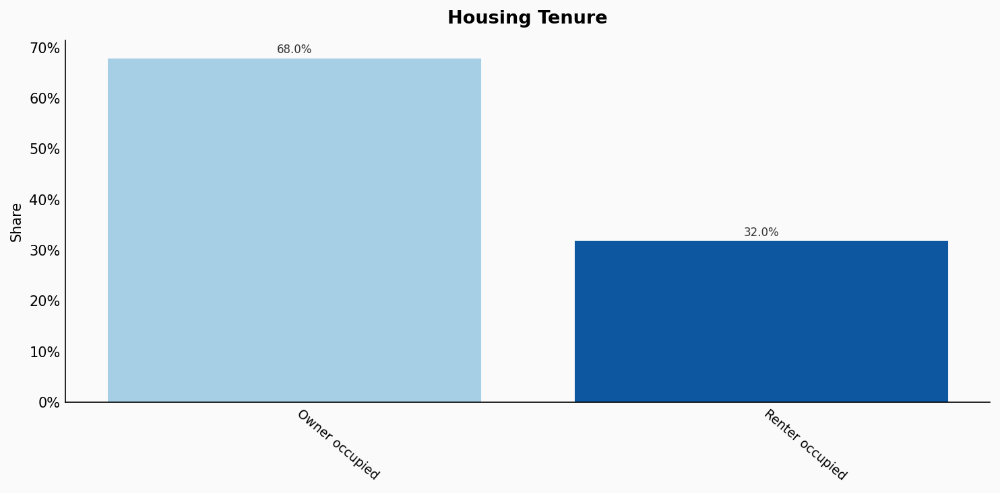
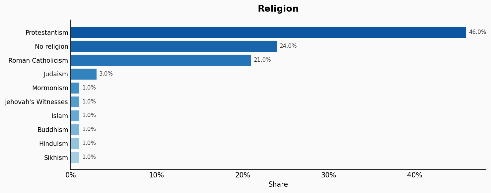
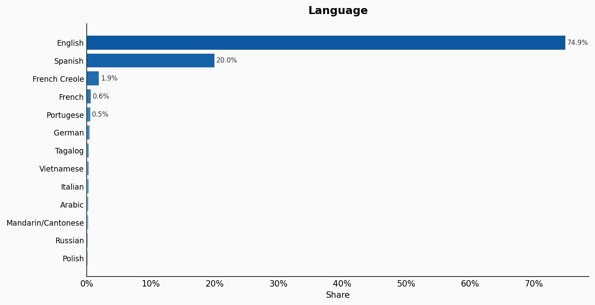
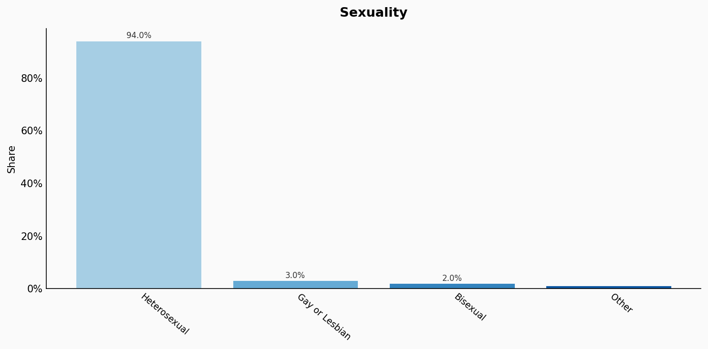
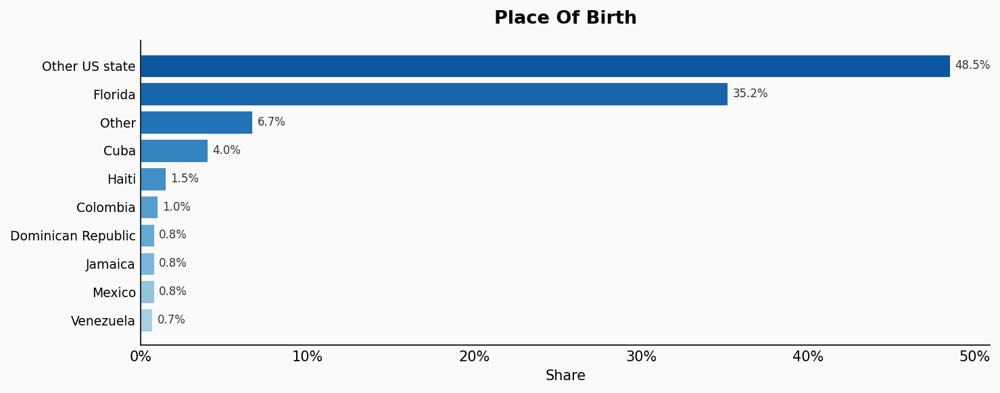
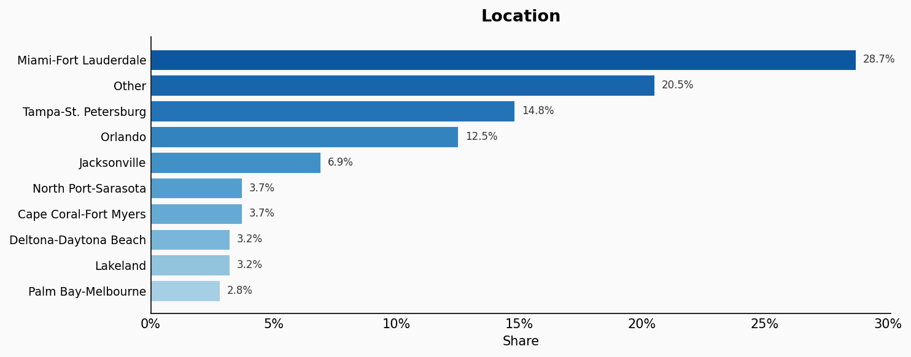

# Florida

**12 features:** age, sex, race, occupation, education, marital status, housing tenure, religion, language, sexuality, place of birth, and location.

## Age

| Option | Share |
|---|---:|
| 0-4 | 4.8% |
| 5-9 | 5.3% |
| 10-14 | 5.4% |
| 15-19 | 5.8% |
| 20-24 | 6.2% |
| 25-29 | 6.8% |
| 30-34 | 6.8% |
| 35-39 | 6.6% |
| 40-44 | 6.1% |
| 45-49 | 6.3% |
| 50-54 | 6.8% |
| 55-59 | 6.9% |
| 60-64 | 6.6% |
| 65-69 | 6.1% |
| 70-74 | 5.3% |
| 75-79 | 3.9% |
| 80-84 | 2.6% |
| 85+ | 1.7% |

## Sex

| Option | Share |
|---|---:|
| Female | 50.8% |
| Male | 49.2% |

## Race

| Option | Share |
|---|---:|
| White | 49.1% |
| Hispanic or Latino | 28.7% |
| Black or African American | 14.3% |
| Two or more races | 4.1% |
| Asian | 3.0% |
| Other | 0.5% |
| Native American | 0.3% |

## Occupation

| Option | Share |
|---|---:|
| Management, business, science and arts | 38.0% |
| Sales and office | 22.0% |
| Service | 21.0% |
| Natural resources, construction and maintenance | 10.0% |
| Production, transportation and material moving | 9.0% |

## Education

| Option | Share |
|---|---:|
| High school diploma or equivalent | 25.5% |
| Bachelor's degree | 20.8% |
| Some college, no degree | 20.5% |
| Graduate or professional degree | 12.6% |
| Less than high school | 10.3% |
| Associate's degree | 10.3% |

## Marital Status

| Option | Share |
|---|---:|
| Married | 49.6% |
| Never married | 32.0% |
| Divorced | 12.2% |
| Widowed | 4.4% |
| Separated | 1.8% |

## Housing Tenure

| Option | Share |
|---|---:|
| Owner occupied | 68.0% |
| Renter occupied | 32.0% |

## Religion

| Option | Share |
|---|---:|
| Protestantism | 46.0% |
| No religion | 24.0% |
| Roman Catholicism | 21.0% |
| Judaism | 3.0% |
| Mormonism | 1.0% |
| Jehovah's Witnesses | 1.0% |
| Islam | 1.0% |
| Buddhism | 1.0% |
| Hinduism | 1.0% |
| Sikhism | 1.0% |

## Language

| Option | Share |
|---|---:|
| English | 74.9% |
| Spanish | 20.0% |
| French Creole | 1.9% |
| French | 0.6% |
| Portugese | 0.5% |
| German | 0.4% |
| Tagalog | 0.3% |
| Vietnamese | 0.3% |
| Italian | 0.3% |
| Arabic | 0.2% |
| Mandarin/Cantonese | 0.2% |
| Russian | 0.2% |
| Polish | 0.1% |

## Sexuality

| Option | Share |
|---|---:|
| Heterosexual | 94.0% |
| Gay or Lesbian | 3.0% |
| Bisexual | 2.0% |
| Other | 1.0% |

## Place Of Birth

| Option | Share |
|---|---:|
| Other US state | 48.5% |
| Florida | 35.2% |
| Other | 6.7% |
| Cuba | 4.0% |
| Haiti | 1.5% |
| Colombia | 1.0% |
| Dominican Republic | 0.8% |
| Jamaica | 0.8% |
| Mexico | 0.8% |
| Venezuela | 0.7% |

## Location

| Option | Share |
|---|---:|
| Miami-Fort Lauderdale | 28.7% |
| Other | 20.5% |
| Tampa-St. Petersburg | 14.8% |
| Orlando | 12.5% |
| Jacksonville | 6.9% |
| North Port-Sarasota | 3.7% |
| Cape Coral-Fort Myers | 3.7% |
| Deltona-Daytona Beach | 3.2% |
| Lakeland | 3.2% |
| Palm Bay-Melbourne | 2.8% |

## Sources

- [American Community Survey 2021 5-Year Estimates, US Census Bureau (2021)](https://censusreporter.org/profiles/04000US12-florida/)
  *Covers: `age`, `sex`, `race`, `occupation`, `education`, `marital status`, `housing tenure`, `location`*
- [Religious Landscape Study - Florida, Pew Research Center](https://www.pewresearch.org/religion/religious-landscape-study/state/florida/)
  *Covers: `religion`*
- [Language Mapper, Modern Language Association](https://www.mla.org/Resources/Research/Language-Mapper)
  *Covers: `language`*
- [LGBT Identification in U.S., Gallup (2022)](https://news.gallup.com/poll/389792/lgbt-identification-ticks-up.aspx)
  *Covers: `sexuality`*
- [American Community Survey 2021 5-Year Estimates, US Census Bureau (2021)](https://censusreporter.org/profiles/04000US12-florida/)
  *Covers: `place of birth`*