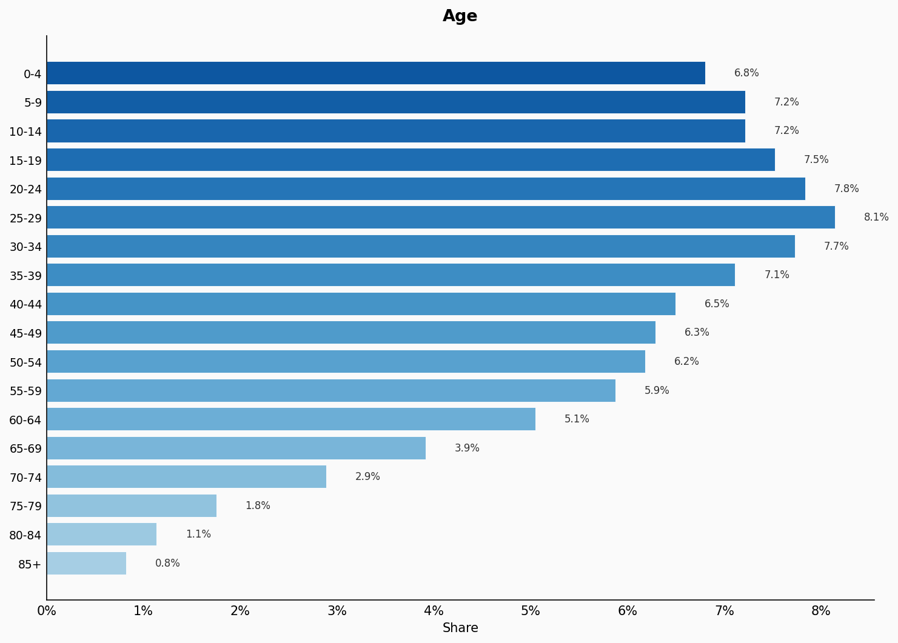
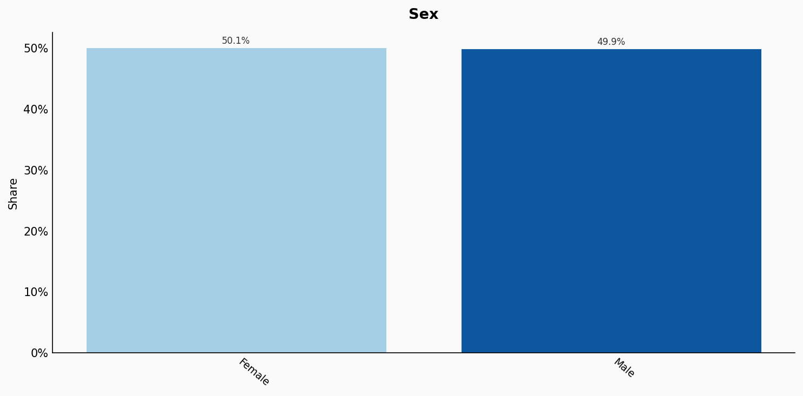
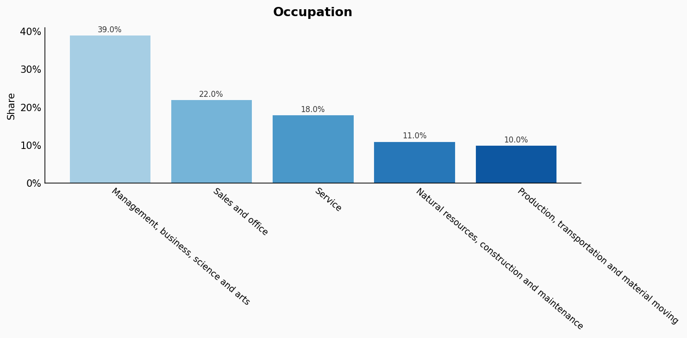
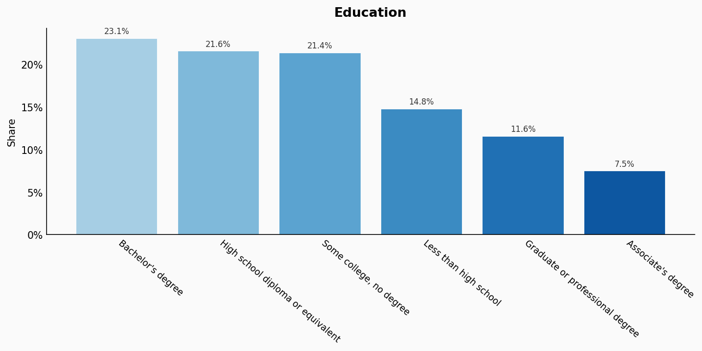
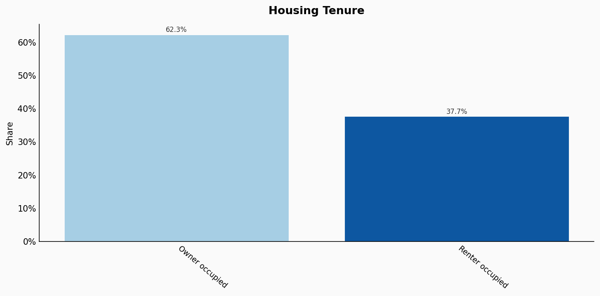
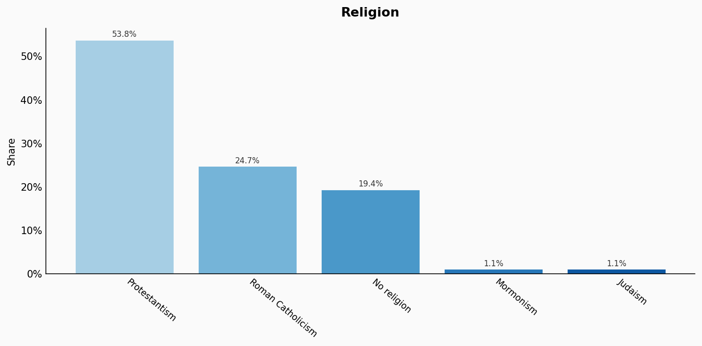
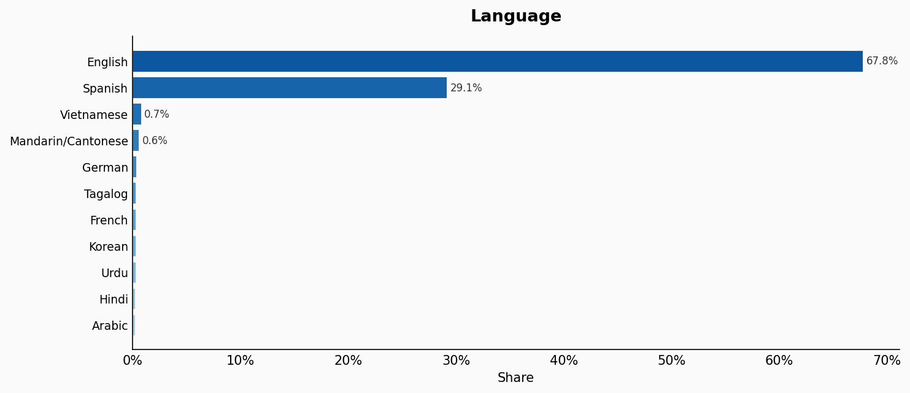
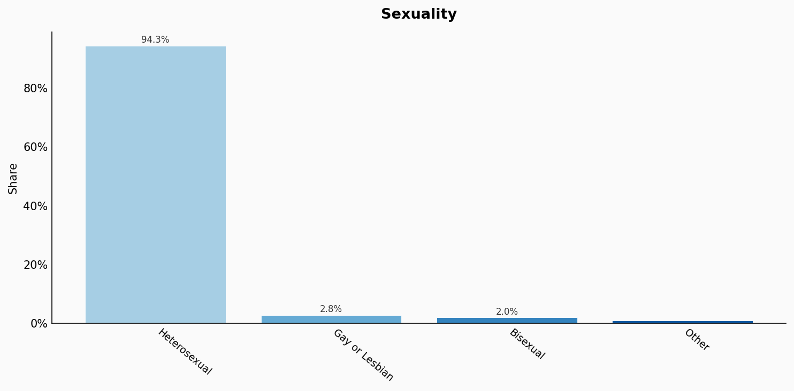
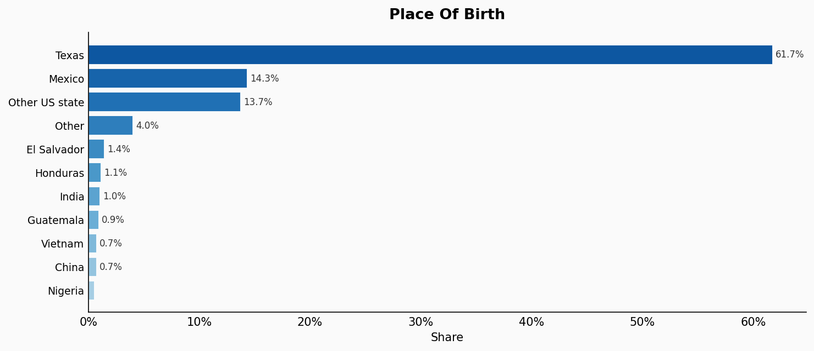
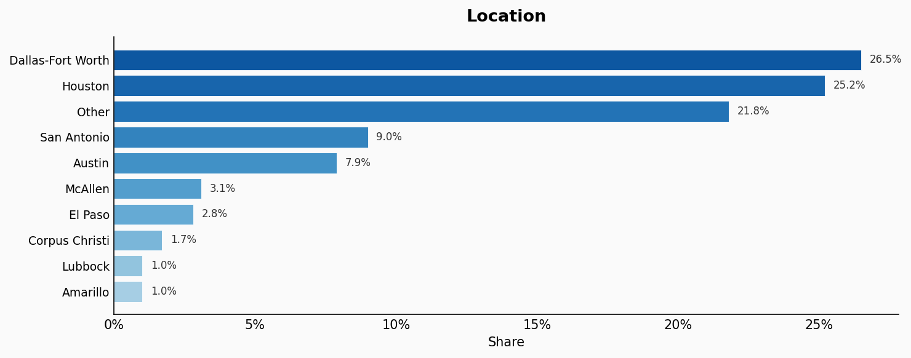

# Texas

**12 features:** age, sex, race, occupation, education, marital status, housing tenure, religion, language, sexuality, place of birth, and location.

## Age

| Option | Share |
|---|---:|
| 0-4 | 6.8% |
| 5-9 | 7.2% |
| 10-14 | 7.2% |
| 15-19 | 7.5% |
| 20-24 | 7.8% |
| 25-29 | 8.1% |
| 30-34 | 7.7% |
| 35-39 | 7.1% |
| 40-44 | 6.5% |
| 45-49 | 6.3% |
| 50-54 | 6.2% |
| 55-59 | 5.9% |
| 60-64 | 5.1% |
| 65-69 | 3.9% |
| 70-74 | 2.9% |
| 75-79 | 1.8% |
| 80-84 | 1.1% |
| 85+ | 0.8% |

## Sex

| Option | Share |
|---|---:|
| Female | 50.1% |
| Male | 49.9% |

## Race

| Option | Share |
|---|---:|
| Hispanic or Latino | 40.3% |
| White | 37.8% |
| Black or African American | 12.0% |
| Asian | 6.0% |
| Two or more races | 3.3% |
| Other | 0.4% |
| Native American | 0.2% |

## Occupation

| Option | Share |
|---|---:|
| Management, business, science and arts | 39.0% |
| Sales and office | 22.0% |
| Service | 18.0% |
| Natural resources, construction and maintenance | 11.0% |
| Production, transportation and material moving | 10.0% |

## Education

| Option | Share |
|---|---:|
| Bachelor's degree | 23.1% |
| High school diploma or equivalent | 21.6% |
| Some college, no degree | 21.4% |
| Less than high school | 14.8% |
| Graduate or professional degree | 11.6% |
| Associate's degree | 7.5% |

## Marital Status

| Option | Share |
|---|---:|
| Married | 50.8% |
| Never married | 33.0% |
| Divorced | 11.0% |
| Widowed | 3.1% |
| Separated | 2.1% |

## Housing Tenure

| Option | Share |
|---|---:|
| Owner occupied | 62.3% |
| Renter occupied | 37.7% |

## Religion

| Option | Share |
|---|---:|
| Protestantism | 53.8% |
| Roman Catholicism | 24.7% |
| No religion | 19.4% |
| Mormonism | 1.1% |
| Judaism | 1.1% |

## Language

| Option | Share |
|---|---:|
| English | 67.8% |
| Spanish | 29.1% |
| Vietnamese | 0.7% |
| Mandarin/Cantonese | 0.6% |
| German | 0.3% |
| Tagalog | 0.3% |
| French | 0.2% |
| Korean | 0.2% |
| Urdu | 0.2% |
| Hindi | 0.2% |
| Arabic | 0.2% |

## Sexuality

| Option | Share |
|---|---:|
| Heterosexual | 94.3% |
| Gay or Lesbian | 2.8% |
| Bisexual | 2.0% |
| Other | 0.9% |

## Place Of Birth

| Option | Share |
|---|---:|
| Texas | 61.7% |
| Mexico | 14.3% |
| Other US state | 13.7% |
| Other | 4.0% |
| El Salvador | 1.4% |
| Honduras | 1.1% |
| India | 1.0% |
| Guatemala | 0.9% |
| Vietnam | 0.7% |
| China | 0.7% |
| Nigeria | 0.5% |

## Location

| Option | Share |
|---|---:|
| Dallas-Fort Worth | 26.5% |
| Houston | 25.2% |
| Other | 21.8% |
| San Antonio | 9.0% |
| Austin | 7.9% |
| McAllen | 3.1% |
| El Paso | 2.8% |
| Corpus Christi | 1.7% |
| Lubbock | 1.0% |
| Amarillo | 1.0% |

## Sources

- [American Community Survey 2021 5-Year Estimates, US Census Bureau (2021)](https://censusreporter.org/profiles/04000US48-texas/)
  *Covers: `age`, `sex`, `race`, `occupation`, `education`, `marital status`, `housing tenure`, `location`*
- [Religious Landscape Study - Texas, Pew Research Center](https://www.pewresearch.org/religion/religious-landscape-study/state/texas/)
  *Covers: `religion`*
- [Language Mapper, Modern Language Association](https://www.mla.org/Resources/Research/Language-Mapper)
  *Covers: `language`*
- [LGBT Identification in U.S., Gallup (2022)](https://news.gallup.com/poll/389792/lgbt-identification-ticks-up.aspx)
  *Covers: `sexuality`*
- [American Community Survey 2021 5-Year Estimates, US Census Bureau (2021)](https://censusreporter.org/profiles/04000US48-texas/)
  *Covers: `place of birth`*