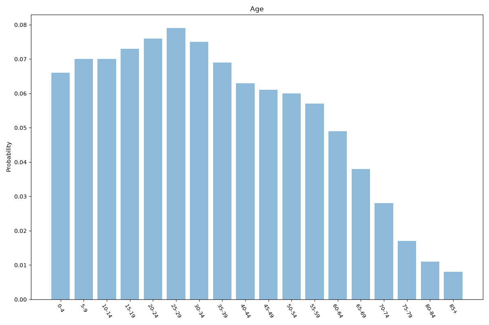
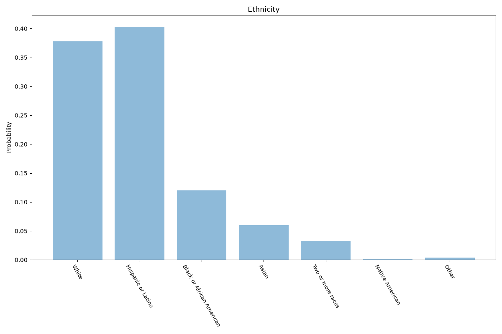
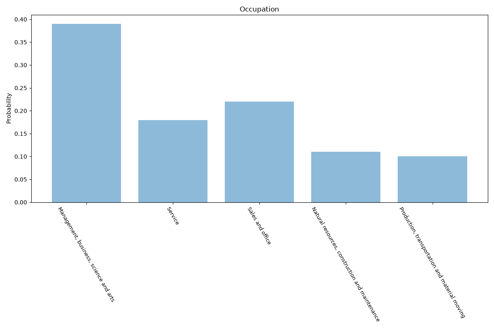
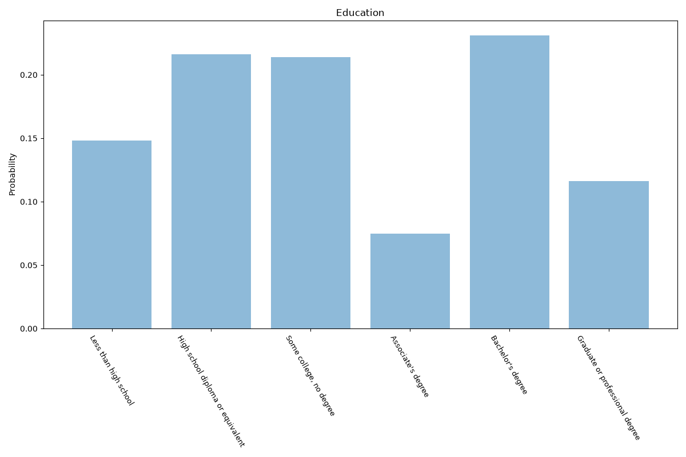
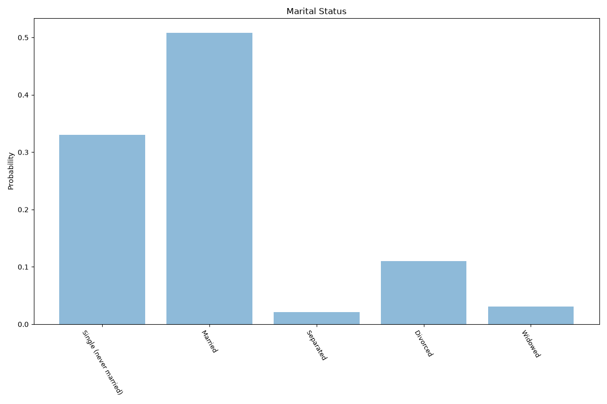
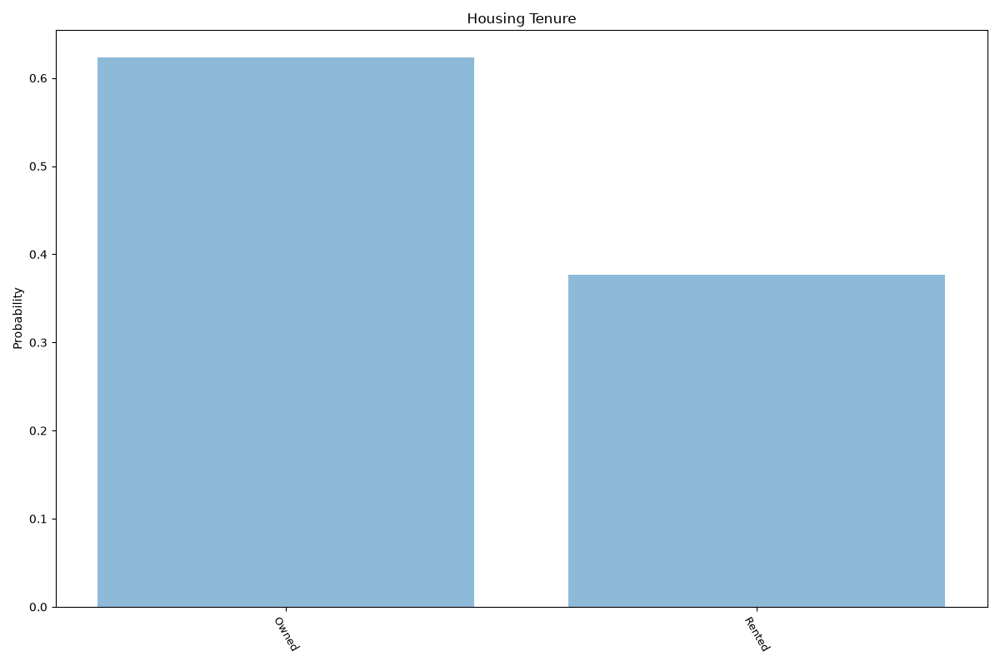
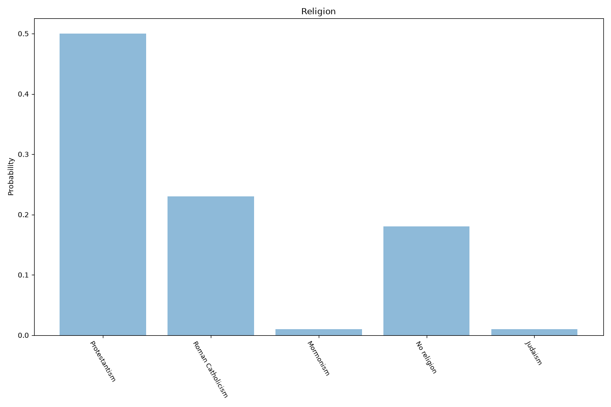
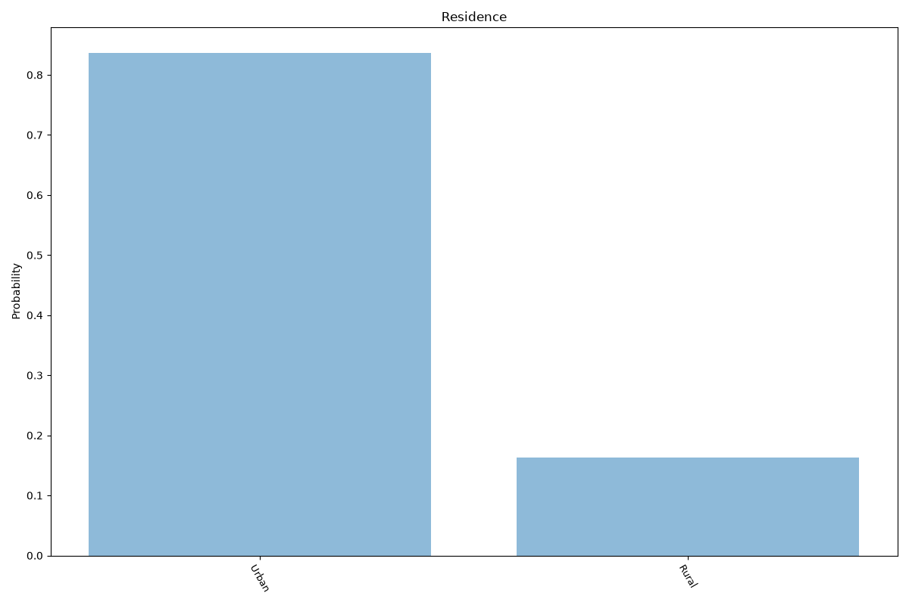
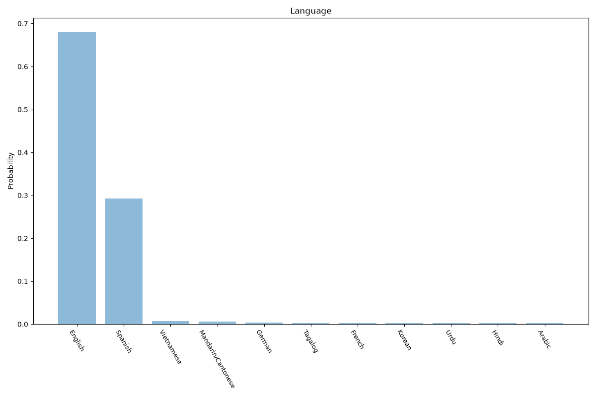

# Texas
**10 features:** age, sex, ethnicity, occupation, education, marital status, housing tenure, religion, residence and language.

## Age

## Sex

## Ethnicity

## Occupation

## Education

## Marital Status

## Housing Tenure

## Religion

## Residence

## Language

## Sources

- [American Community Survey 2021 5-Year Estimates, US Census Bureau (via Census Reporter) (2021)](https://censusreporter.org/profiles/04000US48-texas/) — age, sex, ethnicity, occupation, education, marital status, housing tenure
- [Religious Landscape Study - Texas, Pew Research Center (2014)](https://www.pewresearch.org/religion/religious-landscape-study/state/texas/) — religion
- [Language Map Data Center, Modern Language Association (2010)](https://apps.mla.org/map_data) — language
- [2020 Census Urban and Rural, U.S. Census Bureau (2020)](https://www.census.gov/programs-surveys/geography/guidance/geo-areas/urban-rural.html) — residence