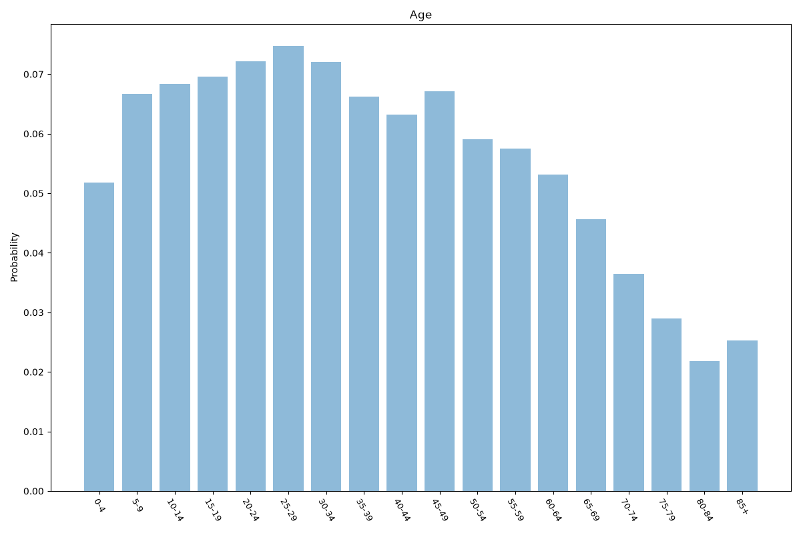
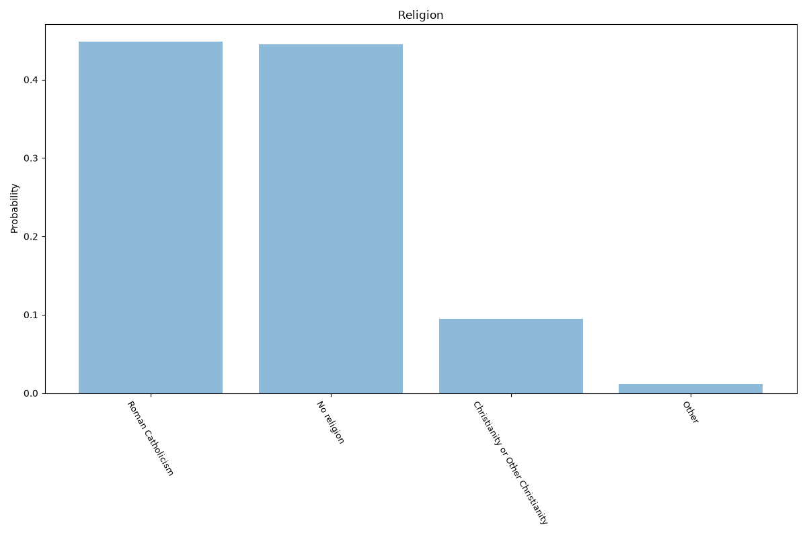
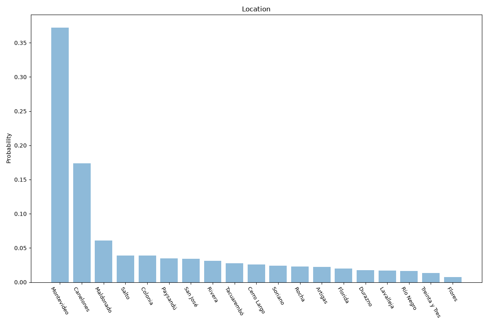

# Uruguay
**4 features:** age, sex, religion and location.

## Age

## Sex

## Religion

## Location

## Sources

- [World Population Prospects 2024, United Nations (2024)](https://population.un.org/wpp/) — age, sex
- [Latinobarómetro (2018)](https://www.latinobarometro.org/) — religion
- [2023 Census, Instituto Nacional de Estadística (INE Uruguay) (2023)](https://www.ine.gub.uy/) — location