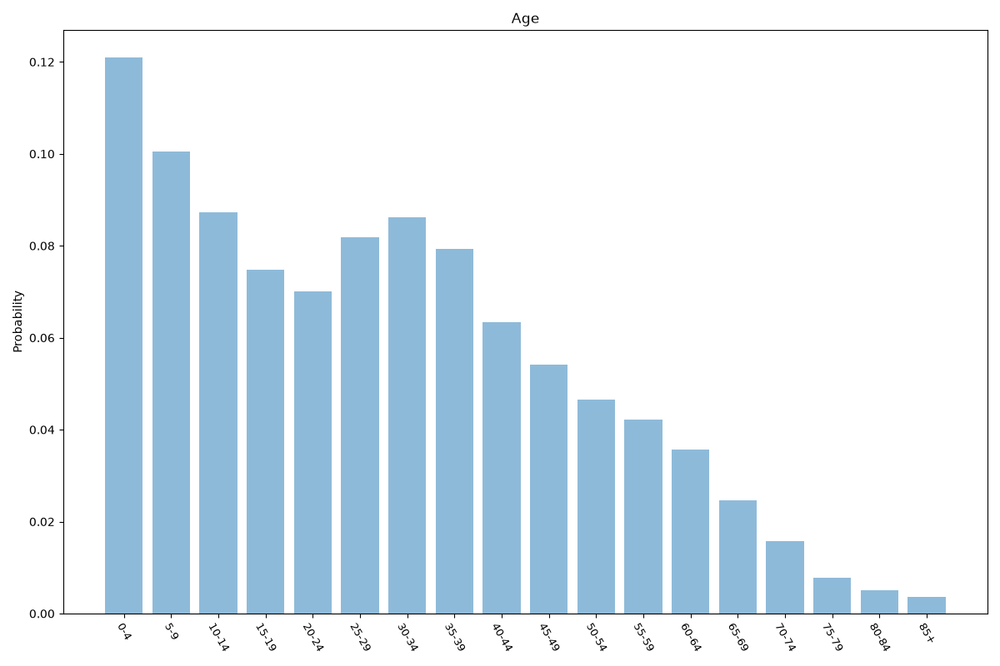
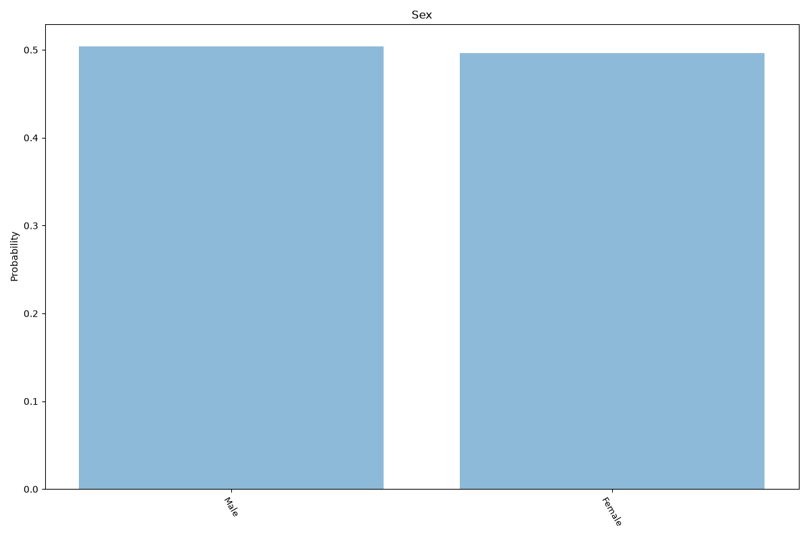
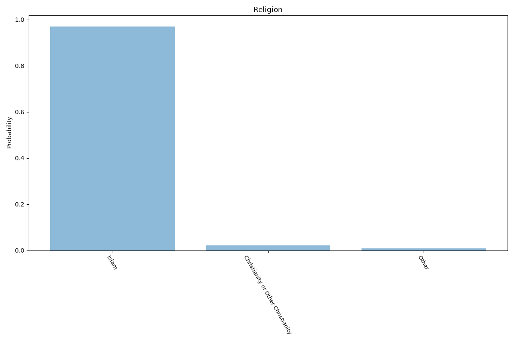
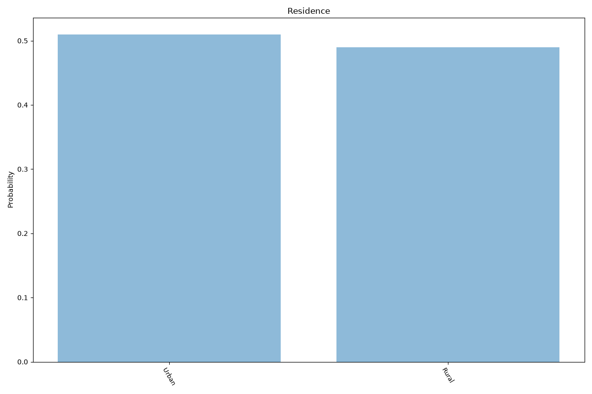
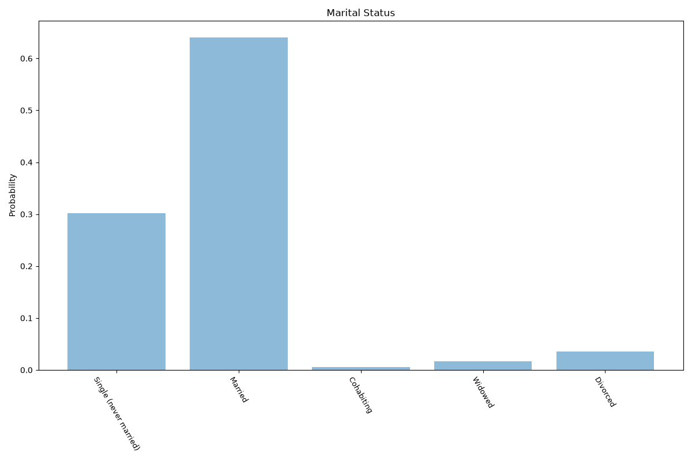
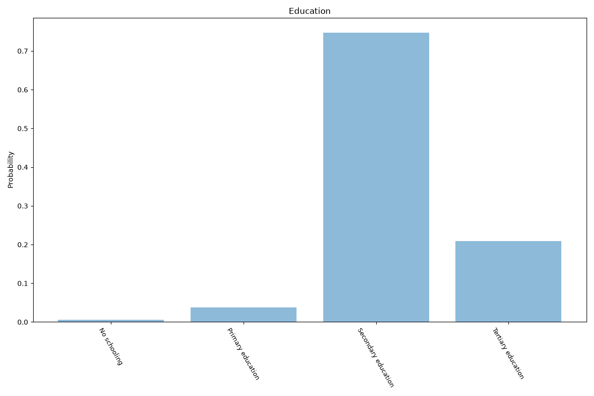

# Uzbekistan
**8 features:** age, location, sex, religion, residence, marital status, employment status and education.

## Age

## Location

Population-weighted regional distribution as of 1 April 2024.

## Sex

## Religion

## Residence

## Marital Status

## Employment Status

Population aged 15 and over.

## Education

## Sources

- [World Population Prospects 2024, United Nations (2024)](https://population.un.org/wpp/) — age, sex
- [2022 Report on International Religious Freedom, U.S. Department of State (2022)](https://www.state.gov/reports/2022-report-on-international-religious-freedom/uzbekistan/) — religion
- [Resident population by region, Statistics Agency under the President of the Republic of Uzbekistan (2024)](https://stat.uz/en/press-center/news-of-committee/52880-hududlar-kesi-mida-doi-miy-aholi-soni-4) — location
- [Urban population (% of total population), World Bank (2025)](https://data.worldbank.org/indicator/SP.URB.TOTL.IN.ZS) — residence
- [World Marriage Data 2019, United Nations (2006)](https://www.un.org/development/desa/pd/data/world-marriage-data) — marital status
- [Labour force participation rate and unemployment rate (modelled ILO estimate), World Bank (2025)](https://data.worldbank.org/indicator/SL.TLF.CACT.ZS) — employment status
- [Wittgenstein Centre Human Capital Data Explorer (Version 3.0, SSP2 scenario), IIASA (2020)](https://dataexplorer.wittgensteincentre.org/wcde-v3/) — education
