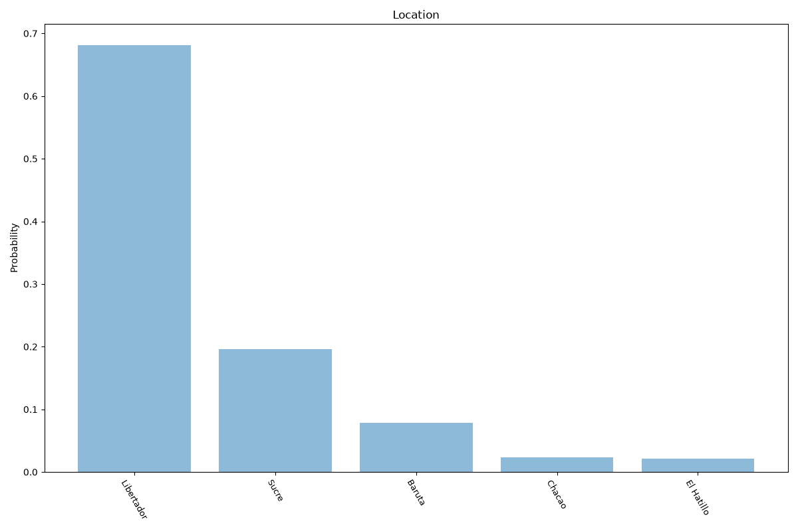

# Caracas
**2 features:** location and residence.

## Location

## Residence

## Sources

- [Censo 2011, Instituto Nacional de Estadística (INE) (2011)](https://www.ine.gob.ve/) — location
- [World Urbanization Prospects 2018, United Nations (2018)](https://population.un.org/wup/) — residence